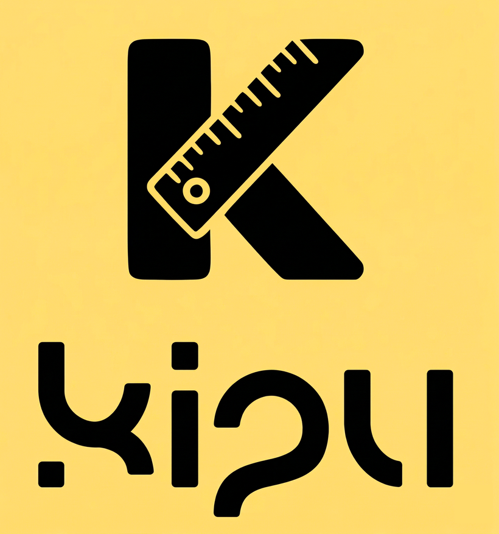

  

## Universidad Peruana de Ciencias Aplicadas

**Ingeniería de Software**

**Ciclo:** 2026-10

**Curso:** Aplicaciones Web

**Sección:** 17953

**Profesor:** Alex Humberto Sánchez Ponce

----
## Informe de Trabajo Final
### PircaIndustries

### Kipu
#### Relación de integrantes 
| Integrante                  | Código         |
|---------------------------------|----------------|
| Francia Torres Jhony Manuel             | U202417329     |
| Montoya Nina Paula Fernanda             | U20241d934     |
| Palacios Tinoco Adrian Fernando         | U202410817     |
| Ramos Hinostroza Diego Antonio          | U202224130     |
| Ramos Mera Neo Daniel                   | U20241e418     |

 
<h3>Abril 2026</h3>
 

  
---
### Registro de Versiones

|**Versión**|**Fecha**|**Autor**|**Descripción de modificación**|
| - | - | - | - |
|1\.0|02/04/2026|Diego Antonio Ramos Hinostroza y Paula Fernanda Montoya Nina| Se agregó la estructura inicial del proyecto: Índice, Student Outcome, los capitulos I, II, III, IV, y V, Conclusiones, Bibliografía y Anexos.|
|1\.1|03/04/2026|Neo Daniel Ramos Mera| Se inició con el capítulo I: Introducción y el Startup Profile.|
|1\.1\.1|03/04/2026|Neo Daniel Ramos Mera, Paula Fernanda Montoya Nina| Se agregó contenido relacionado a los perfiles de los integrantes del equipo.|
|1\.1\.2|03/04/2026|Jhony Manuel Francia Torres| Se agregó contenido de Antecedentes y Problemática (5Ws y 2Hs).|
|1\.1\.3|03/04/2026|Neo Daniel Ramos Mera| Se agregó contenido del Lean UX Process.|
|1\.1\.4|03/04/2026|Diego Antonio Ramos Hinostroza| Se agregó contenido relacionado con los Segmentos Objetivos.|
|1\.2\.1|05/04/2026|Diego Antonio Ramos Hinostroza| Se agregó contenido relacionado con el diseño de entrevistas.|

  

---

# Project Report Collaboration Insights

URL de Organización de GITHUB del equipo PircaIndustries:
https://github.com/PircaIndustries

URL de Repositorio del Project Report:
https://github.com/PircaIndustries/upc-pre-202610-1asi0730-17953-PircaIndustries-report

<strong>*Entrega TB1:*</strong>

---

# Contenido

- [Contenido](#contenido)
- [Student Outcome](#student-outcome)
- [Capítulo I: Introducción](#capítulo-i-introducción)
  - [1.1. Startup Profile](#11-startup-profile)
    - [1.1.1. Descripción de la StartUp](#111-descripción-de-la-startup)
    - [1.1.2. Perfiles de integrantes del equipo](#112-perfiles-de-integrantes-del-equipo)
  - [1.2. Solution Profile](#12-solution-profile)
    - [1.2.1 Antecedentes y problemática](#121-antecedentes-y-problemática)
    - [1.2.2 Lean UX Process](#122-lean-ux-process)
      - [1.2.2.1 Lean UX Problem Statement](#1221-lean-ux-problem-statement)
      - [1.2.2.2 Lean UX Assumptions](#1222-lean-ux-assumptions)
      - [1.2.2.3 Lean UX Hypothesis Statements](#1223-lean-ux-hypothesis-statements)
      - [1.2.2.4 Lean UX Canvas](#1224-lean-ux-canvas)
  - [1.3. Segmentos Objetivo](#13-segmentos-objetivo)
- [Capítulo II: Requirements Elicitation \& Analysis](#capítulo-ii-requirements-elicitation--analysis)
  - [2.1. Competidores](#21-competidores)
    - [2.1.1. Análisis competitivo](#211-análisis-competitivo)
    - [2.1.2. Estrategias y tácticas frente a competidores](#212-estrategias-y-tácticas-frente-a-competidores)
  - [2.2 Entrevistas](#22-entrevistas)
    - [2.2.1 Diseño de entrevistas](#221-diseño-de-entrevistas)
    - [2.2.2 Registro de Entrevistas](#222-registro-de-entrevistas)
    - [2.2.3. Análisis de entrevistas](#223-análisis-de-entrevistas)
  - [2.3. Needfinding](#23-needfinding)
    - [2.3.1. User Personas](#231-user-personas)
    - [2.3.2 User Task Matrix](#232-user-task-matrix)
    - [2.3.3. User Journey Mapping](#233-user-journey-mapping)
    - [2.3.4. Empathy Mapping](#234-empathy-mapping)
    - [2.3.5. As-is Scenario Mapping](#235-as-is-scenario-mapping)
  - [2.4. Big Picture Event Storming.](#24-big-picture-event-storming)
  - [2.5. Ubiquitous Language](#25-ubiquitous-language)
- [Capítulo III: Requirements Specification](#capítulo-iii-requirements-specification)
  - [3.1. User Stories](#31-user-stories)
  - [3.2. Impact Mapping](#32-impact-mapping)
  - [3.3. Product Backlog](#33-product-backlog)
- [Capítulo IV: Product Design](#capítulo-iv-product-design)
  - [4.1 Style Guidelines](#41-style-guidelines)
    - [4.1.1. General Style Guidelines](#411-general-style-guidelines)
    - [4.1.2. Web Style Guidelines](#412-web-style-guidelines)
  - [4.2. Information Architecture](#42-information-architecture)
    - [4.2.1. Organization Systems](#421-organization-systems)
    - [4.2.2. Labeling Systems](#422-labeling-systems)
    - [4.2.3. SEO Tags and Meta Tags](#423-seo-tags-and-meta-tags)
    - [4.2.4. Searching Systems](#424-searching-systems)
    - [4.2.5. Navigation Systems](#425-navigation-systems)
  - [4.3 Landing Page UI Design](#43-landing-page-ui-design)
    - [4.3.1. Landing Page Wireframe](#431-landing-page-wireframe)
    - [4.3.2. Landing Page Mock-up](#432-landing-page-mock-up)
  - [4.4 Web Applications UX/UI Design](#44-web-applications-uxui-design)
    - [4.4.1. Web Applications Wireframes](#441-web-applications-wireframes)
    - [4.4.2. Web Applications Wireflow Diagrams](#442-web-applications-wireflow-diagrams)
    - [4.4.3. Web Applications Mock-ups](#443-web-applications-mock-ups)
    - [4.4.4. Web Applications User Flow Diagrams](#444-web-applications-user-flow-diagrams)
  - [4.5. Web Applications Prototyping](#45-web-applications-prototyping)
  - [4.6. Domain-Driven Software Architecture](#46-domain-driven-software-architecture)
    - [4.6.1. Design-Level Event Storming.](#461-design-level-event-storming)
    - [4.6.2. Software Architecture Context Diagram](#462-software-architecture-context-diagram)
    - [4.6.3. Software Architecture Container Diagrams](#463-software-architecture-container-diagrams)
    - [4.6.4. Software Architecture Components Diagrams](#464-software-architecture-components-diagrams)
  - [4.7. Software Object-Oriented Design](#47-software-object-oriented-design)
    - [4.7.1. Class Diagrams](#471-class-diagrams)
  - [4.8. Database Design](#48-database-design)
    - [4.8.1. Database Diagrams](#481-database-diagrams)
- [Capítulo V: Product Implementation, Validation & Deployment](#capítulo-v-product-implementation-validation--deployment)
  - [5.1. Software Configuration Management](#51-software-configuration-management)
    - [5.1.1. Software Development Environment Configuration](#511-software-development-environment-configuration)
    - [5.1.2. Source Code Management](#512-source-code-management)
    - [5.1.3. Source Code Style Guide & Conventions](#513-source-code-style-guide--conventions)
    - [5.1.4. Software Deployment Configuration](#514-software-deployment-configuration)
  - [5.2. Landing Page, Services & Applications Implementation](#52-landing-page-services--applications-implementation)
    - [5.2.1. Sprint 1](#521-sprint-1)
      - [5.2.1.1. Sprint Planning 1](#5211-sprint-planning-1)
      - [5.2.1.2. Aspect Leaders and Collaborators.](#5212-aspect-leaders-and-collaborators)
      - [5.2.1.3. Sprint Backlog 1](#5213-sprint-backlog-1)
      - [5.2.1.4. Development Evidence for Sprint Review](#5214-development-evidence-for-sprint-review)
      - [5.2.1.5. Execution Evidence for Sprint Review](#5215-execution-evidence-for-sprint-review)
      - [5.2.1.6. Services Documentation Evidence for Sprint Review](#5216-services-documentation-evidence-for-sprint-review)
      - [5.2.1.7. Software Deployment Evidence for Sprint Review](#5217-software-deployment-evidence-for-sprint-review)
      - [5.2.1.8. Team Collaboration Insights during Sprint](#5218-team-collaboration-insights-during-sprint)
  - [5.3 Validation Interviews.](#53-validation-interviews)
    - [5.3.1 Diseño de entrevistas](#531-diseño-de-entrevistas)
    - [5.3.2 Registro de Entrevistas](#532-registro-de-entrevistas)
    - [5.3.3 Evaluaciones Según Heurísticas](#533-evaluaciones-según-heurísticas)
  - [5.4 Video About-the-Product](#54-video-about-the-product)
- [Conclusiones](#conclusiones)
- [Bibliografía](#bibliografía)
- [Anexos](#anexos)

---

# Student Outcome

El curso contribuye al cumplimiento del Student Outcome ABET:  
**ABET – EAC - Student Outcome 5**
Criterio: La capacidad de funcionar efectivamente en un equipo cuyos miembros juntos proporcionan liderazgo, crean un entorno de colaboración e inclusivo establecen objetivos, planifican tareas y cumplen objetivos.  
En el siguiente cuadro se describe las acciones realizadas y enunciados de conclusiones por parte del grupo, que permiten sustentar el haber alcanzado el logro del ABET – EAC - Student Outcome 5.  

<table>
<thead>
<tr>
<th colspan="3"><b>Criterio específico</b></th>
<th colspan="3"><b>Acciones realizadas</b></th>
<th colspan="3"><b>Conclusiones</b></th>
</tr>
</thead>
<tbody>
<tr>
<td colspan="3">Trabaja en equipo para proporcionar liderazgo en forma conjunta.</td>
<td colspan="3" align="justify">
<h3>Francia Torres Jhony Manuel</h3>
 <b>TB1</b>
  

<h3>Montoya Nina Paula Fernanda</h3>
 <b>TB1</b>
  

<h3>Palacios Tinoco Adrian</h3>
 <b>TB1</b>
  

<h3>Ramos Hinostroza Diego Antonio</h3>
 <b>TB1</b>
  

<h3>Ramos Mera Neo Daniel</h3>
 <b>TB1</b>
  

</td>
<td colspan="3">
<b>TB1</b>
  

</td>
</tr>
<tr>
<td colspan="3">Crea un entorno colaborativo e inclusivo, establece metas, planifica tareas y cumple objetivos. </td>
<td colspan="3" align="justify">
<h3>Francia Torres Jhony Manuel</h3>
 <b>TB1</b>
  

<h3>Montoya Nina Paula Fernanda</h3>
 <b>TB1</b>
  

<h3>Palacios Tinoco Adrian</h3>
 <b>TB1</b>
  

<h3>Ramos Hinostroza Diego Antonio</h3>
 <b>TB1</b>
  

<h3>Ramos Mera Neo Daniel</h3>
 <b>TB1</b>
  

</td>
<td colspan="3">
<b>TB1</b>
  

</td>
</tr>
</tbody>
</table>

---

# Capítulo I: Introducción
## 1.1 Startup Profile
### 1.1.1 Descripción de la Startup

**Área:** Innovación tecnológica en Construcción y Gestión Arquitectónica

**PircaIndustries** es una startup conformada por estudiantes de la facultad de ingeniería de la Universidad Peruana de Ciencias Aplicadas (UPC). La compañía nace con el objetivo de modernizar y optimizar la industria de la construcción y arquitectura, tradicionalmente dependiente de procesos manuales y dispersos. Reconociendo la complejidad que implica la ejecución de obras, PircaIndustries ha desarrollado Kipu, una plataforma virtual integral diseñada para centralizar la gestión de proyectos arquitectónicos en un solo ecosistema digital.

* **Misión:** La misión de PircaIndustries es empoderar a arquitectos, ingenieros y gestores de proyectos mediante herramientas tecnológicas avanzadas que faciliten la planificación y ejecución de obras de manera eficiente y transparente. A través de Kipu, buscamos eliminar la fragmentación de la información, permitiendo una gestión fluida de planos, presupuestos y cronogramas. Nos esforzamos por garantizar que cada documento a firmar, avance a revisar o tarea pendiente sea gestionado con precisión, reduciendo errores operativos y optimizando los tiempos de entrega para asegurar la satisfacción total de los stakeholders involucrados en el ciclo de vida de la construcción.

* **Visión:** La visión de PircaIndustries es posicionarse como la plataforma líder en gestión de proyectos arquitectónicos en la región, impulsando la digitalización completa del sector construcción. Nos proyectamos como el estándar tecnológico donde la eficiencia, el control de presupuestos y la supervisión de avances en tiempo real permitan construir ciudades de manera más organizada, colaborativa y tecnológicamente avanzada.

* **Valores:**

    * **Seguridad y Confidencialidad:** Entendemos que la documentación técnica, los planos y los contratos son activos críticos. Por ello, implementamos protocolos de seguridad rigurosos y cifrado de datos para asegurar que la propiedad intelectual y los acuerdos legales de nuestros usuarios estén protegidos en todo momento.

    * **Precisión Operativa:** Nos comprometemos con la exactitud en la gestión de presupuestos y tareas, asegurando que la información reflejada en la plataforma sea un espejo fiel de la realidad del proyecto.

    * **Innovación en la Construcción:** Buscamos constantemente nuevas formas de integrar la tecnología con los flujos de trabajo arquitectónicos, manteniendo a Kipu como una herramienta de vanguardia.

    * **Colaboración Eficiente:** Priorizamos la comunicación fluida entre todas las partes (arquitectos, clientes y revisores), centralizando revisiones y firmas para agilizar la toma de decisiones.
    
    * **Calidad y Excelencia:** Enfocamos nuestros esfuerzos en ofrecer una interfaz que soporte la carga administrativa y técnica de proyectos de alta complejidad.

### 1.1.2 Perfiles de integrantes del equipo

| **Integrante** | **Perfil** | **Imagen** |
| :--- | :--- | :---: |
| **Ramos Mera Neo Daniel - u20241e418** | Mi nombre es Neo Daniel Ramos Mera, tengo 20 años, mi código es u20241e418 y soy de la carrera de Ing. Software, donde vemos el diseño, el manejo, mantenimiento y el desarrollo de aplicaciones web, de escritorio y móvil. Tengo habilidades de programación en C++, Javascript y SQL, Mis intereses están dirigidos al desarrollo web con el backend, manejo de bases de datos y pentesting. Me considero una persona responsable y determinada a cumplir sus metas, además de que siento curiosidad por todo el mundo de la informática, y tengo una inclinación especial por la ciberseguridad. |  |
| **Montoya Nina Paula Fernanda - u20241d934** | Mi nombre es Paula Fernanda Montoya Nina, tengo 19 años y curso el 5.º ciclo de la carrera de Ingeniería de Software, con código u20241D934. Tengo un enfoque de trabajo que prioriza la planificación y el orden estructural antes de iniciar cualquier implementación técnica. Mis fortalezas son la organización de flujos de trabajo eficiente y, además, puedo desempeñar múltiples roles dentro de un proyecto, ya sea en frontend o backend, aunque prefiero dedicarme a la gestión de datos.Mi propósito es profundizar mis conocimientos en Inteligencia Artificial e Internet de las Cosas, además de mejorar mi capacidad de colaboración en equipo para contribuir activamente en la creación de soluciones tecnológicas.|  |
| **Ramos Hinostroza Diego Antonio - u202224130** | Soy estudiante de la carrera de Ingeniería de Software en la Universidad Peruana de Ciencias Aplicadas (UPC), estoy cursando el 5to ciclo de la carrera. Me considero una persona perseverante, con mucho interés en adquirir conocimiento sólido y aplicado en el desarrollo de software. Busco dominar nuevas tecnologías y competencias, además de entender a fondo los principios esenciales que sustentan la creación de aplicaciones tecnologicas. |  |
| **Francia Torres Jhony Manuel - u202417329** | Mi nombre es Jhony Manuel Francia Torres, tengo 19 años, actualmente estoy cursando el 5to  ciclo de la carrera de Ingeniería de Software en la Universidad Peruana de Ciencias Aplicadas. Soy un apasionado del fútbol y la natación. Soy perseverante en lograr mis objetivos y metódico en mis proyectos. Mi objetivo en este grupo es poder desarrollar mis habilidades de trabajo en equipo y comunicación ágil, además de adquirir conocimientos en nuevos lenguajes de programación para el desarrollo de aplicaciones web. Mis aportes en este grupo serán cumplir responsablemente con las tareas que se me asignen y brindar ideas para el desarrollo del proyecto.|  |
| **Palacios Tinoco Adrian Fernando - u202410817** | Estudiante de la carrera de Ingeniería de Software en la Universidad Peruana de Ciencias Aplicadas (UPC). Me encuentro cursando el 5to ciclo de la carrera. Cuento con habilidades tanto blandas como tecnicas. Por un lado, entre mis habilidades blandas destaco el trabajo en equipo, comunicacion efectiva y escucha activa. Por otro lado, mis habilidades entre mis habilidades tecnicas es el diseño de base de datos, analisis de requisitos, diseño de software y como lenguajes destaco mi conocimiento en C++, JavaScript, Python, Java y SQL. Me comprometo a que el proyecto **PircaIndustries** se lleve a cabo con éxito brindando responsabilidad y puntualidad en las entregas y avances del proyecto. |  |

## 1.2 Solution Profile

### 1.2.1 Antecedentes y problemática

**5W's y 2H's**

 

* **What?**
 
Las PYMES constructoras poseen un índice crítico de Resultados no Conformes (RNC). Estas empresas no realizan una inspección rigurosa de los Indicadores Operativos Básicos (como el PPC - Porcentaje de Plan Completado). Estos controles sirven para hacer un seguimiento del inventario ya utilizado en la construcción, por lo que un mal seguimiento de estros procesos genera fugas de presupuesto en la compra de materiales y errores estructurales y de acabados que posteriormente pueden derivar en multas elevadas para la empresa.  

* **Why?**
 
Las PYMES constructoras poseen una deficiente gestión administrativa que ignora los estándares internacionales como el PMBOK o la ISO 9001 (Guías y Normas para la gestión de proyectos). De esta manera, se realiza un nulo seguimiento de KPIs (Key Performance Indicators) lo que deriva en el alza del índice de RNC. Esto reduce el tiempo de construcción de la obra y permite ahorrar gastos en sueldos de constructores, pero también puede causar multas elevadas y pérdida del prestigio de la empresa por no realizar un seguimiento eficiente y adecuado del proyecto.   

* **Who?**
 
Las Pequeñas y Grandes Empresas (PYMES) constructoras con deficiente gestión administrativa y seguimiento de sus proyectos.  

* **When?**
 
La problemática ocurre en 3 etapas:
Al iniciar la obra, ya que una mala inspección a los procesos de construcción de la estructura de la edificación podría causar accidentes de gran escala (Derrumbe de la edificación) y multas que supondrían una pérdida importante de dinero y prestigio en las PYMES.
En la etapa de instalaciones y acabados, ya que un mal registro de los "extras" (Sistema eléctrico, tuberías, Gas) supondría una constante fuga de dinero en el mantenimiento de estos sistemas instalados deficientemente".
Al cierre del proyecto, ya que, al no contar con un historial de cada proceso de la construcción, el ingeniero firma "a ciegas" un proyecto que podría significar una responsabilidad legal peligrosa para la empresa y para quienes habitarán la edificación.  

* **Where?**
 
Sucede en las obras de construcción de edificaciones privadas. En estos entornos, los controles son menos rigurosos, lo que permite la filtración de errores técnicos que afectan directamente en la calidad de las viviendas.  

* **How?**
 
Esta falta de supervisión rigurosa se manifiesta en problemas técnicos y estructurales que deben ser resueltos en la brevedad con mantenimiento o al reconstruir secciones enteras de la obra, lo que supone un fuerte golpe en el Retorno de Inversión (ROI) y en el Resultado Operativo Bruto.  

* **How much?**
 
La falta de inversión en controles de calidad, que Aquise et. al. (2023) estima que debería ser el 2% del costo total de la obra, genera sobrecostos de hasta el 12% del costo directo total de la obra. De esta manera, el margen de utilidad de la PYME (que suele rondar entre 10-15% del costo de la obra) es absorvido casi en su totalidad por errores que podrían ser evitados con un control de calidad adecuado, lo que deriva en pérdidas económicas reales en la empresa.

### 1.2.2 Lean UX Process
#### 1.2.2.1 Lean UX Problem Statement
**Problem Statement 1:**
 
El sector de las PYMES constructoras en proyectos privados experimenta sobrecostos de hasta el 12% del costo directo total debido a la falta de controles de calidad y seguimiento de indicadores (PPC). Esta deficiencia absorbe casi la totalidad del margen de utilidad (10-15%), transformando proyectos potencialmente rentables en pérdidas económicas reales.
 

**Problem Statement 2:**
 
Los ingenieros residentes y gestores de obra carecen de una plataforma segura y centralizada para la gestión de documentación crítica (planos, contratos y firmas). Al realizar cierres de proyecto sin un historial de procesos trazable, asumen responsabilidades legales peligrosas y comprometen la seguridad estructural de las edificaciones y de sus futuros habitantes.
 

#### 1.2.2.2 Lean UX Assumptions

 + **User Assumptions:** 

    + **¿Quién es el usuario?**  Ingenieros civiles, arquitectos residentes, gestores de proyectos en PYMES y dueños de empresas constructoras que buscan proteger su rentabilidad.   

    + **¿Dónde encaja nuestro producto en su trabajo o en su vida?**  Es el ecosistema digital central donde convergen la administración de la oficina y la ejecución técnica en el campo, actuando como el "libro de obra" inteligente.   

    + **¿Cuándo y cómo se utiliza nuestro producto?**  Se utiliza diariamente para registrar el avance diario, consultar planos actualizados, autorizar cambios mediante firmas digitales y monitorear el inventario en tiempo real.   

    + **¿Qué problemas resuelve nuestro producto?**  La fuga de presupuesto por mal control de materiales, la falta de estándares (ISO/PMBOK), el riesgo legal por firmas "a ciegas" y el impacto negativo en el ROI.   

    + **¿Qué características son importantes?**  Gestión de planos y cronogramas, control de inventarios, dashboard de KPIs (PPC), sistema de firmas digitales seguras y alertas de Resultados no Conformes (RNC).   

    + **¿Cómo debe verse y comportarse nuestro producto?**  Debe ser una interfaz de alta precisión técnica, segura (cifrado de datos), rápida en la carga de documentos pesados (planos) y con una navegación lógica que soporte la carga administrativa compleja.   

 + **Business Outcomes:** 

    1. **Creo que nuestros usuarios necesitan** recuperar su margen de utilidad mediante la eliminación de sobrecostos por errores técnicos y falta de supervisión.
 
    2. **Estas necesidades se pueden resolver con** una plataforma web integral (Kipu) que automatice el seguimiento de estándares de calidad y centralice la documentación técnica.

    3. **Nuestros usuarios iniciales son** residentes de obra de PYMES constructoras que gestionan proyectos residenciales privados.

    4. **El valor #1 que un cliente quiere de nuestro servicio es que** la garantía de que su obra se ejecuta bajo estándares técnicos precisos, evitando multas y retrabajos costosos.

    5. **El usuario también puede obtener beneficios adicionales como** mayor transparencia ante los stakeholders, protección de la propiedad intelectual y una gestión de tiempos más fluida.

    6. **Vamos a adquirir la mayoría de nuestros clientes a través de** alianzas estratégicas con facultades de ingeniería, marketing B2B enfocado en rentabilidad constructiva y redes profesionales.

    7. **Haremos dinero a través de** un modelo de suscripción SaaS (Software as a Service) con diferentes niveles según la complejidad y número de proyectos.

    8. **Nuestras competencias principales son** el dominio de procesos de ingeniería de software, conocimiento de normativas de construcción y enfoque en ciberseguridad documental.

    9. **Los venceremos debido a** nuestro enfoque específico en el ROI de las PYMES y la integración de seguridad avanzada para documentos críticos.

    11. **Nuestro mayor riesgo es** que los usuarios consideren que la carga de datos inicial es más lenta que el proceso manual tradicional.

    12. **Resolveremos esto a través de** una experiencia de usuario (UX) optimizada para la eficiencia operativa y la automatización de reportes finales.

#### 1.2.2.3 Lean UX Hypothesis Statements
**Creemos que** automatizar el cálculo de los Indicadores Operativos Básicos (PPC) para los residentes de obra, **sabremos que es cierto** cuando logremos reducir el margen de sobrecostos del 12% al 5% en los proyectos que utilicen la plataforma.

**Creemos que** implementar un sistema de firmas digitales y cifrado de documentos técnicos para los ingenieros y arquitectos, **sabremos que lo habremos logrado** cuando el 90% de los cierres de obra cuenten con un historial de trazabilidad completo sin observaciones legales.

**Creemos que** centralizar la gestión de planos y cronogramas en tiempo real para los equipos de trabajo, **sabremos que esto es cierto** cuando el índice de Resultados no Conformes (RNC) disminuya en un 30% en la etapa de instalaciones.

#### 1.2.2.4 Lean UX Canvas

<table>
    <tr>
        <td valign="top" >
            
  <b>Problema de negocios</b> 
 
            
Las PYMES pierden hasta el 12% de su inversión por falta de controles de calidad (ISO/PMBOK), resultando en multas y baja rentabilidad.
 
        </td>
        <td rowspan="2" valign="top">
            
 <b>Ideas de las soluciones</b> 
 
            
Ecosistema digital para gestión de planos, inventarios y KPIs; firmas digitales seguras; trazabilidad histórica y dashboards de ROI.
            
 
        </td>
            <td valign="top">
            
  <b>Resultados Comerciales</b> 
 
            
1. Reducción de sobrecostos operativos.
	 2. Adopción de la plataforma como estándar técnico.
	 3. Cero incidentes de pérdida de datos críticos.
 
            </td>
        </tr>
    <tr>
        <td valign="top">
            
 <b>Usuarios y Clientes</b>
 
            
Dueños de PYMES constructoras, Ingenieros Residentes, Arquitectos y Gestores de Proyectos.
 
        </td>
        <td valign="top">
            
 <b>Beneficios del usuario</b>
 
            
1. Protección del margen de utilidad.
	 2. Seguridad legal en firmas de cierre.
	 3. Comunicación fluida y centralizada.
 
        </td>
    </tr>
    <tr>
        <td valign="top">
            
  <b>Hipótesis</b> 
 
            
Creemos que al brindar herramientas de precisión operativa y seguridad documental, las PYMES incrementarán su éxito en la entrega de obras sin sacrificar su utilidad.
  
        </td>
        <td valign="top">
            
  <b>¿Qué es lo más importante que necesitamos aprender primero? </b> 
 
¿Qué módulo (Inventarios, Planos o KPIs) genera el mayor ahorro de dinero inmediato para que el usuario decida pagar la suscripción?
  
        </td>
        <td valign="top">
            
   <b>¿Cuál es la menor cantidad de trabajo que necesitamos hacer para resolver las dudas y para hacer lo siguiente más importante?</b> 
 
Desarrollar un módulo core que permita subir planos, registrar el PPC diario y emitir una alerta de sobrecosto basada en el uso de materiales.
  
        </td>
    </tr>
</table>

## 1.3 Segmentos Objetivo
Esta sección incluye la descripción de los segmentos asociados al dominio del problema, incluyendo características geográficas y demográficas. Por lo tanto, con el fin de desarrollar un producto que satisfaga las necesidades operativas de nuestros usuarios, PircaIndustries se enfocará en los siguientes segmentos de la población:
+ **Gestores Operativos de Obra (Arquitectos e Ingenieros):** 
Son aquellos profesionales encargados de la planificación, diseño y supervisión de proyectos de construcción y arquitectura en pequeñas y medianas empresas (PYMES). Pueden utilizar kipu para centralizar documentación técnica y automatizar el seguimiento de proyectos de edificación.
    + **Características demográficas:** Profesionales entre 28 y 55 años de edad que se desempeñan como ingenieros civiles, arquitectos, gerentes de proyecto y residentes de obra. 
    + **Características geográficas:** Personas pertenecientes a zonas urbanas, operando principalmente en obras de Lima Metropolitana.  

+ **Equipos de Logística y Administración:** 
Son los colaboradores encargados del flujo de abastecimiento, control de presupuestos y gestión de inventarios desde la oficina central de la constructora o consultora. Utilizarían Kipu para recibir y gestionar los requerimientos de materiales en tiempo real, controlar los presupuestos operativos y agilizar la cadena de suministro interna para evitar paralizaciones.
    + **Características demográficas:** Personas entre 25 y 60 años de edad que trabajan como jefes de logística, asistentes administrativos, contadores o encargados de compras dentro del rubro de construcción.
    + **Características geográficas:** Personas que residen y laboran en oficinas de Lima Metropolitana, Perú.  

---

# Capítulo II: Requirements Elicitation & Analysis

## 2.1 Competidores

En esta sección se identificarán los mejores referentes para posteriormente realizar un análisis competitivo que nos ayudará a saber nuestro posicionamiento y el valor agregado que ofreceremos en el mercado. 

Según la investigación, se descubrieron apps webs y/o aplicaciones similares. Sin embargo, estamos considerando tres competidores directos o indirectos que se parezcan más a nuestra startup.

* **Competidor 1: ObraLink** Es una startup de tecnología de construcción que automatiza el control de avance de obra mediante dispositivos IoT y visión artificial. Su plataforma permite monitorear en tiempo real el progreso de las partidas y el consumo de materiales, integrándose con modelos BIM. Es un competidor directo tecnológico que busca la eficiencia operativa y la transparencia en la ejecución.

* **Competidor 2: Construapp** Plataforma robusta con presencia en Latinoamérica que centraliza la administración de obras, presupuestos e inventarios. Su solución está diseñada para conectar la oficina con la faena, permitiendo una trazabilidad completa del ciclo de vida de la construcción. Representa un referente regional de escalabilidad para soluciones de gestión integral.

* **Competidor 3: PlanRadar** Software internacional líder en documentación y comunicación para proyectos de construcción e inmobiliarios. Permite la gestión de tickets de defectos sobre planos digitales, firmas electrónicas y reportes de seguridad. Aunque es un competidor indirecto por su alcance global, compite directamente en la funcionalidad de centralización documental y precisión operativa.

### 2.1.1 Análisis Competitivo

En esta sección se realizará el análisis competitivo de los competidores identificados en la sección inicial con el objetivo de tener una idea más clara sobre nuestro producto frente a los competidores y aprender para mejorar nuestro producto.

<table>
<thead>
  <tr>
    <th colspan="6">Competitive Analysis Landscape </th>
  </tr>
</thead>
<tbody>
  <tr>
    <td colspan="2">¿Por qué llevar a cabo este análisis?</td>
    <td colspan="4">Determinar el posicionamiento estratégico de Kipu frente a soluciones tecnológicas (IoT, Gestión regional y Software Global) para identificar brechas de mercado en la centralización documental y firmas digitales en el sector construcción peruano.</td>
  </tr>
  <tr>
    <td colspan="2">
        
Nombre

    </td>
    <td>
        
<b>Kipu (PircaIndustries)</b>

    </td>
    <td>
        
<b>ObraLink</b>

    </td>
    <td>
        
<b>Construapp</b>

    </td>
    <td>
        
<b>PlanRadar</b>

    </td>
  </tr>
  <tr>
    <td colspan="2">
        
Logo

    </td>
    <td>

</td>
    <td>

</td>
    <td>

</td>
    <td>

</td>
  </tr>
  <tr>
    <td rowspan="2">Perfil</td>
    <td>Overview</td>
    <td>Startup peruana que centraliza gestión de proyectos, planos y presupuestos en un solo ecosistema digital.</td>
    <td>Startup ConTech que utiliza IoT y visión artificial para automatizar el control de avance físico en obra.</td>
    <td>Plataforma integral para la administración de obras, control de inventarios y presupuestos en Latam.</td>
    <td>Software global especializado en documentación, gestión de defectos y tareas sobre planos digitales.</td>
  </tr>
  <tr>
    <td>Ventaja Competitiva  ¿Qué valor ofrece a los clientes?</td>
    <td>Centralización absoluta de documentos legales y técnicos; reducción de errores operativos por dispersión de datos.</td>
    <td>Monitoreo automático y objetivo del progreso real mediante sensores, eliminando el reporte manual.</td>
    <td>Trazabilidad completa del ciclo de vida financiero y logístico de la construcción.</td>
    <td>Estandarización internacional, alta eficiencia en reportes y compatibilidad avanzada con modelos BIM.</td>
  </tr>
  <tr>
    <td rowspan="2">Perfiles de Marketing </td>
    <td>Mercado Objetivo </td>
    <td>Arquitectos, ingenieros y gestores de proyectos en el mercado peruano.</td>
    <td>Empresas constructoras medianas y grandes que buscan automatizar la supervisión.</td>
    <td>Constructoras e industrias que requieren control administrativo y logístico en Latam.</td>
    <td>Grandes constructoras corporativas y estudios de arquitectura de alta complejidad.</td>
  </tr>
  <tr>
    <td>Estrategias de marketing</td>
    <td>Networking académico (UPC), contenido técnico educativo y alianzas con gremios locales.</td>
    <td>Demostraciones de tecnología IoT y alianzas estratégicas con proveedores de concreto.</td>
    <td>Marketing B2B directo y posicionamiento en hubs de innovación regional.</td>
    <td>Inbound marketing masivo, SEO global y presencia en eventos internacionales de construcción.</td>
  </tr>
  <tr>
    <td rowspan="3">Perfil de Producto </td>
    <td>Productos &amp; Servicios</td>
    <td>Plataforma virtual integral (Planos, cronogramas, presupuestos y firmas digitales).</td>
    <td>Dispositivos de monitoreo (Hardware) y plataforma de analítica de avance.</td>
    <td>Módulos de digitalización de faenas, inventarios y estados de pago.</td>
    <td>Gestión de tickets, planos interactivos, informes de seguridad y módulos BIM.</td>
  </tr>
  <tr>
    <td>Precios y Costos</td>
    <td><b>SaaS Estratégico:</b> • Plan Starter: $29 USD/mes. • Plan Business: $99 USD/mes (hasta 5 proyectos simultáneos).</td>
    <td><b>Modelo Industrial:</b> • Fee por proyecto: ~$400 - $700 USD/mes. • Incluye monitoreo IoT de concreto y hardware en sitio.</td>
    <td><b>B2B Regional:</b> • Promedio: $50 USD/mes por usuario. • Planes anuales corporativos desde $599 USD.</td>
    <td><b>SaaS Global:</b> • Basic: $35 USD/mes. • Starter: $119 USD/mes. • Pro: $179 USD/mes.</td>
  </tr>
  <tr>
    <td>Canales de Distribución (Web y/o Móvil)</td>
    <td>Plataforma Web y App Móvil sincronizada.</td>
    <td>Dashboard Web y sensores físicos en obra.</td>
    <td>Acceso Multiplataforma (Cloud/App).</td>
    <td>Web, iOS, Android y Windows.</td>
  </tr>
  <tr>
    <td rowspan="4">Análisis SWOT</td>
    <td>Fortalezas</td>
    <td>Enfoque en procesos administrativos locales; respaldo de la UPC; centralización documental.</td>
    <td>Tecnología propietaria avanzada (Hardware + Software); precisión de datos.</td>
    <td>Experiencia en múltiples mercados de Latam; robustez en control financiero.</td>
    <td>Reconocimiento de marca global; soporte técnico 24/7; tecnología BIM.</td>
  </tr>
  <tr>
    <td>Debilidades</td>
    <td>Marca nueva en fase de introducción; recursos limitados frente a corporativos.</td>
    <td>Dependencia de hardware físico que requiere instalación y mantenimiento.</td>
    <td>Interfaz que puede percibirse como compleja para usuarios pequeños.</td>
    <td>Costos elevados para el mercado local; falta de adaptación a trámites legales peruanos.</td>
  </tr>
  <tr>
    <td>Oportunidades</td>
    <td>Baja digitalización en PYMEs de construcción en Perú; necesidad de teletrabajo en gestión.</td>
    <td>Creciente demanda por automatización y reducción de costos de supervisión.</td>
    <td>Expansión a nuevos sectores industriales más allá de la construcción civil.</td>
    <td>Integración total con estándares de construcción inteligente en ciudades modernas.</td>
  </tr>
  <tr>
    <td>Amenazas</td>
    <td>Competidores locales con soluciones más simples o económicas (tipo apps de reportes).</td>
    <td>Nuevas tecnologías de visión artificial que no requieran sensores físicos (drones).</td>
    <td>Inestabilidad económica regional que afecte la inversión en nuevos softwares.</td>
    <td>Saturación del mercado de software de gestión con opciones gratuitas limitadas.</td>
  </tr>
</tbody>
</table>

### 2.1.2. Estrategias y tácticas frente a competidores.

**Estrategia de Diferenciación:**
**Estrategia de Marketing:**
**Tácticas:**

## 2.2 Entrevistas

En esta sección se abordará la investigación en base a la información que se obtendrá de los segmentos entrevistados con el objetivo de conocer mejor a nuestros segmentos objetivos y aprender de ellos y sus procesos.

### 2.2.1 Diseño de entrevistas

**Segmento objetivo 1:** Gestores Operativos de Obra (Arquitectos e Ingenieros)

**Introducción:**

Buenos días/tardes/noches, mi nombre es [Nombre del entrevistador], y en esta ocasión tengo el agrado de poder entrevistar a [Nombre del entrevistado].
Desde ya quiero agradecerle por su presencia y tiempo que me está brindando.

**Perfilamiento y Demografía:**

1. ¿Podría indicarme su nombre completo, edad, distrito de residencia y estado civil?
2. ¿Cuál es su profesión exacta y qué cargo ocupa actualmente en la empresa?
3. ¿Cómo describiría un día típico en su trabajo?

**Comportamiento Digital, Marcas y Canales:**

4. ¿Qué dispositivos utiliza más en su día a día (laptop, smartphone, tablet) tanto en la oficina como en la obra?
5. ¿Cuáles son las aplicaciones o canales digitales que más usa para interactuar con su equipo de trabajo y con sus clientes?

**Exploración del Problema (Metas y Frustraciones):**

6. ¿Cómo es su proceso actual para gestionar las distintas versiones de los planos y asegurarse de que el equipo en obra use la versión final?
7. ¿Qué es lo más frustrante de coordinar el avance de un proyecto con sus clientes?
8.  ¿Qué herramientas tecnológicas utilizan actualmente para gestionar los proyectos y cuánto invierten en licencias? ¿Estarían dispuestos a implementar una plataforma centralizada si eso automatiza sus procesos?

**Preferencias Visuales e Interfaz:**

9. ¿Qué características visuales necesitarías en la pantalla para no equivocarte al usarla directamente en la obra (con luz del sol, apuro o equipo de seguridad)? ¿Letras más grandes, colores muy fuertes o botones amplios?
10.  Si una plataforma tuviera que transmitir "orden, precisión y profesionalismo", ¿qué colores corporativos se le vienen a la mente y por qué?
11.  ¿Preferiría una pantalla que le muestre muchísima información y datos técnicos al mismo tiempo, o un diseño más limpio y minimalista que oculte opciones hasta que las necesites?

**Cierre:**

Bueno esto ha sido todo por esta ocasión, una vez más quisiera agradecerle por su tiempo, muchas gracias y hasta luego.  

**Segmento objetivo 2:** Equipos de Logística y Administración

**Introducción:**

Buenos días/tardes/noches, mi nombre es [Nombre del entrevistador], y en esta ocasión tengo el agrado de poder entrevistar a [Nombre del entrevistado].
Desde ya quiero agradecerle por su presencia y tiempo que me está brindando.

**Perfilamiento y Demografía:**

1. ¿Podrías indicarme tu nombre, edad, distrito de residencia y estado civil?
2. ¿A qué se dedica exactamente y qué cargo ocupa dentro de la empresa?
3. ¿Podría describirme brevemente cómo es un día típico de trabajo gestionando presupuestos, compras o materiales para los proyectos de la empresa?

**Comportamiento Digital, Marcas y Canales:**

4. Durante su jornada laboral, ¿a través de qué dispositivos suele realizar la mayor parte de sus tareas administrativas o de control de inventario?
5. ¿Qué herramientas de software o plataformas digitales utiliza actualmente para llevar el control logístico, contable o de compras?

**Exploración del Problema (Metas y Frustraciones):**

6. Durante el desarrollo de una obra, ¿de qué manera se comunica con los ingenieros o residentes en campo para coordinar los requerimientos de materiales o herramientas?
7. ¿Cuál es su mayor frustración respecto al control de inventarios, el seguimiento de presupuestos o la cadena de suministro interna?
8. ¿Alguna vez ha tenido problemas de coordinación, como compras duplicadas o materiales que no llegaron a tiempo, debido a que la información se manejaba en hojas de cálculo aisladas o mensajes de texto?

**Preferencias Visuales e Interfaz:**

9.  Cuando usted usa plataformas de gestión administrativa o software contable, ¿qué colores o estilos visuales le generan mayor sensación de orden, claridad y eficiencia?
10.  Para llevar el control de stock y de presupuestos, ¿preferiría visualizar tablas detalladas con todos los registros o preferiría contar con un panel principal que sea mucho más gráfico?
11.  Si tuviera que describir cómo debería verse la "aplicación perfecta" para gestionar la logística de sus proyectos usando tres adjetivos (ej. intuitiva, estructurada, moderna), ¿cuáles serían?

**Cierre:**

Bueno esto ha sido todo por esta ocasión, una vez más quisiera agradecerle por su tiempo, muchas gracias y hasta luego.  

### 2.2.2 Registro de entrevistas

### 2.2.3 Análisis de entrevistas

## 2.3 Needfinding

### 2.3.1. User Personas.
### 2.3.2. User Task Matrix.
### 2.3.3. User Journey Mapping.
### 2.3.4. Empathy Mapping.
### 2.3.5. As-is Scenario Mapping.

## 2.4. Big Picture Event Storming.
## 2.5. Ubiquitous Language

---
# Capítulo III: Requirements Specification

## 3.1. User Stories.

| Epic / Story ID | Título | Descripción | Criterios de Aceptación | Relacionado con (Epic ID) |
| :--- | :--- | :--- | :--- | :--- |
| **US-XX** | | | **Escenario 1:**  Dado que  Cuando  Entonces | **EP-XX** |
| | | | | |

## 3.2. Impact Mapping

## 3.3. Product Backlog

---
# Capítulo IV: Product Design

## 4.1. Style Guidelines.
### 4.1.1. General Style Guidelines.
### 4.1.2. Web Style Guidelines.
## 4.2. Information Architecture.
### 4.2.1. Organization Systems.
### 4.2.2. Labeling Systems.
### 4.2.3. SEO Tags and Meta Tags
### 4.2.4. Searching Systems.
### 4.2.5. Navigation Systems.
## 4.3. Landing Page UI Design.
### 4.3.1. Landing Page Wireframe.
### 4.3.2. Landing Page Mock-up.
## 4.4. Web Applications UX/UI Design.
### 4.4.1. Web Applications Wireframes.
### 4.4.2. Web Applications Wireflow Diagrams.
### 4.4.3. Web Applications Mock-ups.
### 4.4.4. Web Applications User Flow Diagrams.
## 4.5. Web Applications Prototyping.
## 4.6. Domain-Driven Software Architecture.
### 4.6.1. Design-Level Event Storming.
### 4.6.2. Software Architecture Context Diagram.
### 4.6.3. Software Architecture Container Diagrams.
### 4.6.4. Software Architecture Components Diagrams.
## 4.7. Software Object-Oriented Design.
### 4.7.1. Class Diagrams.
## 4.8. Database Design.
### 4.8.1. Database Diagrams.

---
# Capítulo V: Product Implementation, Validation & Deployment.
## 5.1. Software Configuration Management.
### 5.1.1. Software Development Environment Configuration.
### 5.1.2. Source Code Management.
### 5.1.3. Source Code Style Guide & Conventions.
### 5.1.4. Software Deployment Configuration.
## 5.2. Landing Page, Services & Applications Implementation.
### 5.2.1. Sprint 1
#### 5.2.1.1. Sprint Planning 1.
#### 5.2.1.2. Aspect Leaders and Collaborators.
#### 5.2.1.3. Sprint Backlog 1.
#### 5.2.1.4. Development Evidence for Sprint Review.
#### 5.2.1.5. Execution Evidence for Sprint Review.
#### 5.2.1.6. Services Documentation Evidence for Sprint Review.
#### 5.2.1.7. Software Deployment Evidence for Sprint Review.
#### 5.2.1.8. Team Collaboration Insights during Sprint.
## 5.3. Validation Interviews.
### 5.3.1. Diseño de Entrevistas.
### 5.3.2. Registro de Entrevistas.
### 5.3.3. Evaluaciones según heurísticas.
## 5.4. Video About-the-Product.
---
# Conclusiones
# Bibliografía
Aquise, J., Bustamante, G. y Cáceres, M. (2021). Control de Calidad y su Impacto en los Indicadores de Desempeño Financiero y Operativo (KPIs) de una Pequeña Empresa Constructora en el Sur del Perú. [Tesis de maestría, Universidad Peruana de Ciencias Aplicadas]. Repositorio académico UPC. https://repositorioacademico.upc.edu.pe/handle/10757/672148
# Anexos

