<div align="center">
  

## Universidad Peruana de Ciencias Aplicadas

**Ingeniería de Software**

**Ciclo:** 2026-10

**Curso:** Aplicaciones Web

**Sección:** 17953

**Profesor:** Alex Humberto Sánchez Ponce

----
## Informe de Trabajo Final
### PircaIndustries

### Kipu
#### Relación de integrantes 
| Integrante                  | Código         |
|---------------------------------|----------------|
| Francia Torres Jhony Manuel             | U202417329     |
| Montoya Nina Paula Fernanda             | U20241d934     |
| Palacios Tinoco Adrian Fernando         | U202410817     |
| Ramos Hinostroza Diego Antonio          | U202224130     |
| Ramos Mera Neo Daniel                   | U20241e418     |

</div>

<br><div align="center"><h3>Abril 2026</h3></div><br>
<div style="text-align: justify;">

<br><br>
---
### Registro de Versiones

<div align="justify">

|**Versión**|**Fecha**|**Autor**|**Descripción de modificación**|
| - | - | - | - |
|1\.0|02/04/2026|Diego Antonio Ramos Hinostroza y Paula Fernanda Montoya Nina| Se agregó la estructura inicial del proyecto: Índice, Student Outcome, los capitulos I, II, III, IV, y V, Conclusiones, Bibliografía y Anexos.|
|1\.1|03/04/2026|Neo Daniel Ramos Mera| Se inició con el capítulo I: Introducción y el Startup Profile.|
|1\.1\.1|03/04/2026|Neo Daniel Ramos Mera, Paula Fernanda Montoya Nina| Se agregó contenido relacionado a los perfiles de los integrantes del equipo.|
|1\.1\.2|03/04/2026|Jhony Manuel Francia Torres| Se agregó contenido de Antecedentes y Problemática (5Ws y 2Hs).|
|1\.1\.3|03/04/2026|Neo Daniel Ramos Mera| Se agregó contenido del Lean UX Process.|
|1\.1\.4|03/04/2026|Diego Antonio Ramos Hinostroza| Se agregó contenido relacionado con los Segmentos Objetivos.|
|1\.1\.5|04/04/2026|Adrian Fernando Palacios Tinoco| Se agregó contenido sobre los competidores y sus analisis y estrategias|
|1\.2\.1|05/04/2026|Diego Antonio Ramos Hinostroza| Se implementó contenido relacionado con el diseño de entrevistas.|
|1\.2\.2|10/04/2026|Diego Antonio Ramos Hinostroza| Se añadió contenido relacionado con el registro de las entrevistas.|
|1\.2\.3|10/04/2026|Diego Antonio Ramos Hinostroza| Se agregó contenido relacionado con el Ubiquitous Language.|
|1\.2\.4|10/04/2026|Jhony Manuel Francia Torres| Se agregó el contenido de los artefactos en el Needfinding (User Persona, User Task Matrix, Empathy Mapping, User Journey Mapping)|
|1\.4\.0|09/04/2026|Paula Fernanda Montoya Nina| Se inició el Capítulo IV: Style Guidelines.|
|1\.3\.0|10/04/2026|Neo Daniel Ramos Mera| Se agregaron épicas y user stories|
|1\.3\.1|10/04/2026|Adrian Fernando Palacios Tinoco| Se agregó contenido sobre el event storming|
|1\.3\.0|10/04/2026|Neo Daniel Ramos Mera, Diego Antonio Ramos Hinostroza, Paula Fernanda Montoya Nina| Se agregaron épicas y user stories|
|1\3.\.1|10/04/2026|Neo Daniel Ramos Mera| Se agregó contenido del Impact Mapping|
|1\.3\.2|10/04/2026|Jhony Manuel Francia Torres| Se agregó épicas y user stories|
|1\.3\.3|10/04/2026|Adrian Fernando Palacios Tinoco| Se agregaron 10 user stories|
|1\.3\.4|11/04/2026|Adrian Fernando Palacios Tinoco| Se completó de documentar el event storming|
|1\.3\.5|12/04/2026|Adrian Fernando Palacios Tinoco| Se agregó y completo el Information Architecture|
|1\.3\.6|24/04/2026|Paula Fernanda Montoya Nina| Se agregó el Product Backlog|
|1\.3\.7|24/04/2026|Paula Fernanda Montoya Nina| Se agregaron las technical Stories|
|1\.4\.1|12/04/2026|Paula Fernanda Montoya Nina| Se agregó Domain-Driven  Architecture|
|1\.5\.1|17/04/2026|Diego Antonio Ramos Hinostroza| Se inicio el Capítulo V: Product Implementation, Validation & Deployment y se agregó contenido relacionado al Software Configuration Management |
|1\.4\.2|18/04/2026|Jhony Manuel Francia Torres| Se agregaron los Diagramas de Clases y Base de Datos|
|1\.5\.2|24/04/2026|Diego Antonio Ramos Hinostroza, Paula Fernanda Montoya Nina, Neo Daniel Ramos Mera, Adrian Fernando Palacios Tinoco, Jhony Manuel Francia Torres | Se agregó contenido relacionado a los Mockups y Wireframes tanto de la aplicación web como de la landing page  |
|1\.5\.3|24/04/2026|Diego Antonio Ramos Hinostroza | Se agregó contenido relacionado a Source Code Management  |
|1\.5\.4|15/04/2026|Paula Fernanda Montoya Nina| Se agregó el apartado Sprint 1 Planning|
|1\.5\.5|15/04/2026|Paula Fernanda Montoya Nina| Se agregó el apartado Sprint 1 Backlog|
|1\.5\.6|24/04/2026|Neo Daniel Ramos Mera| Se agregó el Aspect Leaders and Collaborators|
|1\.5\.7|24/04/2026|Neo Daniel Ramos Mera| Se agregó el apartado de Development Evidence for Sprint Review|
|1\.5\.8|24/04/2026|Neo Daniel Ramos Mera| Se agregó el apartado de Team Collaboration Insights during Sprint|
|1\.5\.9|24/04/2026|Neo Daniel Ramos Mera| Se agregó el apartado de Wireflow|
|1\.5\.10|24/04/2026|Paula Fernanda Montoya Nina| Se agregó el apartado de Execution Evidence for Sprint Review.|
|1\.5\.11|24/04/2026|Paula Fernanda Montoya Nina| Se agregó el apartado de Services Documentation Evidence for Sprint Review.|
|1\.5\.12|24/04/2026|Paula Fernanda Montoya Nina| Se agregó el apartado de Software Deployment Evidence for Sprint Review.|
|1\.4\.3|24/04/2026|Neo Daniel Ramos Mera| Se agregó el apartado de User Flow|
|1\.4\.4|24/04/2026|Neo Daniel Ramos Mera| Se agregó el apartado de Prototype|
</div><br><br>

---
<div align="justify">

# Project Report Collaboration Insights

URL de Organización de GITHUB del equipo PircaIndustries:
https://github.com/PircaIndustries

URL de Repositorio del Project Report:
https://github.com/PircaIndustries/upc-pre-202610-1asi0730-17953-PircaIndustries-report

<strong>*Entrega AV1:*</strong>

+ Desarrollo de Actividades
    Para el entregable AV1, el equipo utilizó Discord en todas sus reuniones y coordinaciones por consenso general. La carga de trabajo del informe se distribuyó equitativamente con plazos adecuados. Finalmente, las sesiones presenciales fueron clave para obtener retroalimentación del docente y resolver dudas, optimizando el avance frente a los horarios limitados del grupo.

+ **Evidencias de colaboración y commits - Github:**
    * **Análiticos de colaboración** <br><br>
        + **Pulse Image of Github Insights**
        <div align="center"></div><br><br>


        + **Contributors Image of Github Insights**
        <div align="center"></div><br><br>


    * **Commits**

         A continuacion se muestran algunos commits realizados en este entrega de AV1.

        + **Adrian Palacios**
            <div style="display: flex; align-items: center;">
            
            </div><br>

        + **Neo Ramos**
            <div style="display: flex; align-items: center;">
            
            </div><br>

        + **Paula Montoya**
            <div style="display: flex; align-items: center;">
            
            </div><br>
        + **Jhony Francia**
            <div style="display: flex; align-items: center;">
            
            </div><br>
        + **Diego Ramos**
            <div style="display: flex; align-items: center;">
            
            </div><br><br>


---


# Contenido

- [Project Report Collaboration Insights](#project-report-collaboration-insights)
- [Contenido](#contenido)
- [Student Outcome](#student-outcome)
- [Capítulo I: Introducción](#capítulo-i-introducción)
  - [1.1 Startup Profile](#11-startup-profile)
    - [1.1.1 Descripción de la Startup](#111-descripción-de-la-startup)
    - [1.1.2 Perfiles de integrantes del equipo](#112-perfiles-de-integrantes-del-equipo)
  - [1.2 Solution Profile](#12-solution-profile)
    - [1.2.1 Antecedentes y problemática](#121-antecedentes-y-problemática)
    - [1.2.2 Lean UX Process](#122-lean-ux-process)
      - [1.2.2.1 Lean UX Problem Statement](#1221-lean-ux-problem-statement)
      - [1.2.2.2 Lean UX Assumptions](#1222-lean-ux-assumptions)
      - [1.2.2.3 Lean UX Hypothesis Statements](#1223-lean-ux-hypothesis-statements)
      - [1.2.2.4 Lean UX Canvas](#1224-lean-ux-canvas)
  - [1.3. Segmentos Objetivo](#13-segmentos-objetivo)
- [Capítulo II: Requirements Elicitation \& Analysis](#capítulo-ii-requirements-elicitation--analysis)
  - [2.1 Competidores](#21-competidores)
    - [2.1.1 Análisis Competitivo](#211-análisis-competitivo)
    - [2.1.2. Estrategias y tácticas frente a competidores.](#212-estrategias-y-tácticas-frente-a-competidores)
  - [2.2. Entrevistas](#22-entrevistas)
    - [2.2.1. Diseño de entrevistas](#221-diseño-de-entrevistas)
    - [2.2.2. Registro de entrevistas](#222-registro-de-entrevistas)
    - [2.2.3. Análisis de entrevistas](#223-análisis-de-entrevistas)
  - [2.3 Needfinding](#23-needfinding)
    - [2.3.1. User Personas.](#231-user-personas)
    - [2.3.2. User Task Matrix.](#232-user-task-matrix)
    - [2.3.3. User Journey Mapping.](#233-user-journey-mapping)
    - [2.3.4. Empathy Mapping.](#234-empathy-mapping)
    - [2.3.5. As-is Scenario Mapping.](#235-as-is-scenario-mapping)
  - [2.4. Big Picture Event Storming.](#24-big-picture-event-storming)
  - [2.5. Ubiquitous Language](#25-ubiquitous-language)
- [Capítulo III: Requirements Specification](#capítulo-iii-requirements-specification)
  - [3.1. User Stories.](#31-user-stories)
  - [3.2. Impact Mapping](#32-impact-mapping)
  - [3.3. Product Backlog](#33-product-backlog)
- [Capítulo IV: Product Design](#capítulo-iv-product-design)
  - [4.1. Style Guidelines.](#41-style-guidelines)
    - [4.1.1. General Style Guidelines.](#411-general-style-guidelines)
    - [4.1.2. Web Style Guidelines.](#412-web-style-guidelines)
  - [4.2. Information Architecture.](#42-information-architecture)
    - [4.2.1. Organization Systems.](#421-organization-systems)
    - [4.2.2. Labeling Systems.](#422-labeling-systems)
    - [4.2.3. SEO Tags and Meta Tags](#423-seo-tags-and-meta-tags)
    - [4.2.4. Searching Systems.](#424-searching-systems)
    - [4.2.5. Navigation Systems.](#425-navigation-systems)
  - [4.3. Landing Page UI Design.](#43-landing-page-ui-design)
    - [4.3.1. Landing Page Wireframe.](#431-landing-page-wireframe)
    - [4.3.2. Landing Page Mock-up.](#432-landing-page-mock-up)
  - [4.4. Web Applications UX/UI Design.](#44-web-applications-uxui-design)
    - [4.4.1. Web Applications Wireframes.](#441-web-applications-wireframes)
    - [4.4.2. Web Applications Wireflow Diagrams.](#442-web-applications-wireflow-diagrams)
    - [4.4.3. Web Applications Mock-ups.](#443-web-applications-mock-ups)
    - [4.4.4. Web Applications User Flow Diagrams.](#444-web-applications-user-flow-diagrams)
  - [4.5. Web Applications Prototyping.](#45-web-applications-prototyping)
  - [4.6. Domain-Driven Software Architecture.](#46-domain-driven-software-architecture)
    - [4.6.1. Design-Level Event Storming.](#461-design-level-event-storming)
    - [4.6.2. Software Architecture Context Diagram.](#462-software-architecture-context-diagram)
    - [4.6.3. Software Architecture Container Diagrams.](#463-software-architecture-container-diagrams)
    - [4.6.4. Software Architecture Components Diagrams.](#464-software-architecture-components-diagrams)
  - [4.7. Software Object-Oriented Design.](#47-software-object-oriented-design)
    - [4.7.1. Class Diagrams.](#471-class-diagrams)
  - [4.8. Database Design.](#48-database-design)
    - [4.8.1. Database Diagrams.](#481-database-diagrams)
- [Capítulo V: Product Implementation, Validation \& Deployment.](#capítulo-v-product-implementation-validation--deployment)
  - [5.1 Software Configuration Management](#51-software-configuration-management)
    - [5.1.1 Software Development Environment Configuration](#511-software-development-environment-configuration)
    - [5.1.2 Source Code Management](#512-source-code-management)
    - [5.1.3 Source Code Style Guide \& Conventions](#513-source-code-style-guide--conventions)
    - [5.1.4. Software Deployment Configuration.](#514-software-deployment-configuration)
  - [5.2. Landing Page, Services \& Applications Implementation.](#52-landing-page-services--applications-implementation)
    - [5.2.1. Sprint 1](#521-sprint-1)
      - [5.2.1.1. Sprint Planning 1.](#5211-sprint-planning-1)
      - [5.2.1.2. Aspect Leaders and Collaborators.](#5212-aspect-leaders-and-collaborators)
      - [5.2.1.3. Sprint Backlog 1.](#5213-sprint-backlog-1)
      - [5.2.1.4. Development Evidence for Sprint Review.](#5214-development-evidence-for-sprint-review)
      - [5.2.1.5. Execution Evidence for Sprint Review.](#5215-execution-evidence-for-sprint-review)
      - [5.2.1.6. Services Documentation Evidence for Sprint Review.](#5216-services-documentation-evidence-for-sprint-review)
      - [5.2.1.7. Software Deployment Evidence for Sprint Review.](#5217-software-deployment-evidence-for-sprint-review)
      - [5.2.1.8. Team Collaboration Insights during Sprint.](#5218-team-collaboration-insights-during-sprint)
  - [5.3. Validation Interviews.](#53-validation-interviews)
    - [5.3.1. Diseño de Entrevistas.](#531-diseño-de-entrevistas)
    - [5.3.2. Registro de Entrevistas.](#532-registro-de-entrevistas)
    - [5.3.3. Evaluaciones según heurísticas.](#533-evaluaciones-según-heurísticas)
  - [5.4. Video About-the-Product.](#54-video-about-the-product)
- [Conclusiones](#conclusiones)
- [Bibliografía](#bibliografía)
- [Anexos](#anexos)
  - [Needfinding Interviews](#needfinding-interviews)

---

# Student Outcome

El curso contribuye al cumplimiento del Student Outcome ABET:<br><br>
**ABET – EAC - Student Outcome 5**
Criterio: La capacidad de funcionar efectivamente en un equipo cuyos miembros juntos proporcionan liderazgo, crean un entorno de colaboración e inclusivo establecen objetivos, planifican tareas y cumplen objetivos.<br><br>
En el siguiente cuadro se describe las acciones realizadas y enunciados de conclusiones por parte del grupo, que permiten sustentar el haber alcanzado el logro del ABET – EAC - Student Outcome 5.<br><br>
<table>
<thead>
<tr>
<th colspan="3"><b>Criterio específico</b></th>
<th colspan="3"><b>Acciones realizadas</b></th>
<th colspan="3"><b>Conclusiones</b></th>
</tr>
</thead>
<tbody>
<tr>
<td colspan="3">Trabaja en equipo para proporcionar liderazgo en forma conjunta.</td>
<td colspan="3" align="justify">
<h3>Francia Torres Jhony Manuel</h3>
 <b>AV1</b><p>Lideró la definición del perfil de la solución y estructuró los modelos de la base de datos y el diseño orientado a objetos.</p>
<h3>Montoya Nina Paula Fernanda</h3>
 <b>AV1</b><p>Asumió el rol de Team Leader, dirigiendo la planificación del primer sprint, la estructuración del Product Backlog y definiendo la arquitectura impulsada por el dominio.</p>
<h3>Palacios Tinoco Adrian Fernando</h3>
 <b>AV1</b><p>Tomó la iniciativa en el análisis de competidores, el desarrollo del Big Picture EventStorming y la definición de la arquitectura de la información.</p>
<h3>Ramos Hinostroza Diego Antonio</h3>
 <b>AV1</b><p>Lideró la gestión de la configuración del software, la identificación de los segmentos objetivos y la recolección de requisitos mediante entrevistas.</p>
<h3>Ramos Mera Neo Daniel</h3>
 <b>AV1</b><p>Dirigió el proceso de Lean UX, la elaboración del Impact Mapping y la organización de líderes y colaboradores para las distintas tareas.</p>
</td>
<td colspan="3">
<b>AV1</b><p>El equipo demostró un liderazgo distribuido. Cada integrante asumió el control de áreas específicas basándose en sus fortalezas analíticas y técnicas, lo que permitió estructurar el proyecto desde la concepción del modelo de negocio hasta la arquitectura del software de manera metódica y equilibrada.</p>
</td>
</tr>
<tr>
<td colspan="3">Crea un entorno colaborativo e inclusivo, establece metas, planifica tareas y cumple objetivos. </td>
<td colspan="3" align="justify">
<h3>Francia Torres Jhony Manuel</h3>
 <b>AV1</b><p>Colaboró en la redacción de User Stories, el diseño UX/UI y cumplió a tiempo con la implementación de la Landing Page y la preparación del Keynote.</p>
<h3>Montoya Nina Paula Fernanda</h3>
 <b>AV1</b><p>Estableció las metas iniciales mediante el Sprint Planning y Backlog, colaborando en el diseño de interfaces y el desarrollo de la Landing Page.</p>
<h3>Palacios Tinoco Adrian Fernando</h3>
 <b>AV1</b><p>Participó en la creación conjunta de User Stories, apoyó en el diseño visual (UX/UI) y completó sus asignaciones de desarrollo de la aplicación web de manera puntual.</p>
<h3>Ramos Hinostroza Diego Antonio</h3>
 <b>AV1</b><p>Aportó en la elaboración del Ubiquitous Language y User Stories, y consolidó las evidencias de ejecución, despliegue y colaboración del equipo durante el sprint.</p>
<h3>Ramos Mera Neo Daniel</h3>
 <b>AV1</b><p>Contribuyó al diseño de interfaces y a la redacción de User Stories, cumpliendo exitosamente con los objetivos de implementación web trazados para la primera entrega.</p>
</td>
<td colspan="3">
<b>AV1</b><p>Se consolidó un entorno de trabajo colaborativo mediante la participación conjunta en actividades transversales, como el diseño de interfaces (UX/UI) y el desarrollo de la Landing Page. La asignación clara de responsabilidades y la planificación estructurada del flujo de trabajo garantizaron que todos los miembros cumplieran a tiempo con el 100% de sus objetivos operativos para la entrega AV1.</p>
</td>
</tr>
</tbody>
</table>


---

# Capítulo I: Introducción
## 1.1 Startup Profile
### 1.1.1 Descripción de la Startup

**Área:** Innovación tecnológica en Construcción y Gestión Arquitectónica

**PircaIndustries** es una startup conformada por estudiantes de la facultad de ingeniería de la Universidad Peruana de Ciencias Aplicadas (UPC). La compañía nace con el objetivo de modernizar y optimizar la industria de la construcción y arquitectura, tradicionalmente dependiente de procesos manuales y dispersos. Reconociendo la complejidad que implica la ejecución de obras, PircaIndustries ha desarrollado Kipu, una plataforma virtual integral diseñada para centralizar la gestión de proyectos arquitectónicos en un solo ecosistema digital.

* **Misión:** La misión de PircaIndustries es empoderar a arquitectos, ingenieros y gestores de proyectos mediante herramientas tecnológicas avanzadas que faciliten la planificación y ejecución de obras de manera eficiente y transparente. A través de Kipu, buscamos eliminar la fragmentación de la información, permitiendo una gestión fluida de planos, presupuestos y cronogramas. Nos esforzamos por garantizar que cada documento a firmar, avance a revisar o tarea pendiente sea gestionado con precisión, reduciendo errores operativos y optimizando los tiempos de entrega para asegurar la satisfacción total de los stakeholders involucrados en el ciclo de vida de la construcción.

* **Visión:** La visión de PircaIndustries es posicionarse como la plataforma líder en gestión de proyectos arquitectónicos en la región, impulsando la digitalización completa del sector construcción. Nos proyectamos como el estándar tecnológico donde la eficiencia, el control de presupuestos y la supervisión de avances en tiempo real permitan construir ciudades de manera más organizada, colaborativa y tecnológicamente avanzada.

* **Valores:**

    * **Seguridad y Confidencialidad:** Entendemos que la documentación técnica, los planos y los contratos son activos críticos. Por ello, implementamos protocolos de seguridad rigurosos y cifrado de datos para asegurar que la propiedad intelectual y los acuerdos legales de nuestros usuarios estén protegidos en todo momento.

    * **Precisión Operativa:** Nos comprometemos con la exactitud en la gestión de presupuestos y tareas, asegurando que la información reflejada en la plataforma sea un espejo fiel de la realidad del proyecto.

    * **Innovación en la Construcción:** Buscamos constantemente nuevas formas de integrar la tecnología con los flujos de trabajo arquitectónicos, manteniendo a Kipu como una herramienta de vanguardia.

    * **Colaboración Eficiente:** Priorizamos la comunicación fluida entre todas las partes (arquitectos, clientes y revisores), centralizando revisiones y firmas para agilizar la toma de decisiones.
    
    * **Calidad y Excelencia:** Enfocamos nuestros esfuerzos en ofrecer una interfaz que soporte la carga administrativa y técnica de proyectos de alta complejidad.

### 1.1.2 Perfiles de integrantes del equipo

| **Integrante** | **Perfil** | **Imagen** |
| :--- | :--- | :---: |
| **Ramos Mera Neo Daniel - u20241e418** | Mi nombre es Neo Daniel Ramos Mera, tengo 20 años, mi código es u20241e418 y soy de la carrera de Ing. Software, donde vemos el diseño, el manejo, mantenimiento y el desarrollo de aplicaciones web, de escritorio y móvil. Tengo habilidades de programación en C++, Javascript y SQL, Mis intereses están dirigidos al desarrollo web con el backend, manejo de bases de datos y pentesting. Me considero una persona responsable y determinada a cumplir sus metas, además de que siento curiosidad por todo el mundo de la informática, y tengo una inclinación especial por la ciberseguridad. |  |
| **Montoya Nina Paula Fernanda - u20241d934** | Mi nombre es Paula Fernanda Montoya Nina, tengo 19 años y curso el 5.º ciclo de la carrera de Ingeniería de Software, con código u20241D934. Tengo un enfoque de trabajo que prioriza la planificación y el orden estructural antes de iniciar cualquier implementación técnica. Mis fortalezas son la organización de flujos de trabajo eficiente y, además, puedo desempeñar múltiples roles dentro de un proyecto, ya sea en frontend o backend, aunque prefiero dedicarme a la gestión de datos.Mi propósito es profundizar mis conocimientos en Inteligencia Artificial e Internet de las Cosas, además de mejorar mi capacidad de colaboración en equipo para contribuir activamente en la creación de soluciones tecnológicas.|  |
| **Ramos Hinostroza Diego Antonio - u202224130** | Soy estudiante de la carrera de Ingeniería de Software en la Universidad Peruana de Ciencias Aplicadas (UPC), estoy cursando el 5to ciclo de la carrera. Me considero una persona perseverante, con mucho interés en adquirir conocimiento sólido y aplicado en el desarrollo de software. Busco dominar nuevas tecnologías y competencias, además de entender a fondo los principios esenciales que sustentan la creación de aplicaciones tecnologicas. |  |
| **Francia Torres Jhony Manuel - u202417329** | Mi nombre es Jhony Manuel Francia Torres, tengo 19 años, actualmente estoy cursando el 5to  ciclo de la carrera de Ingeniería de Software en la Universidad Peruana de Ciencias Aplicadas. Soy un apasionado del fútbol y la natación. Soy perseverante en lograr mis objetivos y metódico en mis proyectos. Mi objetivo en este grupo es poder desarrollar mis habilidades de trabajo en equipo y comunicación ágil, además de adquirir conocimientos en nuevos lenguajes de programación para el desarrollo de aplicaciones web. Mis aportes en este grupo serán cumplir responsablemente con las tareas que se me asignen y brindar ideas para el desarrollo del proyecto.|  |
| **Palacios Tinoco Adrian Fernando - u202410817** | Estudiante de la carrera de Ingeniería de Software en la Universidad Peruana de Ciencias Aplicadas (UPC). Me encuentro cursando el 5to ciclo de la carrera. Cuento con habilidades tanto blandas como tecnicas. Por un lado, entre mis habilidades blandas destaco el trabajo en equipo, comunicacion efectiva y escucha activa. Por otro lado, mis habilidades entre mis habilidades tecnicas es el diseño de base de datos, analisis de requisitos, diseño de software y como lenguajes destaco mi conocimiento en C++, JavaScript, Python, Java y SQL. Me comprometo a que el proyecto **PircaIndustries** se lleve a cabo con éxito brindando responsabilidad y puntualidad en las entregas y avances del proyecto. |  |


## 1.2 Solution Profile


### 1.2.1 Antecedentes y problemática


**5W's y 2H's**

<br>

* **What?**
<br>
Las PYMES constructoras poseen un índice crítico de Resultados no Conformes (RNC). Estas empresas no realizan una inspección rigurosa de los Indicadores Operativos Básicos (como el PPC - Porcentaje de Plan Completado). Estos controles sirven para hacer un seguimiento del inventario ya utilizado en la construcción, por lo que un mal seguimiento de estros procesos genera fugas de presupuesto en la compra de materiales y errores estructurales y de acabados que posteriormente pueden derivar en multas elevadas para la empresa.<br><br>


* **Why?**
<br>
Las PYMES constructoras poseen una deficiente gestión administrativa que ignora los estándares internacionales como el PMBOK o la ISO 9001 (Guías y Normas para la gestión de proyectos). De esta manera, se realiza un nulo seguimiento de KPIs (Key Performance Indicators) lo que deriva en el alza del índice de RNC. Esto reduce el tiempo de construcción de la obra y permite ahorrar gastos en sueldos de constructores, pero también puede causar multas elevadas y pérdida del prestigio de la empresa por no realizar un seguimiento eficiente y adecuado del proyecto. <br><br>

* **Who?**
<br>
Las Pequeñas y Grandes Empresas (PYMES) constructoras con deficiente gestión administrativa y seguimiento de sus proyectos.<br><br>

* **When?**
<br>
La problemática ocurre en 3 etapas:
Al iniciar la obra, ya que una mala inspección a los procesos de construcción de la estructura de la edificación podría causar accidentes de gran escala (Derrumbe de la edificación) y multas que supondrían una pérdida importante de dinero y prestigio en las PYMES.
En la etapa de instalaciones y acabados, ya que un mal registro de los "extras" (Sistema eléctrico, tuberías, Gas) supondría una constante fuga de dinero en el mantenimiento de estos sistemas instalados deficientemente".
Al cierre del proyecto, ya que, al no contar con un historial de cada proceso de la construcción, el ingeniero firma "a ciegas" un proyecto que podría significar una responsabilidad legal peligrosa para la empresa y para quienes habitarán la edificación.<br><br>

* **Where?**
<br>
Sucede en las obras de construcción de edificaciones privadas. En estos entornos, los controles son menos rigurosos, lo que permite la filtración de errores técnicos que afectan directamente en la calidad de las viviendas.<br><br>

* **How?**
<br>
Esta falta de supervisión rigurosa se manifiesta en problemas técnicos y estructurales que deben ser resueltos en la brevedad con mantenimiento o al reconstruir secciones enteras de la obra, lo que supone un fuerte golpe en el Retorno de Inversión (ROI) y en el Resultado Operativo Bruto.<br><br>

* **How much?**
<br>
La falta de inversión en controles de calidad, que Aquise et. al. (2023) estima que debería ser el 2% del costo total de la obra, genera sobrecostos de hasta el 12% del costo directo total de la obra. De esta manera, el margen de utilidad de la PYME (que suele rondar entre 10-15% del costo de la obra) es absorvido casi en su totalidad por errores que podrían ser evitados con un control de calidad adecuado, lo que deriva en pérdidas económicas reales en la empresa.


### 1.2.2 Lean UX Process
#### 1.2.2.1 Lean UX Problem Statement
**Problem Statement 1:**
<br>
El sector de las PYMES constructoras en proyectos privados experimenta sobrecostos de hasta el 12% del costo directo total debido a la falta de controles de calidad y seguimiento de indicadores (PPC). Esta deficiencia absorbe casi la totalidad del margen de utilidad (10-15%), transformando proyectos potencialmente rentables en pérdidas económicas reales.
<br>

**Problem Statement 2:**
<br>
Los ingenieros residentes y gestores de obra carecen de una plataforma segura y centralizada para la gestión de documentación crítica (planos, contratos y firmas). Al realizar cierres de proyecto sin un historial de procesos trazable, asumen responsabilidades legales peligrosas y comprometen la seguridad estructural de las edificaciones y de sus futuros habitantes.
<br>

#### 1.2.2.2 Lean UX Assumptions

 + **User Assumptions:** 

    + **¿Quién es el usuario?** <br>Ingenieros civiles, arquitectos residentes, gestores de proyectos en PYMES y dueños de empresas constructoras que buscan proteger su rentabilidad. <br><br>

    + **¿Dónde encaja nuestro producto en su trabajo o en su vida?** <br>Es el ecosistema digital central donde convergen la administración de la oficina y la ejecución técnica en el campo, actuando como el "libro de obra" inteligente. <br><br>

    + **¿Cuándo y cómo se utiliza nuestro producto?** <br>Se utiliza diariamente para registrar el avance diario, consultar planos actualizados, autorizar cambios mediante firmas digitales y monitorear el inventario en tiempo real. <br><br>

    + **¿Qué problemas resuelve nuestro producto?** <br>La fuga de presupuesto por mal control de materiales, la falta de estándares (ISO/PMBOK), el riesgo legal por firmas "a ciegas" y el impacto negativo en el ROI. <br><br>

    + **¿Qué características son importantes?** <br>Gestión de planos y cronogramas, control de inventarios, dashboard de KPIs (PPC), sistema de firmas digitales seguras y alertas de Resultados no Conformes (RNC). <br><br>

    + **¿Cómo debe verse y comportarse nuestro producto?** <br>Debe ser una interfaz de alta precisión técnica, segura (cifrado de datos), rápida en la carga de documentos pesados (planos) y con una navegación lógica que soporte la carga administrativa compleja. <br><br>

 + **Business Outcomes:** 

    1. **Creo que nuestros usuarios necesitan** recuperar su margen de utilidad mediante la eliminación de sobrecostos por errores técnicos y falta de supervisión.
 
    2. **Estas necesidades se pueden resolver con** una plataforma web integral (Kipu) que automatice el seguimiento de estándares de calidad y centralice la documentación técnica.

    3. **Nuestros usuarios iniciales son** residentes de obra de PYMES constructoras que gestionan proyectos residenciales privados.

    4. **El valor #1 que un cliente quiere de nuestro servicio es que** la garantía de que su obra se ejecuta bajo estándares técnicos precisos, evitando multas y retrabajos costosos.

    5. **El usuario también puede obtener beneficios adicionales como** mayor transparencia ante los stakeholders, protección de la propiedad intelectual y una gestión de tiempos más fluida.

    6. **Vamos a adquirir la mayoría de nuestros clientes a través de** alianzas estratégicas con facultades de ingeniería, marketing B2B enfocado en rentabilidad constructiva y redes profesionales.

    7. **Haremos dinero a través de** un modelo de suscripción SaaS (Software as a Service) con diferentes niveles según la complejidad y número de proyectos.

    8. **Nuestras competencias principales son** el dominio de procesos de ingeniería de software, conocimiento de normativas de construcción y enfoque en ciberseguridad documental.

    9. **Los venceremos debido a** nuestro enfoque específico en el ROI de las PYMES y la integración de seguridad avanzada para documentos críticos.

    11. **Nuestro mayor riesgo es** que los usuarios consideren que la carga de datos inicial es más lenta que el proceso manual tradicional.

    12. **Resolveremos esto a través de** una experiencia de usuario (UX) optimizada para la eficiencia operativa y la automatización de reportes finales.

#### 1.2.2.3 Lean UX Hypothesis Statements
**Creemos que** automatizar el cálculo de los Indicadores Operativos Básicos (PPC) para los residentes de obra, **sabremos que es cierto** cuando logremos reducir el margen de sobrecostos del 12% al 5% en los proyectos que utilicen la plataforma.

**Creemos que** implementar un sistema de firmas digitales y cifrado de documentos técnicos para los ingenieros y arquitectos, **sabremos que lo habremos logrado** cuando el 90% de los cierres de obra cuenten con un historial de trazabilidad completo sin observaciones legales.

**Creemos que** centralizar la gestión de planos y cronogramas en tiempo real para los equipos de trabajo, **sabremos que esto es cierto** cuando el índice de Resultados no Conformes (RNC) disminuya en un 30% en la etapa de instalaciones.


#### 1.2.2.4 Lean UX Canvas

<table>
    <tr>
        <td valign="top" >
            <div align="center"> <br><b>Problema de negocios</b> </div><br>
            <p>Las PYMES pierden hasta el 12% de su inversión por falta de controles de calidad (ISO/PMBOK), resultando en multas y baja rentabilidad.</p><br>
        </td>
        <td rowspan="2" valign="top">
            <div align="center"><br><b>Ideas de las soluciones</b> </div><br>
            <p>Ecosistema digital para gestión de planos, inventarios y KPIs; firmas digitales seguras; trazabilidad histórica y dashboards de ROI.
            </p><br>
        </td>
            <td valign="top">
            <div align="center"> <br><b>Resultados Comerciales</b> </div><br>
            <p>1. Reducción de sobrecostos operativos.
	<br>2. Adopción de la plataforma como estándar técnico.
	<br>3. Cero incidentes de pérdida de datos críticos.</p><br>
            </td>
        </tr>
    <tr>
        <td valign="top">
            <div align="center"><br><b>Usuarios y Clientes</b></div><br>
            <p>Dueños de PYMES constructoras, Ingenieros Residentes, Arquitectos y Gestores de Proyectos.</p><br>
        </td>
        <td valign="top">
            <div align="center"><br><b>Beneficios del usuario</b></div><br>
            <p>1. Protección del margen de utilidad.
	<br>2. Seguridad legal en firmas de cierre.
	<br>3. Comunicación fluida y centralizada.</p><br>
        </td>
    </tr>
    <tr>
        <td valign="top">
            <div align="center"> <br><b>Hipótesis</b> </div><br>
            <p>Creemos que al brindar herramientas de precisión operativa y seguridad documental, las PYMES incrementarán su éxito en la entrega de obras sin sacrificar su utilidad.</p> <br>
        </td>
        <td valign="top">
            <div align="center"> <br><b>¿Qué es lo más importante que necesitamos aprender primero? </b> </div><br><p>¿Qué módulo (Inventarios, Planos o KPIs) genera el mayor ahorro de dinero inmediato para que el usuario decida pagar la suscripción?</p> <br>
        </td>
        <td valign="top">
            <div align="center">  <br><b>¿Cuál es la menor cantidad de trabajo que necesitamos hacer para resolver las dudas y para hacer lo siguiente más importante?</b> </div><br><p>Desarrollar un módulo core que permita subir planos, registrar el PPC diario y emitir una alerta de sobrecosto basada en el uso de materiales.</p> <br>
        </td>
    </tr>
</table>


## 1.3. Segmentos Objetivo
Esta sección incluye la descripción de los segmentos asociados al dominio del problema, incluyendo características geográficas y demográficas. Por lo tanto, con el fin de desarrollar un producto que satisfaga las necesidades operativas de nuestros usuarios, PircaIndustries se enfocará en los siguientes segmentos de la población:
+ **Gestores Operativos de Obra (Arquitectos e Ingenieros):**<br>
Son aquellos profesionales encargados de la planificación, diseño y supervisión de proyectos de construcción y arquitectura en pequeñas y medianas empresas (PYMES). Pueden utilizar kipu para centralizar documentación técnica y automatizar el seguimiento de proyectos de edificación.
    + **Características demográficas:** Profesionales entre 28 y 55 años de edad que se desempeñan como ingenieros civiles, arquitectos, gerentes de proyecto y residentes de obra.<br>
    + **Características geográficas:** Personas que residen y laboran en zonas urbanas a nivel nacional dentro del territorio peruano.<br><br>


+ **Equipos de Logística y Administración:**<br>
Son los colaboradores encargados del flujo de abastecimiento, control de presupuestos y gestión de inventarios desde la oficina central de la constructora o consultora. Utilizarían Kipu para recibir y gestionar los requerimientos de materiales en tiempo real, controlar los presupuestos operativos y agilizar la cadena de suministro interna para evitar paralizaciones.
    + **Características demográficas:** Personas entre 25 y 60 años de edad que trabajan como jefes de logística, asistentes administrativos, contadores o encargados de compras dentro del rubro de construcción.
    + **Características geográficas:** Personas que residen y laboran en zonas urbanas a nivel nacional dentro del territorio peruano.<br><br>

---

# Capítulo II: Requirements Elicitation & Analysis


## 2.1 Competidores

En esta sección se identificarán los mejores referentes para posteriormente realizar un análisis competitivo que nos ayudará a saber nuestro posicionamiento y el valor agregado que ofreceremos en el mercado. 

Según la investigación, se descubrieron apps webs y/o aplicaciones similares. Sin embargo, estamos considerando tres competidores directos o indirectos que se parezcan más a nuestra startup.

* **Competidor 1: ObraLink** Es una startup de tecnología de construcción que automatiza el control de avance de obra mediante dispositivos IoT y visión artificial. Su plataforma permite monitorear en tiempo real el progreso de las partidas y el consumo de materiales, integrándose con modelos BIM. Es un competidor directo tecnológico que busca la eficiencia operativa y la transparencia en la ejecución.

* **Competidor 2: Construapp** Plataforma robusta con presencia en Latinoamérica que centraliza la administración de obras, presupuestos e inventarios. Su solución está diseñada para conectar la oficina con la faena, permitiendo una trazabilidad completa del ciclo de vida de la construcción. Representa un referente regional de escalabilidad para soluciones de gestión integral.

* **Competidor 3: PlanRadar** Software internacional líder en documentación y comunicación para proyectos de construcción e inmobiliarios. Permite la gestión de tickets de defectos sobre planos digitales, firmas electrónicas y reportes de seguridad. Aunque es un competidor indirecto por su alcance global, compite directamente en la funcionalidad de centralización documental y precisión operativa.


### 2.1.1 Análisis Competitivo

En esta sección se realizará el análisis competitivo de los competidores identificados en la sección inicial con el objetivo de tener una idea más clara sobre nuestro producto frente a los competidores y aprender para mejorar nuestro producto.

<table>
<thead>
  <tr>
    <th colspan="6">Competitive Analysis Landscape<br></th>
  </tr>
</thead>
<tbody>
  <tr>
    <td colspan="2">¿Por qué llevar a cabo este análisis?</td>
    <td colspan="4">Determinar el posicionamiento estratégico de Kipu frente a soluciones tecnológicas (IoT, Gestión regional y Software Global) para identificar brechas de mercado en la centralización documental y firmas digitales en el sector construcción peruano.</td>
  </tr>
  <tr>
    <td colspan="2">
        <div align="center">Nombre</div>
    </td>
    <td>
        <div align="center"><b>Kipu (PircaIndustries)</b></div>
    </td>
    <td>
        <div align="center"><b>ObraLink</b></div>
    </td>
    <td>
        <div align="center"><b>Construapp</b></div>
    </td>
    <td>
        <div align="center"><b>PlanRadar</b></div>
    </td>
  </tr>
  <tr>
    <td colspan="2">
        <div align="center">Logo</div>
    </td>
    <td><div align="center"></div></td>
    <td><div align="center"></div></td>
    <td><div align="center"></div></td>
    <td><div align="center"></div></td>
  </tr>
  <tr>
    <td rowspan="2">Perfil</td>
    <td>Overview</td>
    <td>Startup peruana que centraliza gestión de proyectos, planos y presupuestos en un solo ecosistema digital.</td>
    <td>Startup ConTech que utiliza IoT y visión artificial para automatizar el control de avance físico en obra.</td>
    <td>Plataforma integral para la administración de obras, control de inventarios y presupuestos en Latam.</td>
    <td>Software global especializado en documentación, gestión de defectos y tareas sobre planos digitales.</td>
  </tr>
  <tr>
    <td>Ventaja Competitiva <br>¿Qué valor ofrece a los clientes?</td>
    <td>Centralización absoluta de documentos legales y técnicos; reducción de errores operativos por dispersión de datos.</td>
    <td>Monitoreo automático y objetivo del progreso real mediante sensores, eliminando el reporte manual.</td>
    <td>Trazabilidad completa del ciclo de vida financiero y logístico de la construcción.</td>
    <td>Estandarización internacional, alta eficiencia en reportes y compatibilidad avanzada con modelos BIM.</td>
  </tr>
  <tr>
    <td rowspan="2">Perfiles de Marketing<br></td>
    <td>Mercado Objetivo<br></td>
    <td>Arquitectos, ingenieros y gestores de proyectos en el mercado peruano.</td>
    <td>Empresas constructoras medianas y grandes que buscan automatizar la supervisión.</td>
    <td>Constructoras e industrias que requieren control administrativo y logístico en Latam.</td>
    <td>Grandes constructoras corporativas y estudios de arquitectura de alta complejidad.</td>
  </tr>
  <tr>
    <td>Estrategias de marketing</td>
    <td>Networking académico (UPC), contenido técnico educativo y alianzas con gremios locales.</td>
    <td>Demostraciones de tecnología IoT y alianzas estratégicas con proveedores de concreto.</td>
    <td>Marketing B2B directo y posicionamiento en hubs de innovación regional.</td>
    <td>Inbound marketing masivo, SEO global y presencia en eventos internacionales de construcción.</td>
  </tr>
  <tr>
    <td rowspan="3">Perfil de Producto<br></td>
    <td>Productos &amp; Servicios</td>
    <td>Plataforma virtual integral (Planos, cronogramas, presupuestos y firmas digitales).</td>
    <td>Dispositivos de monitoreo (Hardware) y plataforma de analítica de avance.</td>
    <td>Módulos de digitalización de faenas, inventarios y estados de pago.</td>
    <td>Gestión de tickets, planos interactivos, informes de seguridad y módulos BIM.</td>
  </tr>
  <tr>
    <td>Precios y Costos</td>
    <td><b>SaaS Estratégico:</b><br>• Plan Starter: $29 USD/mes.<br>• Plan Business: $99 USD/mes (hasta 5 proyectos simultáneos).</td>
    <td><b>Modelo Industrial:</b><br>• Fee por proyecto: ~$400 - $700 USD/mes.<br>• Incluye monitoreo IoT de concreto y hardware en sitio.</td>
    <td><b>B2B Regional:</b><br>• Promedio: $50 USD/mes por usuario.<br>• Planes anuales corporativos desde $599 USD.</td>
    <td><b>SaaS Global:</b><br>• Basic: $35 USD/mes.<br>• Starter: $119 USD/mes.<br>• Pro: $179 USD/mes.</td>
  </tr>
  <tr>
    <td>Canales de Distribución (Web y/o Móvil)</td>
    <td>Plataforma Web y App Móvil sincronizada.</td>
    <td>Dashboard Web y sensores físicos en obra.</td>
    <td>Acceso Multiplataforma (Cloud/App).</td>
    <td>Web, iOS, Android y Windows.</td>
  </tr>
  <tr>
    <td rowspan="4">Análisis SWOT</td>
    <td>Fortalezas</td>
    <td>Enfoque en procesos administrativos locales; respaldo de la UPC; centralización documental.</td>
    <td>Tecnología propietaria avanzada (Hardware + Software); precisión de datos.</td>
    <td>Experiencia en múltiples mercados de Latam; robustez en control financiero.</td>
    <td>Reconocimiento de marca global; soporte técnico 24/7; tecnología BIM.</td>
  </tr>
  <tr>
    <td>Debilidades</td>
    <td>Marca nueva en fase de introducción; recursos limitados frente a corporativos.</td>
    <td>Dependencia de hardware físico que requiere instalación y mantenimiento.</td>
    <td>Interfaz que puede percibirse como compleja para usuarios pequeños.</td>
    <td>Costos elevados para el mercado local; falta de adaptación a trámites legales peruanos.</td>
  </tr>
  <tr>
    <td>Oportunidades</td>
    <td>Baja digitalización en PYMEs de construcción en Perú; necesidad de teletrabajo en gestión.</td>
    <td>Creciente demanda por automatización y reducción de costos de supervisión.</td>
    <td>Expansión a nuevos sectores industriales más allá de la construcción civil.</td>
    <td>Integración total con estándares de construcción inteligente en ciudades modernas.</td>
  </tr>
  <tr>
    <td>Amenazas</td>
    <td>Competidores locales con soluciones más simples o económicas (tipo apps de reportes).</td>
    <td>Nuevas tecnologías de visión artificial que no requieran sensores físicos (drones).</td>
    <td>Inestabilidad económica regional que afecte la inversión en nuevos softwares.</td>
    <td>Saturación del mercado de software de gestión con opciones gratuitas limitadas.</td>
  </tr>
</tbody>
</table>

### 2.1.2. Estrategias y tácticas frente a competidores.

**Estrategia de Diferenciación:**
Kipu se posicionará como la solución líder en **localización normativa y administrativa** para el sector construcción en Perú. A diferencia de competidores globales como PlanRadar u ObraLink, nuestra plataforma integrará flujos de trabajo diseñados específicamente para los procesos de revisión municipal y formatos legales del Colegio de Arquitectos del Perú (CAP). Buscamos neutralizar la complejidad técnica de las herramientas extranjeras ofreciendo una interfaz intuitiva que centraliza firmas digitales y gestión documental sin requerir hardware adicional, permitiendo una implementación inmediata y de bajo costo.

**Estrategia de Marketing:**
Nuestra estrategia se centrará en el **liderazgo de pensamiento y confianza académica**. Aprovecharemos el respaldo de la Universidad Peruana de Ciencias Aplicadas (UPC) para lanzar el programa "Kipu Academy", que ofrecerá certificaciones gratuitas en gestión digital de proyectos para estudiantes y recién egresados. Esta táctica permitirá capturar al usuario desde su formación profesional, creando una barrera de salida frente a competidores regionales como Construapp al convertir a Kipu en el estándar educativo y profesional del mercado peruano.

**Tácticas:**
* **Táctica de Penetración de Precios:** Lanzar un Plan Starter de **$29 USD/mes**, posicionándonos como la opción más accesible frente a los altos costos de licenciamiento de software global.
* **Táctica de Soporte Local:** Ofrecer asistencia técnica personalizada y en tiempo real en español, enfocada en resolver dudas sobre la normativa de construcción local, superando la debilidad de soporte remoto de los competidores extranjeros.
* **Táctica de Demostración Ágil:** Implementar un periodo de prueba de 14 días sin necesidad de tarjetas de crédito ni instalación de hardware, atacando directamente la debilidad de otro tipo de software como ObraLink (que requiere sensores físicos) y facilitando la digitalización de PYMEs constructoras.

## 2.2. Entrevistas


En esta sección se abordará la investigación en base a la información que se obtendrá de los segmentos entrevistados con el objetivo de conocer mejor a nuestros segmentos objetivos y aprender de ellos y sus procesos.


### 2.2.1. Diseño de entrevistas


**Segmento objetivo 1:** Gestores Operativos de Obra (Arquitectos e Ingenieros)


**Introducción:**


Buenos días/tardes/noches, mi nombre es [Nombre del entrevistador], y en esta ocasión tengo el agrado de poder entrevistar a [Nombre del entrevistado].
Desde ya quiero agradecerle por su presencia y tiempo que me está brindando.


**Perfilamiento y Demografía:**


1. ¿Podría indicarme su nombre completo, edad, distrito de residencia y estado civil?
2. ¿Cuál es su profesión exacta y qué cargo ocupa actualmente en la empresa?
3. ¿Cómo describiría un día típico en su trabajo?


**Comportamiento Digital, Marcas y Canales:**


4. ¿Qué dispositivos utiliza más en su día a día (laptop, smartphone, tablet) tanto en la oficina como en la obra?
5. ¿Cuáles son las aplicaciones o canales digitales que más usa para interactuar con su equipo de trabajo y con sus clientes?


**Exploración del Problema (Metas y Frustraciones):**


6. ¿Cómo es su proceso actual para gestionar las distintas versiones de los planos y asegurarse de que el equipo en obra use la versión final?
7. ¿Qué es lo más frustrante de coordinar el avance de un proyecto con sus clientes?
8.  ¿Qué herramientas tecnológicas utilizan actualmente para gestionar los proyectos y cuánto invierten en licencias? ¿Estarían dispuestos a implementar una plataforma centralizada si eso automatiza sus procesos?


**Preferencias Visuales e Interfaz:**


9. ¿Qué características visuales necesitarías en la pantalla para no equivocarte al usarla directamente en la obra (con luz del sol, apuro o equipo de seguridad)? ¿Letras más grandes, colores muy fuertes o botones amplios?
10.  Si una plataforma tuviera que transmitir "orden, precisión y profesionalismo", ¿qué colores corporativos se le vienen a la mente y por qué?
11.  ¿Preferiría una pantalla que le muestre muchísima información y datos técnicos al mismo tiempo, o un diseño más limpio y minimalista que oculte opciones hasta que las necesites?


**Cierre:**


Bueno esto ha sido todo por esta ocasión, una vez más quisiera agradecerle por su tiempo, muchas gracias y hasta luego.<br><br>


**Segmento objetivo 2:** Equipos de Logística y Administración


**Introducción:**


Buenos días/tardes/noches, mi nombre es [Nombre del entrevistador], y en esta ocasión tengo el agrado de poder entrevistar a [Nombre del entrevistado].
Desde ya quiero agradecerle por su presencia y tiempo que me está brindando.


**Perfilamiento y Demografía:**


1. ¿Podría indicarme su nombre, edad, distrito de residencia y estado civil?
2. ¿A qué se dedica exactamente y qué cargo ocupa dentro de la empresa?
3. ¿Podría describirme brevemente cómo es un día típico de trabajo gestionando presupuestos, compras o materiales para los proyectos de la empresa?


**Comportamiento Digital, Marcas y Canales:**


4. Durante su jornada laboral, ¿a través de qué dispositivos suele realizar la mayor parte de sus tareas administrativas o de control de inventario?
5. ¿Qué herramientas de software o plataformas digitales utiliza actualmente para llevar el control logístico, contable o de compras?


**Exploración del Problema (Metas y Frustraciones):**


6. Durante el desarrollo de una obra, ¿de qué manera se comunica con los ingenieros o residentes en campo para coordinar los requerimientos de materiales o herramientas?
7. ¿Cuál es su mayor frustración respecto al control de inventarios, el seguimiento de presupuestos o la cadena de suministro interna?
8. ¿Alguna vez ha tenido problemas de coordinación, como compras duplicadas o materiales que no llegaron a tiempo, debido a que la información se manejaba en hojas de cálculo aisladas o mensajes de texto?


**Preferencias Visuales e Interfaz:**


9.  Cuando usted usa plataformas de gestión administrativa o software contable, ¿qué colores o estilos visuales le generan mayor sensación de orden, claridad y eficiencia?
10.  Para llevar el control de stock y de presupuestos, ¿preferiría visualizar tablas detalladas con todos los registros o preferiría contar con un panel principal que sea mucho más gráfico?
11.  Si tuviera que describir cómo debería verse la "aplicación perfecta" para gestionar la logística de sus proyectos usando tres adjetivos (ej. intuitiva, estructurada, moderna), ¿cuáles serían?


**Cierre:**


Bueno esto ha sido todo por esta ocasión, una vez más quisiera agradecerle por su tiempo, muchas gracias y hasta luego.<br><br>


### 2.2.2. Registro de entrevistas


En esta sección presentamos los registros de las entrevistas que hicimos para cada segmento objetivo de nuestra aplicación.


**Segmento Objetivo 1: Gestores y Supervisores de Obra**<br>

<table>
<colgroup>
</colgroup>
<thead>
  <tr>
    <th colspan="2">Entrevista #1<br></th>
  </tr>
</thead>
<tbody>
  <tr>
    <td>Nombre</td>
    <td>Harry Josué</td>
  </tr>
  <tr>
    <td>Apellidos</td>
    <td>Rodas Oliveros</td>
  </tr>
  <tr>
    <td>Edad</td>
    <td>23 años</td>
  </tr>
  <tr>
    <td>Distrito</td>
    <td>Comas</td>
  </tr>
  <tr>
    <td>Aplicaciones y Canales Utilizados</td>
    <td>Google Meet, WhatsApp, Facebook, Instagram, AutoCAD, software BIM</td>
  </tr>
  <tr>
    <td>Motivacion</td>
    <td>Automatizar procesos colaborativos en proyectos de gran escala y brindar las mejores soluciones técnicas orientando al cliente de manera eficaz.</td>
  </tr>
  <tr>
    <td>Frustracion</td>
    <td>La falta de comunicación asertiva; existe una gran brecha de entendimiento entre lo que el cliente "quiere" y lo que realmente "necesita".</td>
  </tr>
  <tr>
    <td>Tecnologias</td>
    <td>Laptop, Smartphone</td>
  </tr>
  <tr>
    <td>Preferencias Visuales</td>
    <td>Letras mayúsculas y cursivas para lectura rápida de títulos. Colores neutros (blanco, grises, negro, marrones) y tonos azules por familiaridad con programas de diseño. Interfaz altamente personalizable (estilo Photoshop) para ver todas las opciones posibles.</td>
  </tr>
  <tr>
    <td>Evidencia</td>
    <td><div align="center"></div></td>
  </tr>
  <tr>
    <td>Link</td>
    <td><p><a target="_blank" href="https://upcedupe-my.sharepoint.com/:v:/g/personal/u202224130_upc_edu_pe/IQD0ILyKaMoNQpmNfCo1snWaAcoXcuh_qXizzUDEAj-AWTg?e=XVCNNU&nav=eyJyZWZlcnJhbEluZm8iOnsicmVmZXJyYWxBcHAiOiJTdHJlYW1XZWJBcHAiLCJyZWZlcnJhbFZpZXciOiJTaGFyZURpYWxvZy1MaW5rIiwicmVmZXJyYWxBcHBQbGF0Zm9ybSI6IldlYiIsInJlZmVycmFsTW9kZSI6InZpZXcifX0%3D" title="Title">Microsoft Stream</a></p></td>
  </tr>
  <tr>
    <td>Duracion<br></td>
    <td>00:02 min - 06:32 min</td>
  </tr>
  <tr>
    <td>Resumen</td>
    <td>Arquitecto y diseñador joven orientado al trabajo colaborativo en proyectos de gran escala (BIM). Su mayor dolor es la brecha de comunicación para aterrizar las ideas del cliente. Valora interfaces altamente personalizables con colores corporativos sobrios que le permitan tener todo el control de sus herramientas en pantalla.</td>
  </tr>
</tbody>
</table>

<br>

<table>
<colgroup>
</colgroup>
<thead>
  <tr>
    <th colspan="2">Entrevista #2<br></th>
  </tr>
</thead>
<tbody>
  <tr>
    <td>Nombre</td>
    <td>Juan</td>
  </tr>
  <tr>
    <td>Apellidos</td>
    <td>Macedo Gutiérrez</td>
  </tr>
  <tr>
    <td>Edad</td>
    <td>55 años</td>
  </tr>
  <tr>
    <td>Distrito</td>
    <td>Mariscal Nieto (Moquegua)</td>
  </tr>
  <tr>
    <td>Aplicaciones y Canales Utilizados</td>
    <td>AutoCAD, ETAPS, WhatsApp, correos electrónicos</td>
  </tr>
  <tr>
    <td>Motivacion</td>
    <td>Elaborar proyectos que cumplan estrictamente con el Reglamento Nacional de Edificaciones, automatizando los procesos para no perder tiempo.</td>
  </tr>
  <tr>
    <td>Frustracion</td>
    <td>Los cuellos de botella logísticos y la carga burocrática que acortan los plazos y terminan atrasando la ejecución de las obras.</td>
  </tr>
  <tr>
    <td>Tecnologias</td>
    <td>Computadora, laptop</td>
  </tr>
  <tr>
    <td>Preferencias Visuales</td>
    <td>Interfaz en modo oscuro (colores opacos/escalas de grises) para evitar la resolana del sol al salir a obra. Diseño extremadamente minimalista y limpio para lectura rápida ("mientras menos tenga la pantalla, lo leo más rápido").</td>
  </tr>
  <tr>
    <td>Evidencia</td>
    <td><div align="center"></div></td>
  </tr>
  <tr>
    <td>Link</td>
    <td><p><a target="_blank" href="https://upcedupe-my.sharepoint.com/:v:/g/personal/u202224130_upc_edu_pe/IQD0ILyKaMoNQpmNfCo1snWaAcoXcuh_qXizzUDEAj-AWTg?e=0eJNZF&nav=eyJyZWZlcnJhbEluZm8iOnsicmVmZXJyYWxBcHAiOiJTdHJlYW1XZWJBcHAiLCJyZWZlcnJhbFZpZXciOiJTaGFyZURpYWxvZy1MaW5rIiwicmVmZXJyYWxBcHBQbGF0Zm9ybSI6IldlYiIsInJlZmVycmFsTW9kZSI6InZpZXcifSwicGxheWJhY2tPcHRpb25zIjp7InN0YXJ0VGltZUluU2Vjb25kcyI6MzkzfX0%3D" title="Title">Microsoft Stream</a></p></td>
  </tr>
  <tr>
    <td>Duracion<br></td>
    <td>06:32 min - 16:10 min</td>
  </tr>
  <tr>
    <td>Resumen</td>
    <td>Arquitecto veterano con experiencia en el sector público y privado. Sufre constantemente por los retrasos logísticos y burocráticos que paralizan sus obras. Requiere una plataforma minimalista, sin sobrecarga de datos, y con un modo oscuro nativo que le permita visualizar información desde su laptop bajo el sol directo de la obra.</td>
  </tr>
</tbody>
</table>

<br>

<table>
<colgroup>
</colgroup>
<thead>
  <tr>
    <th colspan="2">Entrevista #3<br></th>
  </tr>
</thead>
<tbody>
  <tr>
    <td>Nombre</td>
    <td>Vilma Consuelo</td>
  </tr>
  <tr>
    <td>Apellidos</td>
    <td>Hinostroza Palpa</td>
  </tr>
  <tr>
    <td>Edad</td>
    <td>47 años</td>
  </tr>
  <tr>
    <td>Distrito</td>
    <td>San Martín de Porres</td>
  </tr>
  <tr>
    <td>Aplicaciones y Canales Utilizados</td>
    <td>WhatsApp, correo, Google Meet, AutoCAD, ETABS</td>
  </tr>
  <tr>
    <td>Motivacion</td>
    <td>Implementar una plataforma centralizada que comunique al equipo técnico y envíe alertas automáticas al cliente para que vea el progreso gradual de su inversión.</td>
  </tr>
  <tr>
    <td>Frustracion</td>
    <td>La asincronía y lentitud en la comunicación. Los clientes no verifican la información de manera oportuna y demoran en responder sobre los avances.</td>
  </tr>
  <tr>
    <td>Tecnologias</td>
    <td>Laptop, Smartphone</td>
  </tr>
  <tr>
    <td>Preferencias Visuales</td>
    <td>Íconos grandes y diferenciación clara por colores para uso rápido en obra. Colores corporativos: azul (desarrollo), negro (orden), blanco (limpieza) y gris. Prefiere un diseño limpio y minimalista.</td>
  </tr>
  <tr>
    <td>Evidencia</td>
    <td><div align="center"></div></td>
  </tr>
  <tr>
    <td>Link</td>
    <td><p><a target="_blank" href="https://upcedupe-my.sharepoint.com/:v:/g/personal/u202224130_upc_edu_pe/IQD0ILyKaMoNQpmNfCo1snWaAcoXcuh_qXizzUDEAj-AWTg?e=Dg11ct&nav=eyJyZWZlcnJhbEluZm8iOnsicmVmZXJyYWxBcHAiOiJTdHJlYW1XZWJBcHAiLCJyZWZlcnJhbFZpZXciOiJTaGFyZURpYWxvZy1MaW5rIiwicmVmZXJyYWxBcHBQbGF0Zm9ybSI6IldlYiIsInJlZmVycmFsTW9kZSI6InZpZXcifSwicGxheWJhY2tPcHRpb25zIjp7InN0YXJ0VGltZUluU2Vjb25kcyI6OTcwLjQ3fX0%3D" title="Title">Microsoft Stream</a></p></td>
  </tr>
  <tr>
    <td>Duracion<br></td>
    <td>16:10 min - 23:34 min</td>
  </tr>
  <tr>
    <td>Resumen</td>
    <td>Gerente General enfocada en la gestión comercial y coordinación operativa. Busca desesperadamente automatizar el flujo de información hacia sus clientes mediante alertas en tiempo real. Necesita una interfaz limpia, con íconos grandes e intuitivos que soporten el ritmo acelerado de las inspecciones en obra.</td>
  </tr>
</tbody>
</table>

<br><br>

**Segmento Objetivo 2: Equipos de Logística y Administración**<br>

<table>
<colgroup>
</colgroup>
<thead>
  <tr>
    <th colspan="2">Entrevista #4<br></th>
  </tr>
</thead>
<tbody>
  <tr>
    <td>Nombre</td>
    <td>Eliud</td>
  </tr>
  <tr>
    <td>Apellidos</td>
    <td>López Torres</td>
  </tr>
  <tr>
    <td>Edad</td>
    <td>26 años</td>
  </tr>
  <tr>
    <td>Distrito</td>
    <td>Los Olivos</td>
  </tr>
  <tr>
    <td>Aplicaciones y Canales Utilizados</td>
    <td>Excel, Word, AutoCAD, Revit, SketchUp, WhatsApp, correos electrónicos</td>
  </tr>
  <tr>
    <td>Motivacion</td>
    <td>Lograr un trabajo de equipo centralizado, ordenado y eficiente, eliminando los desfases de información.</td>
  </tr>
  <tr>
    <td>Frustracion</td>
    <td>La falta de control de inventarios en tiempo real. Los desfases constantes entre lo presupuestado y lo ejecutado, así como los retrasos de materiales por tener la información dispersa en Excel.</td>
  </tr>
  <tr>
    <td>Tecnologias</td>
    <td>PC de escritorio</td>
  </tr>
  <tr>
    <td>Preferencias Visuales</td>
    <td>Colores neutros y profesionales (gris y azul). Prefiere visualización en formato Dashboard (paneles principales con gráficos e indicadores de resumen) en lugar de tablas estáticas. La app debe ser "intuitiva, rápida y centralizada".</td>
  </tr>
  <tr>
    <td>Evidencia</td>
    <td><div align="center"></div></td>
  </tr>
  <tr>
    <td>Link</td>
    <td><p><a target="_blank" href="https://upcedupe-my.sharepoint.com/:v:/g/personal/u202224130_upc_edu_pe/IQD0ILyKaMoNQpmNfCo1snWaAcoXcuh_qXizzUDEAj-AWTg?e=UJFJ7b&nav=eyJyZWZlcnJhbEluZm8iOnsicmVmZXJyYWxBcHAiOiJTdHJlYW1XZWJBcHAiLCJyZWZlcnJhbFZpZXciOiJTaGFyZURpYWxvZy1MaW5rIiwicmVmZXJyYWxBcHBQbGF0Zm9ybSI6IldlYiIsInJlZmVycmFsTW9kZSI6InZpZXcifSwicGxheWJhY2tPcHRpb25zIjp7InN0YXJ0VGltZUluU2Vjb25kcyI6MTQxNi4wOH19" title="Title">Microsoft Stream</a></p></td>
  </tr>
  <tr>
    <td>Duración<br></td>
    <td>23:36 min - 29:41 min</td>
  </tr>
  <tr>
    <td>Resumen</td>
    <td>Jefe de Proyectos que asume carga administrativa y logística. Lidia diariamente con quiebres de stock y desfases presupuestales causados por la desconexión de manejar todo en Excel y WhatsApp. Su solución ideal es un dashboard altamente visual e intuitivo que centralice el estado real del suministro.</td>
  </tr>
</tbody>
</table>

<br>

<table>
<colgroup>
</colgroup>
<thead>
  <tr>
    <th colspan="2">Entrevista #5<br></th>
  </tr>
</thead>
<tbody>
  <tr>
    <td>Nombre</td>
    <td>Nayeli Sabrina</td>
  </tr>
  <tr>
    <td>Apellidos</td>
    <td>Guaman Romero</td>
  </tr>
  <tr>
    <td>Edad</td>
    <td>24 años</td>
  </tr>
  <tr>
    <td>Distrito</td>
    <td>San Martín de Porres</td>
  </tr>
  <tr>
    <td>Aplicaciones y Canales Utilizados</td>
    <td>AutoCAD, Google Earth, plataformas municipales, WhatsApp, llamadas, correos</td>
  </tr>
  <tr>
    <td>Motivacion</td>
    <td>Mejorar la organización para entregar expedientes adecuadamente y a tiempo, evitando subsanaciones tardías.</td>
  </tr>
  <tr>
    <td>Frustracion</td>
    <td>La falta de control sobre los tiempos límite de entrega o subsanación de expedientes, lo que provoca que se venzan los plazos debido a la carga de pendientes y mala coordinación inicial.</td>
  </tr>
  <tr>
    <td>Tecnologias</td>
    <td>Computadoras, móviles</td>
  </tr>
  <tr>
    <td>Preferencias Visuales</td>
    <td>Colores claros y neutros (blancos, grises, celestes). A nivel funcional, prefiere tablas de datos muy detalladas para su uso personal/administrativo, pero gráficos visuales cuando se trata de exponer al cliente.</td>
  </tr>
  <tr>
    <td>Evidencia</td>
    <td><div align="center"></div></td>
  </tr>
  <tr>
    <td>Link</td>
    <td><p><a target="_blank" href="https://upcedupe-my.sharepoint.com/:v:/g/personal/u202224130_upc_edu_pe/IQD0ILyKaMoNQpmNfCo1snWaAcoXcuh_qXizzUDEAj-AWTg?e=pjv5Cj&nav=eyJyZWZlcnJhbEluZm8iOnsicmVmZXJyYWxBcHAiOiJTdHJlYW1XZWJBcHAiLCJyZWZlcnJhbFZpZXciOiJTaGFyZURpYWxvZy1MaW5rIiwicmVmZXJyYWxBcHBQbGF0Zm9ybSI6IldlYiIsInJlZmVycmFsTW9kZSI6InZpZXcifSwicGxheWJhY2tPcHRpb25zIjp7InN0YXJ0VGltZUluU2Vjb25kcyI6MTc4MS43NX19" title="Title">Microsoft Stream</a></p></td>
  </tr>
  <tr>
    <td>Duracion<br></td>
    <td>29:41 min - 35:59 min</td>
  </tr>
  <tr>
    <td>Resumen</td>
    <td>Asistente de arquitectura enfocada en trámites y elaboración de expedientes técnicos. Su mayor dolor es la desorganización de los tiempos y fechas de vencimiento. Requiere una plataforma rápida y centralizada con tablas de registros minuciosos y un diseño limpio en tonos claros (celestes/grises).</td>
  </tr>
</tbody>
</table>

<br>

<table>
<colgroup>
</colgroup>
<thead>
  <tr>
    <th colspan="2">Entrevista #6<br></th>
  </tr>
</thead>
<tbody>
  <tr>
    <td>Nombre</td>
    <td>Jacqueline Jeanela</td>
  </tr>
  <tr>
    <td>Apellidos</td>
    <td>Herrera Huerta</td>
  </tr>
  <tr>
    <td>Edad</td>
    <td>30 años</td>
  </tr>
  <tr>
    <td>Distrito</td>
    <td>Pumabamba, Ancash</td>
  </tr>
  <tr>
    <td>Aplicaciones y Canales Utilizados</td>
    <td>Excel, Correos, WhatsApp, llamadas</td>
  </tr>
  <tr>
    <td>Motivacion</td>
    <td>Garantizar que los insumos requeridos lleguen en el tiempo exacto y con las unidades correctas para no frenar la construcción.</td>
  </tr>
  <tr>
    <td>Frustracion</td>
    <td>Compras "informales" mal gestionadas. Los materiales no llegan a tiempo, llegan incompletos o con especificaciones técnicas equivocadas (ej. varillas de metal de otra medida) por coordinar presupuestos únicamente vía WhatsApp.</td>
  </tr>
  <tr>
    <td>Tecnologias</td>
    <td>Computadora de escritorio</td>
  </tr>
  <tr>
    <td>Preferencias Visuales</td>
    <td>Escala de grises, azules y colores pasteles suaves (sin mucho contraste para no alterar la vista). Prefiere un panel principal (dashboard) gráfico que permita seleccionar la información requerida en el momento.</td>
  </tr>
  <tr>
    <td>Evidencia</td>
    <td><div align="center"></div></td>
  </tr>
  <tr>
    <td>Link</td>
    <td><p><a target="_blank" href="https://upcedupe-my.sharepoint.com/:v:/g/personal/u202224130_upc_edu_pe/IQD0ILyKaMoNQpmNfCo1snWaAcoXcuh_qXizzUDEAj-AWTg?e=J3CVG7&nav=eyJyZWZlcnJhbEluZm8iOnsicmVmZXJyYWxBcHAiOiJTdHJlYW1XZWJBcHAiLCJyZWZlcnJhbFZpZXciOiJTaGFyZURpYWxvZy1MaW5rIiwicmVmZXJyYWxBcHBQbGF0Zm9ybSI6IldlYiIsInJlZmVycmFsTW9kZSI6InZpZXcifSwicGxheWJhY2tPcHRpb25zIjp7InN0YXJ0VGltZUluU2Vjb25kcyI6MjE1OS4zMn19" title="Title">Microsoft Stream</a></p></td>
  </tr>
  <tr>
    <td>Duración<br></td>
    <td>35:59 min - 42:26 min</td>
  </tr>
  <tr>
    <td>Resumen</td>
    <td>Arquitecta encargada de oficina responsable del flujo logístico y saneamiento. Ha experimentado paralizaciones críticas en obra debido a errores humanos al solicitar materiales por canales informales. Necesita urgentemente un sistema gráfico (Dashboard) con colores suaves que garantice el control inmutable de cantidades y tiempos de entrega.</td>
  </tr>
</tbody>
</table>

### 2.2.3. Análisis de entrevistas

En esta sección presentaremos el análisis consolidado de las entrevistas realizadas a nuestros dos segmentos objetivos. Esta síntesis nos permite extraer información cualitativa y cuantitativa crucial para definir las funcionalidades, la arquitectura de la información y la línea visual (UI/UX) de nuestra aplicación.

**Segmento objetivo 1:** Gestores y Supervisores de Obra (Arquitectos e Ingenieros).<br>

A partir de las entrevistas realizadas a este primer segmento (conformado por profesionales en campo y oficina técnica), hemos podido notar que su flujo de trabajo depende en gran medida de software especializado (AutoCAD, ETABS, metodologías BIM), pero su comunicación y gestión diaria se sostiene en canales informales como WhatsApp y correos electrónicos. Su experiencia actual coordinando proyectos es frustrante debido a los cuellos de botella logísticos, la burocracia y la falta de comunicación asertiva y oportuna con los clientes o inversores. Los tres profesionales coinciden en que la asimetría de información genera retrasos y retrabajos. Consideran que una plataforma centralizada automatizaría sus procesos y ahorraría tiempo valioso. Además, sugirieron enfáticamente que la interfaz debe ser minimalista, personalizable y utilizar colores corporativos sobrios (azules, grises, neutros), incluyendo un modo oscuro o de alto contraste para facilitar la lectura de planos y datos cuando se encuentran directamente en la obra bajo la luz del sol.

**Análisis por medio de herramientas estadísticas:**

<div align="center">
    
</div>
<br>

Las respuestas de nuestros entrevistados evidencian una dependencia absoluta de herramientas no especializadas para la gestión operativa. El 100% de los arquitectos e ingenieros entrevistados utilizan WhatsApp como medio principal para coordinar avances, lo cual centraliza el problema de la pérdida de trazabilidad en las obras.

<div align="center">
    <br><br>
    <br><br>
    
</div>
<br>

Como se puede apreciar en los gráficos, las frustraciones están divididas equitativamente entre problemas de comunicación, coordinación logística y demoras en respuestas de clientes. Sin embargo, existe una unanimidad total (100%) en la disposición de implementar una plataforma centralizada que resuelva estos problemas. A nivel de diseño, la preferencia se inclina drásticamente hacia interfaces minimalistas y limpias que no sobrecarguen la vista del usuario en campo.<br><br>

**Segmento objetivo 2:** Equipos de Logística y Administración.<br>

Al finalizar las entrevistas a nuestro segundo segmento objetivo, logramos identificar un patrón crítico en el back-office de las constructoras y consultoras: el manejo de inventarios, presupuestos y compras se realiza de forma casi exclusiva mediante Microsoft Excel y coordinaciones telefónicas o por WhatsApp. Han atravesado por situaciones de alto riesgo, como compras duplicadas, envíos de materiales con especificaciones incorrectas (ej. distintos grosores de fierro) y quiebres de stock que paralizan la obra. Su mayor frustración es la falta de control en tiempo real y los desfases entre lo presupuestado y lo ejecutado. Por ello, consideran que una aplicación estructurada solucionaría estos vacíos. Sugirieron que la herramienta debe ser rápida, intuitiva y centralizada. En cuanto a la visualización de datos, prefieren un panel principal (Dashboard) muy gráfico y visual para resúmenes rápidos, respaldado por tablas detalladas para la auditoría de registros, todo envuelto en una paleta de colores suaves (pasteles, celestes y grises) que transmita orden y no fatigue la vista durante largas jornadas administrativas.

**Análisis por medio de herramientas estadísticas:**

<div align="center">
    <br><br>
    <br><br>
    
</div>
<br>

Según los datos recopilados, existe una correlación directa entre el uso exclusivo de Excel/WhatsApp y la alta incidencia de problemas en la cadena de suministro interna. La mayoría de los administrativos ha lidiado con retrasos o errores de material a causa de esta informalidad en la comunicación. Además, se destaca una fuerte preferencia por el uso de Dashboards interactivos por encima de las tablas estáticas tradicionales.

<div align="center">
    
</div>
<br>

Finalmente, al consultar sobre las características fundamentales que debería tener la solución de software perfecta para su gestión diaria, los conceptos de "centralización", "rapidez" e "intuición" fueron los más repetidos, confirmando que la propuesta de valor de nuestra aplicación está directamente alineada con la eliminación de los dolores operativos de este sector.

## 2.3 Needfinding

### 2.3.1. User Personas.
<br>

**Segmento objetivo 1:** Gestores y Supervisores de Obra (Arquitectos e Ingenieros).

<br>

 
 
<br>

**Segmento objetivo 2:** Equipos de Logística y Administración.

<br>


### 2.3.2. User Task Matrix.
<br>
Para comprender las acciones realizadas por nuestros usuarios en su día a día, se elaboró una matriz de tareas que identifica las actividades más comunes relacionadas a la gestión de proyectos de construcción. Esta herramienta nos permitió reconocer los problemas que sufren en el desarrollo de sus proyectos, las actividades en las que podrían requerir de apoyo y Kipu podría aportar mayor valor como solución. En particular, se analizaron las rutinas tanto de gestores y supervisores de obra, que requieren planificación constante con herramientas de apoyo, como de equipos de logística y administración, que enfrentan necesidades de registro de inventario y auditoria.

<br>

|**N°**|**Task Matrix**|**Julian Carbonero (Supervisor de Obra)**|**Olivia Da Silva (Ayudante de Logística)**|
| - | - | - | - |
| 1 | Consultar la versión vigente de los planos técnicos | F: Siempre, I: Alta | F: Ocasionalmente, I: Media |	
| 2 | Registrar el porcentaje de avances completados | F: Siempre, I: Alta | F: Pocas veces, I: Baja |
| 3 | Solicitar materiales o  herramientas adicionales | F: A veces, I: Alta | F: Regularmente, I: Alta |
| 4 | Reportar resultados inconformes e incidentes | F: A veces, I: Alta | F: A veces, I: Media |
| 5 | Monitorear inventario y alertar stock insuficiente | F: Ocasionalmente, I: Media | F: Siempre, I: Alta |
| 6 | Firmar digitalmente actas de conformidad o cierre de etapa | F: Ocasionalmente, I: Media | F: Siempre, I: Alta |
| 7 | Consultar el cronograma de fechas límite de expedientes | F: Pocas veces, I: Media | F: Regularmente, I: Alta |
| 8 | Generar reportes visuales para los inversores | F: Ocasionalmente, I: Alta | F: Pocas veces, I: Baja |
| 9 | Formalizar pedidos de compra para evitar coordinaciones informales | F: Regularmente, I: Alta | F: A veces, I: Alta |
| 10 | Monitorear el impacto de gastos en el Retorno de Inversión | F: Regularmente, I: Alta | F: A veces, I: Alta |

### 2.3.3. User Journey Mapping.

<br>

**Segmento objetivo 1:** Gestores y Supervisores de Obra (Arquitectos e Ingenieros).

<br>

 
 
<br>

**Segmento objetivo 2:** Equipos de Logística y Administración.

<br>


### 2.3.4. Empathy Mapping.
<br>

**Segmento objetivo 1:** Gestores y Supervisores de Obra (Arquitectos e Ingenieros).

<br>

 
 
<br>

**Segmento objetivo 2:** Equipos de Logística y Administración.

<br>


### 2.3.5. As-is Scenario Mapping.
<table>
  <thead>
    <tr>
      <th style="padding: 8px;">Fase</th>
      <th style="padding: 8px;">Haciendo</th>
      <th style="padding: 8px;">Pensando</th>
      <th style="padding: 8px;">Sintiendo</th>
    </tr>
  </thead>
  <tbody>
    <tr>
      <td style="padding: 8px;"><b>Revisión de planos técnicos</b></td>
      <td style="padding: 8px;">Busca la última versión de los planos entre correos electrónicos, mensajes de WhatsApp o copias impresas directamente en la obra.</td>
      <td style="padding: 8px;">"¿Estaré usando el plano correcto o construiré sobre un diseño que ya fue modificado en la oficina?"</td>
      <td style="padding: 8px;">Frustración e inseguridad por el tiempo perdido validando documentos y el alto riesgo de cometer errores de construcción caros.</td>
    </tr>
    <tr>
      <td style="padding: 8px;"><b>Requerimiento de materiales</b></td>
      <td style="padding: 8px;">El residente pide insumos por WhatsApp. El equipo de logística copia esos mensajes a mano en un Excel para verificar si hay presupuesto.</td>
      <td style="padding: 8px;">"Ojalá anoten bien las medidas del material que pedí y que el presupuesto alcance para comprarlo a tiempo."</td>
      <td style="padding: 8px;">Estrés constante por el riesgo de compras duplicadas, envío de materiales equivocados y retrasos que terminan paralizando la obra.</td>
    </tr>
    <tr>
      <td style="padding: 8px;"><b>Control de avance diario</b></td>
      <td style="padding: 8px;">Anota el progreso físico de la construcción en cuadernos o libretas sueltas y calcula los porcentajes manualmente al final del mes.</td>
      <td style="padding: 8px;">"Armar los reportes de avance para los clientes o inversores me quita demasiado tiempo porque la información está dispersa."</td>
      <td style="padding: 8px;">Agobio por el desorden de los datos y preocupación por no detectar a tiempo fallas estructurales o fugas de dinero.</td>
    </tr>
    <tr>
      <td style="padding: 8px;"><b>Cierre de etapas y firmas</b></td>
      <td style="padding: 8px;">Persigue a los ingenieros y dueños de manera presencial para conseguir firmas físicas en las actas de conformidad y expedientes.</td>
      <td style="padding: 8px;">"Si no consigo estas firmas antes del límite de la municipalidad, nos van a poner una multa o detener la obra."</td>
      <td style="padding: 8px;">Ansiedad por la lentitud de la burocracia y temor al riesgo legal de cerrar un proyecto sin un historial claro de responsabilidades.</td>
    </tr>
  </tbody>
</table>

## 2.4. Big Picture Event Storming.

### Fase 1: Big Picture Event Storming - Chaos Exploration

En esta etapa inicial, el equipo de **PircaIndustries** se enfocó en capturar la línea de tiempo de los eventos de dominio. Un **evento de dominio** es algo que sucede en el negocio, que es de interés para los expertos (arquitectos, ingenieros, gestores) y que se escribe siempre en **tiempo pasado**.

El objetivo no fue establecer un orden perfecto desde el inicio, sino obtener una **visibilidad total** de lo que ocurre dentro de **Kipu**, abarcando desde que un usuario se registra hasta que un documento es legalmente firmado o una obra es supervisada en campo.

---

### Categorización de Eventos Identificados
Durante la lluvia de ideas, identificamos que los eventos orbitan alrededor de conceptos clave que definen nuestra solución:

#### A. Flujos de Identidad (Identity)
Se capturaron los eventos que garantizan la seguridad y el acceso, esenciales para una plataforma profesional de alta confianza:
* `User registered`
* `Account verified`
* `Permissions updated`

#### B. Ciclo de Vida del Proyecto y Planificación
Eventos que reflejan la estructura organizativa de una obra y su cronograma:
* **Gestión de Proyecto:** `Project created`, `Member added to project`.
* **Planificación:** `Schedule created`, `Task scheduled`, `Deadline modified`.

#### C. Gestión Técnica y Legal (El valor diferencial de Kipu)
Aquí capturamos la esencia de la modernización que propone **PircaIndustries** para centralizar la información dispersa:
* **Planos:** `Blueprint uploaded`, `Blueprint rejected`, `Blueprint approved`.
* **Legalidad:** `Document uploaded`, `Document sent for signature`, `Document signed`, `Document approved`.
* **Finanzas:** `Budget created`, `Budget approved`, `Cost modified`.

#### D. Ejecución y Control en Campo
Eventos críticos que ocurren durante la fase de construcción real para asegurar la precisión operativa:
* `Progress recorded`
* `Progress observed` (detección de errores en obra)
* `Progress approved`

#### E. Comunicación y Notificaciones
La capa transversal diseñada para eliminar la fragmentación de la información y la dependencia de procesos manuales:
* `Comment added`
* `Notification sent`
* `Notification read`
* `File shared`

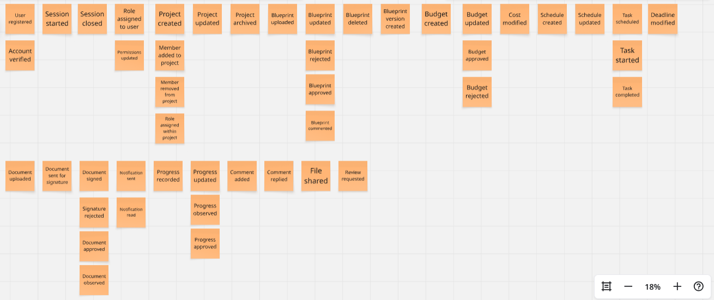
---

## Fase 2: Process Modeling - Comandos y Actores

En esta etapa de diseño de **Kipu**, identificamos quién inicia las acciones (**Actores** - etiquetas amarillas) y qué intención tienen (**Comandos** - etiquetas azules) para producir los eventos de dominio ya definidos en la fase anterior.

---

#### Gestión de Usuarios (User)
El **User** interactúa con el sistema para gestionar su cuenta mediante comandos como `Register`, `Verify`, `Start Session` y `Log out`. Por otro lado, el **Admin** interviene en la seguridad mediante comandos de control como `Asign role to user` y `Register Account`, permitiendo una gestión jerárquica y segura de los accesos a la plataforma.

#### Gestión de Proyectos (Project)
El **Project Manager** centraliza la actividad operativa del proyecto. Es el responsable de ejecutar comandos para `Create`, `Update` y `Delete project`. Además, gestiona al equipo de trabajo mediante acciones para agregar o remover miembros y asignar roles específicos dentro de la obra, asegurando que cada integrante tenga el contexto adecuado.

#### Planos y Diseño (Blueprint)
El **Admin** (o responsable técnico) lidera el flujo de ingeniería. Utiliza comandos para `Upload`, `Update` y `Create version` de planos. La lógica de negocio se consolida con la capacidad de ejecutar `Approve` o `Reject blueprint`, garantizando que solo el diseño técnico validado sea el que se ejecute en la obra.


#### Control Financiero (Budget)
Para garantizar la transparencia, existe una clara separación de responsabilidades. El **Project Manager** propone la estructura financiera con `Create budget`, mientras que el **Stakeholder** actúa como ente aprobador mediante `Approve` o `Reject budget`. El comando `Update budget` permite que el sistema refleje modificaciones de costos en tiempo real.

#### Cronograma (Schedule)
El **Project Manager** define la planificación mediante `Create/Update schedule` y `Schedule task`. La ejecución operativa recae en el **Team Member**, quien dispara los comandos `Start task` y `Complete task`, permitiendo que Kipu registre el avance temporal y detecte desviaciones en el cronograma.


#### Documentación y Firmas (Document)
El flujo legal es altamente colaborativo. El **User** carga y envía documentos para firma, mientras que el **Stakeholder** asume la responsabilidad crítica de `Sign document` o `Reject signature`. Finalmente, el **Manager** supervisa la integridad del proceso mediante `Approve document` u `Observe document` en caso de encontrar inconsistencias.

#### Sistema de Notificaciones
Se identifica al **System** como un actor automatizado que ejecuta el comando `Send notification` ante eventos clave. El **User** cierra este ciclo con el comando `Read notification`, garantizando que la información importante sea consumida y que no existan cuellos de botella por falta de comunicación.


#### Seguimiento de Avance (Progress)
El **Engineer / Supervisor** es el actor encargado de reportar la realidad del campo mediante `Record progress` y `Update progress`. Esta información es auditada por el **Project Manager**, quien decide `Approve progress` para validarlo formalmente u `Observe progress` si el avance físico no cumple con los estándares de calidad.

#### Colaboración y Comunicación (Collaboration)
El **Team Member** utiliza comandos sociales como `Add comment`, `Reply to comment` y `Share file` para mantener la comunicación centralizada en la plataforma. El **Project Manager** tiene la facultad de forzar revisiones críticas mediante el comando `Request review`, asegurando que los puntos de fricción sean atendidos oportunamente.


## 2.5. Ubiquitous Language

En esta sección se define el glosario de términos y conceptos fundamentales del dominio del negocio de construcción y arquitectura que manejamos dentro de la startup. Este lenguaje ubicuo asegura una comunicación efectiva y libre de ambigüedades entre los expertos del dominio, los usuarios (arquitectos, ingenieros y logísticos) y el equipo de desarrollo, evitando así la terminología técnica de software.

* **Blue Print (Plano):** A highly detailed technical drawing or architectural design used as a guide for constructing, remodeling, or sanitizing a building. Within the platform, a blueprint represents a dynamic entity that undergoes multiple revisions (versions). It is the primary reference document that the field team uses to execute the physical work, making strict version control essential to prevent critical construction errors.

* **Worksite (Obra):** The physical location or temporary endeavor where the construction, architecture, or sanitation project is actively being executed. The worksite is the core entity around which all logistical, budgetary, and personnel activities revolve. It acts as the central hub where material requests originate and where the progress of the execution is continuously tracked against the initial planning.

* **Technical Dossier (Expediente Técnico):** A comprehensive set of technical documents, blueprints, descriptive memories, and specifications required by municipal authorities to approve and legalize a construction or sanitation project. Managing the lifecycle and deadlines of the dossier is a critical administrative task, as failing to submit amendments or updates on time can result in project paralysis.

* **Site Manager (Residente de Obra / Supervisor):** The technical professional (typically an engineer or architect) who is physically present at the worksite and is directly responsible for overseeing the physical execution of the project. Their main responsibilities include tracking daily progress, ensuring compliance with the final version of the blueprints, and formally requesting necessary materials and tools from the central office to avoid workflow interruptions.

* **Logistics Officer (Encargado de Logística):** The administrative staff member working from the central office (back-office) responsible for the supply chain, inventory management, and budget control. They receive material requests from the worksite, coordinate with suppliers, and ensure that the right materials arrive at the worksite at the exact required time, avoiding duplication of purchases or out-of-stock scenarios.

* **Material Request (Requerimiento de Materiales):** A formal petition issued by the Site Manager from the worksite to the Logistics Officer, detailing the exact supplies, tools, or raw materials (e.g., cement, steel rods) needed to continue the construction execution. This request must be accurately tracked in real-time to prevent the common issue of informal or incorrect orders.

* **Budget (Presupuesto):** The detailed and anticipated calculation of the financial costs required to execute a worksite project. Throughout the construction lifecycle, the platform continuously contrasts the estimated budget against the real executed expenses, providing the administrative team with visibility over financial deviations or cost overruns.

* **Inventory (Inventario):** The real-time, centralized record of the quantity and location of construction materials, tools, and equipment owned by the company. It tracks items stored in the main warehouse as well as those distributed across multiple active worksites, enabling the logistics team to make informed purchasing decisions based on actual stock levels.

* **Purchase Order (Orden de Compra):** A formal, legally binding document issued by the Logistics Officer and sent to a Supplier, authorizing the acquisition of specific materials or equipment required to replenish the inventory or supply a worksite directly. It ensures transparency and traceability in the company's external expenditures.

* **Supplier (Proveedor):** An external third-party company or individual that provides the raw materials, specialized equipment, or tools required by the construction firm. Interactions with suppliers are managed by the logistics team through formal purchase orders to ensure timely delivery and exact material specifications.

* **Dashboard (Panel de control):** A highly visual, centralized interface used primarily by the administrative and logistics teams to obtain an immediate overview of the company's status. It utilizes graphical elements (such as charts, indicators, and alerts) to summarize complex data related to budgets, stock levels, and worksite progress, enabling rapid decision-making without the need to manually review extensive data tables.

---
# Capítulo III: Requirements Specification

## 3.1. User Stories.


**EPICS**

| **ID** | **Nombre de la Épica** | **Descripción** | **Criterios de Aceptación** |
| :--- | :--- | :--- | :--- |
| **EP01** | **Gestión de Calidad y Trazabilidad (RNC)** | Como Gestor Operativo, quiero registrar el avance y las incidencias técnicas para mantener el control estricto del proyecto. | **Escenario 1: Trazabilidad de RNC**<br>Dado que se detecta una falla técnica en la ejecución,<br>Cuando el usuario reporta la incidencia adjuntando evidencia visual,<br>Entonces el sistema debe generar un ticket inmutable en el historial del proyecto.<br><br>**Escenario 2: Automatización del PPC**<br>Dado que finaliza la jornada laboral,<br>Cuando el usuario actualiza el estado de sus actividades programadas,<br>Entonces el sistema debe calcular el Porcentaje de Plan Completado automáticamente. |
| **EP02** | **Control de Suministros y Presupuesto Meta** | Como Equipo de Logística, quiero auditar las solicitudes de materiales para evitar sobrecostos y quiebres de stock. | **Escenario 1: Bloqueo de Sobrecostos**<br>Dado que se procesa un nuevo requerimiento de materiales,<br>Cuando el monto proyectado excede el presupuesto meta de la partida,<br>Entonces el sistema debe bloquear la transacción y emitir una alerta a gerencia.<br><br>**Escenario 2: Reposición de Inventario**<br>Dado que el material se despacha hacia la obra,<br>Cuando el inventario restante alcanza el límite mínimo configurado,<br>Entonces el sistema debe notificar al área logística para su reposición inmediata. |
| **EP03** | **Visualización Técnica y Colaboración en Campo** | Como Residente de Obra, quiero acceder a la documentación oficial para garantizar que la construcción cumpla con el diseño. | **Escenario 1: Trazabilidad de Versiones**<br>Dado que un usuario consulta un plano arquitectónico,<br>Cuando accede al historial del documento,<br>Entonces el sistema debe listar todas las versiones previas, fechas y responsables del cambio.<br><br>**Escenario 2: Accesibilidad en Campo**<br>Dado que el usuario accede al sistema desde un dispositivo en obra,<br>Cuando visualiza los planos o cronogramas,<br>Entonces la plataforma debe adaptar su interfaz gráfica para asegurar la legibilidad en condiciones de alta luminosidad. |
| **EP04** | **Administración de Cuenta y Seguridad de Accesos** | Como usuario de la plataforma, quiero gestionar mi perfil y permisos para asegurar que la información del proyecto solo sea accesible según la jerarquía establecida. | **Escenario 1: Control de Accesos por Roles (RBAC)**<br>Dado que un nuevo usuario ingresa al ecosistema del proyecto,<br>Cuando se configura su cuenta con un rol técnico específico,<br>Entonces el sistema debe habilitar o restringir los módulos y datos correspondientes a su nivel de autorización.<br><br>**Escenario 2: Consistencia del Directorio**<br>Dado que un usuario actualiza sus datos de contacto profesional,<br>Cuando confirma las modificaciones en su perfil,<br>Entonces el sistema debe sincronizar automáticamente esta información en el directorio de los proyectos activos. |
| **EP05** | **Exploración Informativa y Registro (Landing Page)** | Como profesional de la construcción que visita la web por primera vez, quiero explorar una página introductoria clara sobre Kipu, para entender cómo resolverá mis problemas en obra y decidir si creo una cuenta. | **Escenario 1: Descubrimiento de Valor Operativo**<br>Dado que un visitante con perfil de residente/arquitecto ingresa a la página,<br>Cuando explora la sección de soluciones para obra,<br>Entonces el sistema debe presentarle los beneficios técnicos (RNC, PPC) y un botón directo para ingresar. |

<br><br>

**USER STORIES**
| Story ID  | Título                                                          | Descripción                                                                                                                                                                                                                                  | Criterios de Aceptación                                                                                                                                                                                                                                                                                                                                                                                                                                                                                                                                                                                                                                                                                              | Relacionado con (Epic ID) |
| :----------| :----------------------------------------------------------------| :---------------------------------------------------------------------------------------------------------------------------------------------------------------------------------------------------------------------------------------------| :---------------------------------------------------------------------------------------------------------------------------------------------------------------------------------------------------------------------------------------------------------------------------------------------------------------------------------------------------------------------------------------------------------------------------------------------------------------------------------------------------------------------------------------------------------------------------------------------------------------------------------------------------------------------------------------------------------------------| :--------------------------|
| **US-01** | Registro de cuenta nueva                                        | Como nuevo miembro del equipo, quiero registrarme en la plataforma para acceder a los datos del proyecto asignado.                                                                                                                           | **Escenario 1:** <br>Dado que un usuario no registrado accede al registro, <br>Cuando ingresa nombre completo, correo electrónico, contraseña alfanumérica y rol técnico válidos, <br>Entonces el sistema crea la cuenta y otorga acceso a la plataforma. <br><br>**Escenario 2:** <br>Dado que un usuario intenta registrarse, <br>Cuando ingresa un correo electrónico previamente registrado, <br>Entonces el sistema detiene el proceso y emite un mensaje de error.                                                                                                                                                                                                                                             | **EP04**                  |
| **US-02** | Visualización en "Modo Obra"                                    | Como residente, quiero activar el tema de alto contraste para visualizar datos bajo luz solar intensa sin fatiga.                                                                                                                            | **Escenario 1:** <br>Dado que el supervisor de obra utiliza el sistema, <br>Cuando activa la configuración de alto contraste, <br>Entonces el sistema ajusta la paleta de colores y el tamaño de la tipografía para mejorar la legibilidad. <br><br>**Escenario 2:** <br>Dado que la configuración de alto contraste se encuentra activa, <br>Cuando el supervisor de obra desactiva la opción, <br>Entonces el sistema restaura los valores visuales predeterminados.                                                                                                                                                                                                                                               | **EP03**                  |
| **US-03** | Registro de incidencia RNC                                      | Como supervisor, quiero registrar un Resultado No Conforme con fotos para que el error sea subsanado de inmediato.                                                                                                                           | **Escenario 1:** <br>Dado que el supervisor de obra detecta una falla técnica, <br>Cuando ingresa el título, partida afectada, descripción detallada y adjunta al menos una evidencia fotográfica, <br>Entonces el sistema registra el evento y envía una alerta a la supervisión. <br><br>**Escenario 2:** <br>Dado que el supervisor de obra intenta registrar el evento, <br>Cuando omite adjuntar evidencia fotográfica, <br>Entonces el sistema impide el registro y requiere obligatoriamente la inclusión de material visual.                                                                                                                                                                                 | **EP01**                  |
| **US-04** | Solicitud formal de materiales                                  | Como residente, quiero enviar pedidos de insumos desde la app para evitar errores de comunicación por canales informales.                                                                                                                    | **Escenario 1:** <br>Dado que el supervisor de obra requiere materiales, <br>Cuando ingresa el nombre del insumo, cantidad, unidad de medida y fecha máxima de llegada, <br>Entonces el sistema genera la solicitud en estado pendiente y asigna un identificador de seguimiento. <br><br>**Escenario 2:** <br>Dado que existe una solicitud en estado pendiente, <br>Cuando el supervisor de obra modifica la cantidad solicitada, <br>Entonces el sistema actualiza el registro y notifica el cambio al equipo de logística.                                                                                                                                                                                       | **EP02**                  |
| **US-05** | Visualizar alerta de stock bajo (cualquier material crítico)    | Como Encargado de Logística, quiero recibir una alerta visual cuando cualquier material crítico (ej. acero, cemento) alcance su nivel mínimo, para generar órdenes de compra antes de que ocurra un quiebre de stock.                        | **Escenario 1:** <br>Dado que un material crítico tiene configurado un límite mínimo, <br>Cuando el inventario desciende por debajo de dicho límite, <br>Entonces el sistema emite una alerta preventiva de stock bajo. <br><br>**Escenario 2:** <br>Dado que el inventario se encuentra por debajo del límite mínimo, <br>Cuando el sistema realiza la verificación diaria programada a la medianoche, <br>Entonces el sistema envía un aviso de reposición al equipo de logística.                                                                                                                                                                                                                                 | **EP02**                  |
| **US-06** | Firma digital de actas (Token)                                  | Como ingeniero residente, quiero firmar actas de conformidad con un token para asegurar la validez legal del cierre de etapa.                                                                                                                | **Escenario 1:** <br>Dado que el supervisor de obra revisa un acta de cierre, <br>Cuando ingresa el código numérico de seguridad de seis dígitos y confirma la acción, <br>Entonces el sistema valida la información y aplica el sello criptográfico de aprobación al documento. <br><br>**Escenario 2:** <br>Dado que el supervisor de obra intenta confirmar el acta, <br>Cuando ingresa un código incorrecto o expirado, <br>Entonces el sistema rechaza la solicitud y mantiene el documento en estado sin firmar.                                                                                                                                                                                               | **EP01**                  |
| **US-07** | Validación de compra vs Presupuesto (con autorización especial) | Como jefe de compras, quiero que el sistema valide cada orden de compra contra el presupuesto asignado a la partida, bloqueándola o solicitando autorización especial según el excedente, para evitar pérdidas de utilidad.                  | **Escenario 1:** <br>Dado que el equipo de logística procesa un pedido, <br>Cuando el monto excede el presupuesto asignado en más de un diez por ciento, <br>Entonces el sistema bloquea la transacción y emite un mensaje de error. <br><br>**Escenario 2:** <br>Dado que el equipo de logística procesa un pedido, <br>Cuando el monto se encuentra dentro del presupuesto, <br>Entonces el sistema aprueba la transacción y reduce el saldo disponible. <br><br>**Escenario 3:** <br>Dado que el equipo de logística procesa un pedido, <br>Cuando el monto excede el presupuesto hasta en un diez por ciento, <br>Entonces el sistema retiene la transacción y requiere una autorización superior para proceder. | **EP02**                  |
| **US-08** | Filtro de planos por especialidad                               | Como técnico, quiero filtrar los planos por tipo (Sanitarias, Eléctricas, etc.) para localizar el diseño vigente rápidamente.                                                                                                                | **Escenario 1:** <br>Dado que el supervisor de obra consulta el repositorio documental, <br>Cuando aplica el filtro por especialidad, <br>Entonces el sistema muestra únicamente los documentos correspondientes a dicha categoría. <br><br>**Escenario 2:** <br>Dado que el supervisor de obra busca un plano específico, <br>Cuando aplica filtros simultáneos de especialidad y estado de aprobación, <br>Entonces el sistema retorna exclusivamente los documentos que cumplen con todos los criterios seleccionados.                                                                                                                                                                                            | **EP03**                  |
| **US-09** | Cálculo automático de KPI (PPC)                                 | Como gerente, quiero visualizar el Porcentaje de Plan Completado semanal para medir la productividad real de la obra.                                                                                                                        | **Escenario 1:** <br>Dado que el supervisor de obra consulta el módulo de indicadores, <br>Cuando el sistema evalúa las tareas programadas y completadas de la semana en curso, <br>Entonces el sistema calcula y expone el porcentaje de cumplimiento. <br><br>**Escenario 2:** <br>Dado que el supervisor de obra consulta los indicadores de desempeño, <br>Cuando define un rango de fechas específico, <br>Entonces el sistema calcula el porcentaje considerando exclusivamente los registros de ese periodo temporal.                                                                                                                                                                                         | **EP01**                  |
| **US-10** | Historial de cambios en planos                                  | Como arquitecto, quiero ver el registro de versiones de un plano para asegurar que el equipo no use diseños obsoletos.                                                                                                                       | **Escenario 1:** <br>Dado que el supervisor de obra consulta la trazabilidad de un plano, <br>Cuando solicita visualizar las versiones anteriores, <br>Entonces el sistema presenta la información con número de versión, fecha de actualización, responsable y notas de cambio. <br><br>**Escenario 2:** <br>Dado que el supervisor de obra revisa el historial de un plano, <br>Cuando ordena la restauración de una versión anterior, <br>Entonces el sistema reasigna la condición de versión vigente a dicho archivo y marca la versión actual como obsoleta.                                                                                                                                                   | **EP03**                  |
| **US-11** | Subir nueva versión de plano                                    | Como Residente de Obra,<br>Quiero subir una nueva versión actualizada de un plano técnico,<br>Para asegurar que el equipo en campo construya basándose en el diseño final aprobado.                                                          | **Escenario 1:** <br>Dado que el supervisor de obra actualiza un documento técnico, <br>Cuando adjunta un archivo en formato admitido, selecciona su categoría e ingresa las notas de cambio, <br>Entonces el sistema incrementa el correlativo de versión y establece el nuevo archivo como el documento vigente. <br><br>**Escenario 2:** <br>Dado que el supervisor de obra intenta cargar una actualización, <br>Cuando el archivo adjunto no posee el formato admitido o excede el peso límite, <br>Entonces el sistema impide el registro y notifica la restricción técnica.                                                                                                                                   | **EP03**                  |
| **US-12** | Atender solicitud de materiales                                 | Como Encargado de Logística,<br>Quiero cambiar el estado de las solicitudes de materiales a "Aprobado" o "Rechazado",<br>Para mantener al equipo de obra informado sobre la disponibilidad de los insumos.                                   | **Escenario 1:** <br>Dado que el equipo de logística evalúa un requerimiento en estado pendiente, <br>Cuando registra la aprobación de la solicitud, <br>Entonces el sistema actualiza el estado a en proceso e informa al supervisor de obra. <br><br>**Escenario 2:** <br>Dado que el equipo de logística evalúa un requerimiento, <br>Cuando determina el rechazo de la solicitud, <br>Entonces el sistema exige obligatoriamente la captura de una justificación antes de asentar el estado.                                                                                                                                                                                                                     | **EP02**                  |
| **US-13** | Actualizar inventario general                                   | Como Encargado de Logística,<br>Quiero actualizar las cantidades de los materiales en el almacén central,<br>Para mantener un registro exacto del stock físico disponible para las obras.                                                    | **Escenario 1:** <br>Dado que el equipo de logística gestiona las existencias físicas, <br>Cuando ingresa un valor numérico positivo para adicionar, <br>Entonces el sistema incrementa el inventario del material y asienta la responsabilidad del usuario. <br><br>**Escenario 2:** <br>Dado que el equipo de logística intenta modificar el inventario, <br>Cuando introduce valores de texto o números negativos, <br>Entonces el sistema bloquea la modificación y requiere el ingreso de cantidades numéricas positivas válidas.                                                                                                                                                                               | **EP02**                  |
| **US-14** | Registrar avance diario de obra                                 | Como Residente de Obra,<br>Quiero registrar el porcentaje de avance físico del proyecto diariamente,<br>Para mantener la trazabilidad de la ejecución real frente al cronograma.                                                             | **Escenario 1:** <br>Dado que el supervisor de obra asienta el reporte operativo, <br>Cuando ingresa un porcentaje de progreso, especifica la fecha y detalla una observación, <br>Entonces el sistema almacena el registro y recalcula el avance general del proyecto. <br><br>**Escenario 2:** <br>Dado que el supervisor de obra asienta el reporte operativo, <br>Cuando ingresa un porcentaje fuera del rango válido de cero a cien, <br>Entonces el sistema restringe el registro y solicita corregir la magnitud numérica.                                                                                                                                                                                    | **EP01**                  |
| **US-15** | Cambiar estado del proyecto                                     | Como Administrador del Sistema,<br>Quiero modificar el estado global de una obra (ej. En ejecución, Paralizada, Finalizada),<br>Para reflejar la situación operativa actual ante todos los usuarios.                                         | **Escenario 1:** <br>Dado que el administrador gestiona la configuración de la obra, <br>Cuando cambia la situación operativa a paralizada y justifica la decisión, <br>Entonces el sistema restringe a todos los usuarios la creación de nuevos requerimientos y documentos en dicho proyecto. <br><br>**Escenario 2:** <br>Dado que un proyecto posee la situación operativa de paralizado, <br>Cuando el administrador lo restituye al estado en ejecución, <br>Entonces el sistema levanta las restricciones de registro en todos los módulos de la obra.                                                                                                                                                        | **EP04**                  |
| **US-16** | Visualizar Dashboard logístico                                  | Como Encargado de Logística,<br>Quiero visualizar un resumen gráfico de requerimientos pendientes y presupuesto ejecutado,<br>Para tomar decisiones de compra rápidas sin tener que cruzar datos de Excel.                                   | **Escenario 1:** <br>Dado que el equipo de logística consulta su entorno operativo, <br>Cuando existen datos financieros procesados, <br>Entonces el sistema presenta la relación comparativa entre solicitudes en espera y completadas, además del acumulado financiero aprobado. <br><br>**Escenario 2:** <br>Dado que el equipo de logística consulta su entorno operativo, <br>Cuando no existen transacciones asentadas en el periodo actual, <br>Entonces el sistema expone un aviso notificando la insuficiencia de datos para procesar métricas.                                                                                                                                                             | **EP02**                  |
| **US-17** | Asignar roles a usuarios                                        | Como Administrador del Sistema,<br>Quiero asignar o modificar los permisos de los trabajadores en la plataforma,<br>Para asegurar que cada empleado solo tenga acceso a los módulos correspondientes a su cargo.                             | **Escenario 1:** <br>Dado que el administrador gestiona el perfil de un colaborador, <br>Cuando le atribuye el rol operativo de logística, <br>Entonces el sistema reasigna los privilegios, habilitando las funciones de inventario y revocando el acceso a diseño técnico. <br><br>**Escenario 2:** <br>Dado que el administrador gestiona sus propias credenciales, <br>Cuando intenta degradar sus privilegios sistémicos a un nivel inferior, <br>Entonces el sistema impide la acción para evitar la pérdida de control administrativo.                                                                                                                                                                        | **EP04**                  |
| **US-18** | Confirmación de recepción de materiales                         | Como Residente de Obra, quiero registrar si los materiales llegaron completos y en buen estado a la obra, para alertar a logística de envíos defectuosos por parte del proveedor.                                                            | **Escenario 1:** <br>Dado que el supervisor de obra recibe mercancía, <br>Cuando asienta la conformidad total del suministro, <br>Entonces el sistema cierra el ciclo de la solicitud estableciendo su estado como entregado. <br><br>**Escenario 2:** <br>Dado que el supervisor de obra detecta anomalías en la mercancía recibida, <br>Cuando asienta la recepción con observaciones, <br>Entonces el sistema exige la redacción del problema detectado y cursa una alerta prioritaria al equipo de logística.                                                                                                                                                                                                    | **EP02**                  |
| **US-19** | Gestión de fechas límite de expedientes                         | Como Gestor Operativo, quiero configurar fechas de vencimiento para los trámites municipales, para recibir recordatorios automáticos y evitar multas o paralizaciones.                                                                       | **Escenario 1:** <br>Dado que el supervisor de obra registra un trámite técnico, <br>Cuando establece una fecha límite de gestión, <br>Entonces el sistema activa un seguimiento cronológico visible en el panel del proyecto. <br><br>**Escenario 2:** <br>Dado que un trámite técnico posee una fecha límite registrada, <br>Cuando el seguimiento cronológico marca un plazo de tres días previos al vencimiento, <br>Entonces el sistema remite una alerta preventiva a los involucrados en la gestión.                                                                                                                                                                                                          | **EP01**                  |
| **US-20** | Generar enlace de reporte para clientes                         | Como Gerente, quiero generar un enlace de solo lectura con el resumen del avance, para enviarlo al cliente (inversor) y mantenerlo informado sin que necesite crear una cuenta.                                                              | **Escenario 1:** <br>Dado que el supervisor de obra requiere compartir progresos, <br>Cuando solicita emitir un reporte externo, <br>Entonces el sistema genera una ruta de acceso única que expone métricas y registros fotográficos. <br><br>**Escenario 2:** <br>Dado que un usuario externo accede al reporte mediante la ruta de acceso, <br>Cuando intenta explorar módulos operativos o financieros, <br>Entonces el sistema deniega el acceso, garantizando un entorno de visualización exclusivo y limitado.                                                                                                                                                                                                | **EP01**                  |
| **US-21** | Generación de Orden de Compra en PDF                            | Como Encargado de Logística, quiero exportar un requerimiento aprobado en formato PDF, para enviarlo como Orden de Compra formal al proveedor.                                                                                               | **Escenario 1:** <br>Dado que el equipo de logística gestiona una solicitud aprobada, <br>Cuando ejecuta la orden de exportación documental, <br>Entonces el sistema consolida un archivo con los pormenores del requerimiento y los espacios de validación comercial. <br><br>**Escenario 2:** <br>Dado que el equipo de logística visualiza una solicitud pendiente o denegada, <br>Cuando busca realizar la exportación documental, <br>Entonces el sistema mantiene inhabilitada la opción para evitar emisiones inválidas.                                                                                                                                                                                      | **EP02**                  |
| **US-22** | Descarga de planos para uso Offline                             | Como Residente de Obra, quiero descargar la versión vigente del plano a mi dispositivo, para poder consultarlo cuando esté en sótanos o áreas de la obra sin cobertura de internet.                                                          | **Escenario 1:** <br>Dado que el supervisor de obra consulta el repositorio documental con conectividad de red, <br>Cuando ejecuta la orden de descarga sobre un archivo vigente, <br>Entonces el sistema transfiere una copia al almacenamiento local del dispositivo. <br><br>**Escenario 2:** <br>Dado que el supervisor de obra intenta descargar un archivo categorizado como obsoleto, <br>Cuando ejecuta la orden de descarga, <br>Entonces el sistema detiene la transferencia y demanda una ratificación explícita para continuar.                                                                                                                                                                          | **EP03**                  |
| **US-23** | Visor de planos con anotaciones digitales                       | Como residente de obra, quiero agregar anotaciones digitales (texto y dibujo libre) directamente sobre el plano de cimentación, para reportar interferencias detectadas en campo inmediatamente al equipo de diseño sin usar papel.          | **Escenario 1:** <br>Dado que el supervisor de obra revisa un documento técnico interactivo, <br>Cuando introduce marcadores o trazos sobre un área, <br>Entonces el sistema vincula y almacena estas anotaciones en las coordenadas espaciales exactas del diseño. <br><br>**Escenario 2:** <br>Dado que el supervisor de obra finaliza sus anotaciones sobre un documento técnico, <br>Cuando envía el reporte de interferencia, <br>Entonces el sistema comunica la eventualidad al equipo de diseño adjuntando la ubicación del documento marcado.                                                                                                                                                               | **EP03**                  |
| **US-24** | Exportación del Libro de Obra (Cierre)                          | Como Administrador del Sistema, quiero compilar toda la documentación histórica al finalizar el proyecto, para entregar el "Libro de Obra" digital exigido por ley.                                                                          | **Escenario 1:** <br>Dado que la condición operativa del proyecto indica su conclusión, <br>Cuando el administrador solicita la compilación del libro final, <br>Entonces el sistema empaqueta y entrega el conjunto completo de validaciones, incidencias solucionadas y documentos técnicos vigentes. <br><br>**Escenario 2:** <br>Dado que un proyecto mantiene su situación operativa en ejecución, <br>Cuando el administrador intenta compilar el libro final, <br>Entonces el sistema restringe el proceso señalando la falta de conclusión.                                                                                                                                                                  | **EP01**                  |
| **US-25** | Directorio de Proveedores Frecuentes                            | Como Encargado de Logística, quiero mantener un registro de mis proveedores, para acelerar la emisión de órdenes de compra sin tener que buscar sus datos de contacto externamente.                                                          | **Escenario 1:** <br>Dado que el equipo de logística registra una entidad comercial, <br>Cuando provee la identificación tributaria, nombre legal y contacto, <br>Entonces el sistema incorpora la entidad al directorio operativo. <br><br>**Escenario 2:** <br>Dado que el equipo de logística confecciona una solicitud comercial, <br>Cuando inicia la captura de datos de la entidad proveedora, <br>Entonces el sistema autocompleta la información tomando como base los registros del directorio operativo.                                                                                                                                                                                                  | **EP02**                  |
| **US-26** | Recuperación de contraseña                                      | Como usuario del sistema, quiero poder solicitar un enlace de restablecimiento si olvido mi contraseña, para recuperar el acceso a mi cuenta sin depender del administrador.                                                                 | **Escenario 1:** <br>Dado que un usuario requiere restaurar su acceso, <br>Cuando envía una solicitud con un identificador de correo válido, <br>Entonces el sistema provee una credencial temporal de restablecimiento. <br><br>**Escenario 2:** <br>Dado que un usuario intenta establecer una nueva credencial de seguridad, <br>Cuando los datos proporcionados no satisfacen las políticas de complejidad mínimas, <br>Entonces el sistema rechaza la actualización y exige parámetros seguros.                                                                                                                                                                                                                 | **EP04**                  |
| **US-27** | Desactivación de personal retirado                              | Como Administrador del Sistema, quiero desactivar la cuenta de un trabajador que dejó la empresa, para revocar su acceso sin borrar su nombre de los historiales de firmas y planos.                                                         | **Escenario 1:** <br>Dado que el administrador ajusta la nómina del sistema, <br>Cuando modifica la condición de un perfil operativo a inactivo, <br>Entonces el sistema anula permanentemente su capacidad de autenticación. <br><br>**Escenario 2:** <br>Dado que un perfil operativo se encuentra en condición inactiva, <br>Cuando se auditan expedientes o documentos refrendados en el pasado, <br>Entonces el sistema preserva la identidad y autoría original de dicho usuario en el registro.                                                                                                                                                                                                               | **EP04**                  |
| **US-28** | Notificaciones automáticas de nuevas versiones de planos        | Como residente de obra, quiero recibir una alerta automática (push y email) cuando el arquitecto suba una nueva versión de un plano, para evitar continuar la construcción con diseños obsoletos.                                            | **Escenario 1:** <br>Dado que se introduce una modificación a un documento técnico, <br>Cuando el sistema asienta el nuevo archivo, <br>Entonces emite alertas directas y correos electrónicos a los supervisores de obra involucrados con versiones previas. <br><br>**Escenario 2:** <br>Dado que un supervisor de obra ha restringido las alertas directas, <br>Cuando el sistema asienta un nuevo archivo técnico, <br>Entonces informa la novedad apoyándose de manera exclusiva en el correo electrónico.                                                                                                                                                                                                      | **EP03**                  |
| **US-29** | Exportación de Dossier de Calidad en PDF                        | Como administrador de proyecto, quiero exportar un archivo PDF que contenga todo el historial de firmas electrónicas y aprobaciones de una etapa constructiva, para facilitar la entrega del proyecto a la municipalidad o al cliente final. | **Escenario 1:** <br>Dado que el administrador consulta una fase operativa finalizada, <br>Cuando instruye la extracción del dossier, <br>Entonces el sistema consolida las validaciones y su cronograma de aprobaciones en un documento integral. <br><br>**Escenario 2:** <br>Dado que el administrador requiere información segmentada, <br>Cuando establece criterios de fecha o tipología documental antes de la extracción, <br>Entonces el sistema consolida un documento que satisface exclusivamente dichos parámetros de filtrado.                                                                                                                                                                         | **EP01**                  |
| **US-30** | Registro de material dañado y sobrante por jornada              | Como almacenero de obra, quiero registrar por jornada la cantidad de material dañado o sobrante, para que el sistema acumule esos datos y ayude a ajustar futuras compras reduciendo desperdicios.                                           | **Escenario 1:** <br>Dado que el equipo de logística identifica insumos mermados, <br>Cuando reporta el volumen y clasificación del material afectado, <br>Entonces el sistema asienta el detrimento y ajusta los saldos del inventario de forma automática. <br><br>**Escenario 2:** <br>Dado que el equipo de logística gestiona insumos no utilizados, <br>Cuando asienta los datos para el reintegro al proveedor, <br>Entonces el sistema formula un ajuste financiero sugerido y recompone el inventario activo.                                                                                                                                                                                               | **EP02**                  |
| **US-31** | Eliminación de cuenta (soft delete)                             | Como administrador del sistema, quiero desactivar una cuenta sin eliminar sus datos históricos, para mantener la integridad de la auditoría.                                                                                                 | **Escenario 1:** <br>Dado que el administrador revoca la habilitación de un perfil, <br>Cuando dicho perfil intenta autenticarse, <br>Entonces el sistema bloquea el ingreso a la plataforma operativa. <br><br>**Escenario 2:** <br>Dado que un perfil carece de habilitación activa, <br>Cuando se revisan trazas de auditoría o históricos de transacciones, <br>Entonces el sistema mantiene íntegra y visible la información del autor.                                                                                                                                                                                                                                                                         | **EP04**                  |
| **US-32** | Visualizar detalle de solicitud de material                     | Como residente de obra, quiero ver el detalle completo de una solicitud, para validar la información antes de seguimiento.                                                                                                                   | **Escenario 1:** <br>Dado que el supervisor de obra investiga un requerimiento en curso, <br>Cuando accede a sus propiedades, <br>Entonces el sistema expone los atributos completos de nombre, cantidad, métrica, condición y fecha. <br><br>**Escenario 2:** <br>Dado que un usuario carece de los roles asignados a una obra específica, <br>Cuando intenta inspeccionar los requerimientos de la misma, <br>Entonces el sistema restringe la exposición de datos operativos.                                                                                                                                                                                                                                     | **EP02**                  |
| **US-33** | Descargar acta firmada                                          | Como usuario, quiero descargar un acta firmada, para almacenarla o compartirla externamente.                                                                                                                                                 | **Escenario 1:** <br>Dado que un documento cuenta con la totalidad de refrendos requeridos, <br>Cuando el usuario solicita su extracción, <br>Entonces el sistema habilita y procesa la transferencia del archivo. <br><br>**Escenario 2:** <br>Dado que un documento presenta ausencia de refrendos, <br>Cuando el usuario requiere su extracción, <br>Entonces el sistema inhibe la funcionalidad de transferencia para evitar la distribución de borradores.                                                                                                                                                                                                                                                      | **EP01**                  |
| **US-34** | Ordenar lista de planos                                         | Como usuario técnico, quiero ordenar los planos por fecha o versión, para encontrar rápidamente el más reciente.                                                                                                                             | **Escenario 1:** <br>Dado que el supervisor de obra consulta el catálogo documental, <br>Cuando aplica el ordenamiento cronológico, <br>Entonces el sistema reorganiza los registros basándose en su fecha de asientamiento. <br><br>**Escenario 2:** <br>Dado que el supervisor de obra consulta el catálogo documental, <br>Cuando aplica el ordenamiento por iteración técnica, <br>Entonces el sistema estructura los registros de mayor a menor jerarquía de versión.                                                                                                                                                                                                                                           | **EP03**                  |
| **US-35** | Visualizar presupuesto restante                                 | Como jefe de compras, quiero ver el presupuesto disponible de una partida, para tomar decisiones antes de comprar.                                                                                                                           | **Escenario 1:** <br>Dado que el equipo de logística investiga un rubro operativo, <br>Cuando expone los datos económicos, <br>Entonces el sistema contrasta el fondo asignado frente al remanente disponible. <br><br>**Escenario 2:** <br>Dado que el equipo de logística consolida una transacción comercial, <br>Cuando la operación adquiere validez, <br>Entonces el sistema deduce el impacto económico del remanente de manera automática.                                                                                                                                                                                                                                                                   | **EP02**                  |
| **US-36** | Visualizar lista de usuarios del proyecto                       | Como administrador, quiero ver todos los usuarios asignados a un proyecto, para gestionar el equipo de trabajo.                                                                                                                              | **Escenario 1:** <br>Dado que el administrador revisa la composición del equipo de obra, <br>Cuando accede a la gestión de personal, <br>Entonces el sistema enlista a los colaboradores detallando sus credenciales y roles asignados. <br><br>**Escenario 2:** <br>Dado que ocurre una incorporación o baja en el equipo de obra, <br>Cuando el administrador solicita la información actualizada, <br>Entonces el sistema refleja las variaciones en la nómina operativa del proyecto.                                                                                                                                                                                                                            | **EP04**                  |
| **US-37** | Marcar notificación como leída                                  | Como usuario, quiero marcar una notificación como leída, para mantener organizado mi panel.                                                                                                                                                  | **Escenario 1:** <br>Dado que el supervisor de obra atiende una alerta operativa, <br>Cuando decreta su revisión, <br>Entonces el sistema retira el distintivo de pendiente. <br><br>**Escenario 2:** <br>Dado que una alerta operativa fue revisada en el pasado, <br>Cuando el supervisor de obra accede a la bandeja histórica, <br>Entonces el sistema preserva la condición de revisión sin mostrar falsos pendientes.                                                                                                                                                                                                                                                                                          | **EP04**                  |
| **US-38** | Visualizar materiales por categoría                             | Como encargado de logística, quiero filtrar materiales por categoría, para gestionar mejor el inventario.                                                                                                                                    | **Escenario 1:** <br>Dado que el equipo de logística explora el almacén digital, <br>Cuando restringe la búsqueda a una familia de insumos, <br>Entonces el sistema presenta únicamente los elementos vinculados a dicha familia. <br><br>**Escenario 2:** <br>Dado que el equipo de logística busca una familia de insumos vacía, <br>Cuando restringe la búsqueda a dicho parámetro, <br>Entonces el sistema informa sobre la ausencia de existencias.                                                                                                                                                                                                                                                             | **EP02**                  |
| **US-39** | Visualizar estado del proyecto                                  | Como usuario, quiero ver el estado actual del proyecto, para entender su situación operativa.                                                                                                                                                | **Escenario 1:** <br>Dado que el supervisor de obra accede a las métricas iniciales, <br>Cuando la información se estructura, <br>Entonces el sistema exhibe la fase operativa vigente en la que se encuentra la obra. <br><br>**Escenario 2:** <br>Dado que la administración modifica la fase operativa de la obra, <br>Cuando el supervisor de obra actualiza sus métricas iniciales, <br>Entonces el sistema exhibe el nuevo escenario operativo reflejando los últimos cambios administrativos.                                                                                                                                                                                                                 | **EP04**                  |
| **US-40** | Confirmar eliminación de registro                               | Como usuario, quiero confirmar antes de eliminar un registro, para evitar acciones accidentales.                                                                                                                                             | **Escenario 1:** <br>Dado que el supervisor de obra solicita suprimir un registro, <br>Cuando el sistema demanda una segunda verificación, <br>Entonces el supervisor debe ratificar la orden para concretar la eliminación en la base de datos. <br><br>**Escenario 2:** <br>Dado que el supervisor de obra evalúa la segunda verificación de eliminación, <br>Cuando interrumpe la confirmación, <br>Entonces el sistema detiene el proceso y preserva el registro intacto.                                                                                                                                                                                                                                        | **EP04**                  |
| **US-41** | Bitácora fotográfica de excavaciones                            | Como supervisor de obras, quiero crear una galería específica para la etapa de excavación para documentar el tipo de suelo encontrado y evitar reclamos futuros.                                                                             | **Escenario 1:** <br>Dado que el supervisor de obra introduce evidencia visual de terreno, <br>Cuando clasifica los archivos bajo el concepto de suelo, <br>Entonces el sistema los compila en orden secuencial asignándolos a la fase de excavación correspondiente. <br><br>**Escenario 2:** <br>Dado que el supervisor de obra requiere fundamentar un hallazgo, <br>Cuando compila los registros visuales, <br>Entonces el sistema estructura un documento oficial conteniendo la evidencia gráfica, fechas y referencias espaciales.                                                                                                                                                                            | **EP01**                  |
| **US-42** | Seguimiento de órdenes de cambio                                | Como arquitecto ayudante de logística, quiero registrar modificaciones al contrato original solicitadas por el cliente para ajustar el presupuesto y cronograma oficial.                                                                     | **Escenario 1:** <br>Dado que el equipo de logística asienta una variación exigida al contrato, <br>Cuando ingresa las modificaciones en los requisitos, <br>Entonces el sistema determina el saldo económico a favor o en contra y lo somete a aprobación superior. <br><br>**Escenario 2:** <br>Dado que una variación contractual es validada, <br>Cuando el impacto altera la duración del esfuerzo constructivo, <br>Entonces el sistema recalibra los plazos establecidos en el plan maestro del proyecto.                                                                                                                                                                                                     | **EP01**                  |
| **US-43** | Control de herramientas asignadas                               | Como ayudante de logística, quiero registrar las herramientas eléctricas asignadas (taladros, amoladoras) a un obrero específico para que sea el responsable de su devolución en buen estado.                                                | **Escenario 1:** <br>Dado que el equipo de logística entrega un activo menor, <br>Cuando lo asocia al código identificador del obrero, <br>Entonces el sistema adjudica la responsabilidad de custodia al perfil del trabajador. <br><br>**Escenario 2:** <br>Dado que un obrero retorna un activo menor a custodia, <br>Cuando el equipo de logística asienta el ingreso, <br>Entonces el sistema demanda certificar la integridad del activo o registrar daños detectados durante su uso.                                                                                                                                                                                                                          | **EP02**                  |
| **US-44** | Exportación de reporte de asistencia mensual                    | Como supervisor de obra, quiero exportar las asistencias del mes a un archivo CSV para facilitar el cálculo de la planilla en el software contable.                                                                                          | **Escenario 1:** <br>Dado que el supervisor de obra audita la jornada laboral, <br>Cuando extrae la compilación mensual, <br>Entonces el sistema provee un archivo de formato crudo compatible con el manejo contable mostrando los días laborados. <br><br>**Escenario 2:** <br>Dado que el supervisor de obra gestiona cuadrillas en diferentes locaciones, <br>Cuando especifica una locación antes de extraer los datos, <br>Entonces el sistema provee la compilación exclusiva del personal adscrito a dicha área de trabajo.                                                                                                                                                                                  | **EP04**                  |
| **US-45** | Visualización de planos en 3D                                   | Como arquitecto ayudante de logística, quiero visualizar modelos 3D sencillos (formatos glTF/OBJ) para realizar implementaciones extra de manera efectiva.                                                                                   | **Escenario 1:** <br>Dado que el equipo de logística consulta la planimetría tridimensional validada, <br>Cuando accede a su inspección, <br>Entonces el sistema habilita el estudio volumétrico permitiendo detectar conflictos físicos previos a la ejecución. <br><br>**Escenario 2:** <br>Dado que el equipo de logística intenta almacenar modelos tridimensionales, <br>Cuando provee archivos con estándares geométricos compatibles, <br>Entonces el sistema incorpora la información y activa las capacidades de inspección.                                                                                                                                                                                | **EP03**                  |
| **US-46** | Gestión de residuos de construcción                             | Como ayudante de logística, quiero registrar el volumen de residuos retirados de la obra para cumplir con la normativa ambiental municipal.                                                                                                  | **Escenario 1:** <br>Dado que el equipo de logística documenta el flujo de desmonte, <br>Cuando informa la volumetría saliente y los datos de transporte, <br>Entonces el sistema adiciona la métrica a los parámetros de control ecológico de la obra. <br><br>**Escenario 2:** <br>Dado que el área de acopio de excedentes incrementa su carga, <br>Cuando la volumetría roza el límite de tolerancia técnica, <br>Entonces el sistema despacha una señal preventiva para programar traslados.                                                                                                                                                                                                                    | **EP01**                  |
| **US-47** | Registro de mantenimiento de maquinaria                         | Como ayudante de logística, quiero programar alertas de mantenimiento para las mezcladoras según horas de uso para evitar paradas por avería.                                                                                                | **Escenario 1:** <br>Dado que el equipo de logística fiscaliza la maquinaria pesada, <br>Cuando el uso continuo supera el margen operativo seguro, <br>Entonces el sistema lanza un requerimiento de servicio mecánico a los encargados. <br><br>**Escenario 2:** <br>Dado que una maquinaria recibe intervención técnica, <br>Cuando el equipo de logística asienta la finalización del servicio, <br>Entonces el sistema reinicia la métrica de uso y custodia el historial de la intervención de forma permanente.                                                                                                                                                                                                | **EP02**                  |
| **US-48** | Contenido para gestores operativos               | Como arquitecto o ingeniero que visita el sitio, quiero encontrar información específica sobre cómo Kipu mejora la supervisión técnica y trazabilidad de obra para evaluar si se adapta a mis necesidades profesionales.                     | **Escenario 1:** <br>Dado que un visitante evalúa la capacidad de control operativo en el portal, <br>Cuando analiza las funciones para campo, <br>Entonces el sistema mantiene opciones directas para iniciar el proceso de suscripción. <br><br>**Escenario 2:** <br>Dado que un visitante inicia su suscripción durante la evaluación operativa, <br>Cuando avanza hacia el registro, <br>Entonces el sistema configura automáticamente su perfil con los atributos propios de un gestor operativo en campo.                                                                                                                                                                                                      | **EP05**                  |
| **US-49** | Contenido para equipos de logística              | Como responsable de logística o administración que visita el sitio, quiero encontrar información específica sobre cómo Kipu centraliza pedidos y controla presupuestos para convencerme de su utilidad en mi área.                           | **Escenario 1:** <br>Dado que un visitante analiza la gestión financiera e inventarios en el portal, <br>Cuando demanda una prueba guiada, <br>Entonces el sistema requiere la recopilación de sus datos de contacto institucionales. <br><br>**Escenario 2:** <br>Dado que un visitante suministra sus datos institucionales para una prueba, <br>Cuando valida la entrega de información, <br>Entonces el sistema registra al interesado y provee la constancia de que su requerimiento será atendido en breve.                                                                                                                                                                                                    | **EP05**                  |
| **US-50** | Presentación de Kipu y propuesta de valor                       | Como visitante nuevo, quiero entender qué es Kipu y qué problema resuelve, para decidir si continúo explorando la plataforma.                                                                                                                | **Escenario 1:** <br>Dado que el usuario entra por primera vez a la landing page, <br>Cuando visualiza la sección principal, <br>Entonces el sistema muestra un mensaje claro con la propuesta de valor de Kipu y un resumen breve del beneficio principal. <br><br>**Escenario 2:** <br>Dado que el usuario termina de leer la introducción, <br>Cuando avanza por la página, <br>Entonces el sistema refuerza el propósito de la plataforma con llamados visuales consistentes.                                                                                                                                                                                                                                    | **EP05**                  |
| **US-51** | Visualización de funcionalidades principales                    | Como visitante interesado, quiero ver las funcionalidades principales de Kipu, para identificar rápidamente si la solución cubre mis necesidades.                                                                                            | **Escenario 1:** <br>Dado que el visitante revisa la landing page, <br>Cuando llega a la sección de funcionalidades, <br>Entonces el sistema presenta las capacidades clave de la plataforma en tarjetas o bloques visuales. <br><br>**Escenario 2:** <br>Dado que el usuario compara la información mostrada, <br>Cuando explora cada funcionalidad, <br>Entonces el sistema permite entender con claridad qué puede hacer dentro de Kipu.                                                                                                                                                                                                                                                                          | **EP05**                  |
| **US-52** | Presentación de misión y visión                                 | Como visitante potencial, quiero conocer la misión y visión de Kipu, para confiar en la identidad y dirección del proyecto.                                                                                                                  | **Escenario 1:** <br>Dado que el usuario navega por la página informativa, <br>Cuando llega a la sección institucional, <br>Entonces el sistema muestra la misión y visión de la startup de forma clara y visible. <br><br>**Escenario 2:** <br>Dado que el visitante evalúa la credibilidad de la propuesta, <br>Cuando lee esta sección, <br>Entonces el sistema refuerza el enfoque profesional y el propósito de largo plazo de Kipu.                                                                                                                                                                                                                                                                            | **EP05**                  |
| **US-53** | Visualización de canales de contacto y formulario               | Como visitante interesado, quiero ver los canales de contacto y un formulario simple, para poder comunicarme con el equipo de Kipu fácilmente.                                                                                               | **Escenario 1:** <br>Dado que el visitante desea hacer una consulta, <br>Cuando llega a la sección de contacto, <br>Entonces el sistema muestra medios de contacto visibles como correo, teléfono o formulario. <br><br>**Escenario 2:** <br>Dado que el usuario completa el formulario de contacto, <br>Cuando presiona enviar, <br>Entonces el sistema registra la solicitud y muestra un mensaje de confirmación.                                                                                                                                                                                                                                                                                                 | **EP05**                  |
| **US-54** | Solicitud de registro y/o demo                                  | Como visitante de la landing page, quiero ver llamados a la acción claros para registrarme o solicitar una demo, para avanzar al siguiente paso sin confusión.                                                                               | **Escenario 1:** <br>Dado que el usuario recorre la landing page, <br>Cuando visualiza las secciones promocionales, <br>Entonces el sistema muestra botones de registro o solicitud de demo con alta visibilidad. <br><br>**Escenario 2:** <br>Dado que el usuario hace clic en uno de los botones de llamada a la acción, <br>Cuando selecciona la opción correspondiente, <br>Entonces el sistema lo dirige al flujo de registro o al formulario de solicitud de demo.                                                                                                                                                                                                                                             | **EP05**                  |

| **Technical story ID** | **Título**            | **Descripción**                                                                                                                                                     | **Criterios de Aceptación**                                                                                                                                                                                                                                                                                                                                                                                                                                                                                                 | **Epica** |
| :-----------------------| :----------------------| :--------------------------------------------------------------------------------------------------------------------------------------------------------------------| :----------------------------------------------------------------------------------------------------------------------------------------------------------------------------------------------------------------------------------------------------------------------------------------------------------------------------------------------------------------------------------------------------------------------------------------------------------------------------------------------------------------------------| :----------|
| **TS01**               | Create API User       | **Como** usuario developer, **quiero** diseñar una API que facilite la gestión de usuarios, **para** administrar eficazmente la seguridad y acceso a la plataforma. | **Escenario 1: Diseño de la API User**<br>Dado que el usuario developer configura la plataforma,<br>Cuando diseñe la API para gestionar usuarios,<br>Entonces definirá los endpoints y rutas para registro e inicio de sesión estableciendo el estándar de seguridad.                                                                                                                                                                                                                                                       | **EP04**  |
| **TS02**               | Post User             | **Como** usuario developer, **quiero** registrar usuarios en el API, **para** que los profesionales puedan crear sus cuentas de obra.                               | **Escenario 1: Agregar User**<br>Dado que el endpoint "/usuarios" está disponible,<br>Cuando se envía una solicitud POST con los detalles del usuario,<br>Entonces se recibe una respuesta con estado 201 y los detalles registrados.<br>**Escenario 2: Agregar User ya existente**<br>Dado que el endpoint "/usuarios" está disponible,<br>Cuando se envía una solicitud POST con un correo ya registrado,<br>Entonces se recibe una respuesta con estado 400.                                                             | **EP04**  |
| **TS03**               | Get User              | **Como** usuario developer, **quiero** obtener la información de un usuario, **para** usarla en la aplicación cuando se necesite mostrar el perfil.                 | **Escenario 1: Obtener informacion de User**<br>Dado que el endpoint "/usuarios" está disponible,<br>Cuando se envía una solicitud GET con el identificador del usuario,<br>Entonces se recibe una respuesta con estado 200 y los datos del usuario.<br>**Escenario 2: Obtener informacion de User no disponible**<br>Dado que el endpoint "/usuarios" está disponible,<br>Cuando se envía una solicitud GET con un ID inexistente,<br>Entonces se recibe una respuesta con estado 404.                                     | **EP04**  |
| **TS04**               | Create API Projects   | **Como** usuario developer, **quiero** diseñar una API para la gestión de proyectos de obra, **para** centralizar la información técnica de las construcciones.     | **Escenario 1: Diseño de la API Projects**<br>Dado que el developer configura el módulo de obra,<br>Cuando diseñe la API de proyectos,<br>Entonces definirá las rutas para creación y listado de obras asegurando la integridad de los datos financieros.                                                                                                                                                                                                                                                                   | **EP01**  |
| **TS05**               | Post Project          | **Como** usuario developer, **quiero** registrar nuevas obras en el API, **para** iniciar el seguimiento operativo del proyecto.                                    | **Escenario 1: Agregar Project**<br>Dado que el endpoint "/proyectos" está disponible,<br>Cuando se envía una solicitud POST con el nombre y presupuesto asignado,<br>Entonces se recibe una respuesta con estado 201 y el nuevo ID generado.<br>**Escenario 2: Agregar Project ya existente**<br>Dado que el endpoint "/proyectos" está disponible,<br>Cuando se intenta registrar un proyecto con un código de obra duplicado,<br>Entonces se recibe una respuesta con estado 400.                                        | **EP01**  |
| **TS06**               | Get Project           | **Como** usuario developer, **quiero** consultar la lista de obras, **para** mostrar los indicadores de avance en la aplicación.                                    | **Escenario 1: Obtener informacion de Project**<br>Dado que el endpoint "/proyectos" está disponible,<br>Cuando se envía una solicitud GET,<br>Entonces se recibe una respuesta con estado 200 y la lista de proyectos.<br>**Escenario 2: Obtener informacion de Project no disponible**<br>Dado que el endpoint "/proyectos" está disponible,<br>Cuando no existen proyectos registrados en la base de datos,<br>Entonces se recibe una respuesta con estado 200 y un arreglo vacío.                                       | **EP01**  |
| **TS07**               | Create API Advances   | **Como** usuario developer, **quiero** diseñar una API para el registro de avances diarios, **para** medir la productividad real de la construcción.                | **Escenario 1: Diseño de la API Advances**<br>Dado que el developer configura el módulo de seguimiento,<br>Cuando diseñe la API de avances,<br>Entonces definirá los endpoints para recibir porcentajes de ejecución vinculados a partidas específicas.                                                                                                                                                                                                                                                                     | **EP01**  |
| **TS08**               | Post Advance          | **Como** usuario developer, **quiero** registrar el progreso diario en el API, **para** actualizar el porcentaje de avance físico frente al cronograma.             | **Escenario 1: Agregar Advance**<br>Dado que el endpoint "/avances" está disponible,<br>Cuando se envía una solicitud POST con un valor entre 1 y 100,<br>Entonces se recibe una respuesta con estado 201 confirmando el progreso.<br>**Escenario 2: Agregar Advance ya existente**<br>Dado que el endpoint "/avances" está disponible,<br>Cuando se envía un avance para una fecha y partida que ya cuenta con registro,<br>Entonces se recibe una respuesta con estado 400.                                               | **EP01**  |
| **TS09**               | Get Advance           | **Como** usuario developer, **quiero** consultar los avances registrados, **para** calcular el Porcentaje de Plan Completado (PPC).                                 | **Escenario 1: Obtener informacion de Advance**<br>Dado que el endpoint "/avances" está disponible,<br>Cuando se envía una solicitud GET especificando el proyecto,<br>Entonces se recibe una respuesta con estado 200 y los porcentajes acumulados.<br>**Escenario 2: Obtener informacion de Advance no disponible**<br>Dado que el endpoint "/avances" está disponible,<br>Cuando se consulta un proyecto que aún no tiene avances registrados,<br>Entonces se recibe una respuesta con estado 404.                       | **EP01**  |
| **TS10**               | Create API RNC        | **Como** usuario developer, **quiero** diseñar una API para incidencias no conformes, **para** gestionar los fallos de calidad detectados en campo.                 | **Escenario 1: Diseño de la API RNC**<br>Dado que el developer configura el módulo de calidad,<br>Cuando diseñe la API de RNC,<br>Entonces definirá las rutas para reporte de fallas y almacenamiento de rutas de evidencia fotográfica.                                                                                                                                                                                                                                                                                    | **EP01**  |
| **TS11**               | Post RNC              | **Como** usuario developer, **quiero** registrar fallas técnicas en el API, **para** alertar inmediatamente al equipo de diseño.                                    | **Escenario 1: Agregar RNC**<br>Dado que el endpoint "/rnc" está disponible,<br>Cuando se envía una solicitud POST con la descripción y evidencia,<br>Entonces se recibe una respuesta con estado 201 y un nuevo ID de ticket.<br>**Escenario 2: Agregar RNC ya existente**<br>Dado que el endpoint "/rnc" está disponible,<br>Cuando se intenta registrar una falla con un identificador de referencia técnica duplicado,<br>Entonces se recibe una respuesta con estado 400.                                              | **EP01**  |
| **TS12**               | Get RNC               | **Como** usuario developer, **quiero** obtener la lista de RNC, **para** permitir la revisión y subsanación de errores de obra.                                     | **Escenario 1: Obtener informacion de RNC**<br>Dado que el endpoint "/rnc" está disponible,<br>Cuando se envía una solicitud GET con el ID de obra,<br>Entonces se recibe una respuesta con estado 200 y los detalles de los RNC pendientes.<br>**Escenario 2: Obtener informacion de RNC no disponible**<br>Dado que el endpoint "/rnc" está disponible,<br>Cuando se consulta un ID de obra sin incidencias de calidad,<br>Entonces se recibe una respuesta con estado 200 y una lista vacía.                             | **EP01**  |
| **TS13**               | Create API Materials  | **Como** usuario developer, **quiero** diseñar una API para el control logístico, **para** administrar el stock de materiales de construcción.                      | **Escenario 1: Diseño de la API Materials**<br>Dado que el developer configura el módulo logístico,<br>Cuando diseñe la API de materiales,<br>Entonces establecerá los endpoints necesarios para actualización de inventario y pedidos de insumos.                                                                                                                                                                                                                                                                          | **EP02**  |
| **TS14**               | Post Material         | **Como** usuario developer, **quiero** registrar pedidos de materiales en el API, **para** que el área de compras procese los requerimientos.                       | **Escenario 1: Agregar Material**<br>Dado que el endpoint "/pedidos" está disponible,<br>Cuando se envía una solicitud POST con la cantidad requerida,<br>Entonces se recibe una respuesta con estado 201.<br>**Escenario 2: Agregar Material ya existente**<br>Dado que el endpoint "/pedidos" está disponible,<br>Cuando se envía una solicitud de pedido duplicada para el mismo material y lote en la misma sesión,<br>Entonces se recibe una respuesta con estado 400.                                                 | **EP02**  |
| **TS15**               | Get Material          | **Como** usuario developer, **quiero** consultar el stock disponible en tiempo real, **para** informar al personal sobre la existencia de materiales.               | **Escenario 1: Obtener informacion de Material**<br>Dado que el endpoint "/materiales" está disponible,<br>Cuando se envía una solicitud GET,<br>Entonces se recibe una respuesta con estado 200 y las cantidades actuales.<br>**Escenario 2: Obtener informacion de Material no disponible**<br>Dado que el endpoint "/materiales" está disponible,<br>Cuando se consulta por un material específico que no existe en el catálogo,<br>Entonces se recibe una respuesta con estado 404.                                     | **EP02**  |
| **TS16**               | Create API Budget     | **Como** usuario developer, **quiero** diseñar una API financiera, **para** controlar que los gastos no excedan el presupuesto meta.                                | **Escenario 1: Diseño de la API Budget**<br>Dado que el developer configura el módulo financiero,<br>Cuando diseñe la API de presupuesto,<br>Entonces definirá las reglas de negocio para validar saldos antes de confirmar cualquier compra.                                                                                                                                                                                                                                                                               | **EP02**  |
| **TS17**               | Post Budget           | **Como** usuario developer, **quiero** cargar el presupuesto inicial en el API, **para** establecer los topes económicos de la obra.                                | **Escenario 1: Agregar Budget**<br>Dado que el endpoint "/presupuesto" está disponible,<br>Cuando se envía una solicitud POST con los montos por partida,<br>Entonces se recibe una respuesta con estado 201.<br>**Escenario 2: Agregar Budget ya existente**<br>Dado que el endpoint "/presupuesto" está disponible,<br>Cuando se intenta cargar un presupuesto inicial para una obra que ya tiene fondos asignados,<br>Entonces se recibe una respuesta con estado 400.                                                   | **EP02**  |
| **TS18**               | Get Budget            | **Como** usuario developer, **quiero** obtener el estado del presupuesto, **para** visualizar desviaciones financieras en los paneles de control.                   | **Escenario 1: Obtener informacion de Budget**<br>Dado que el endpoint "/presupuesto" está disponible,<br>Cuando se envía una solicitud GET,<br>Entonces se recibe una respuesta con estado 200 con el saldo consumido y disponible.<br>**Escenario 2: Obtener informacion de Budget no disponible**<br>Dado que el endpoint "/presupuesto" está disponible,<br>Cuando se consulta el estado financiero de un proyecto sin presupuesto definido,<br>Entonces se recibe una respuesta con estado 404.                        | **EP02**  |
| **TS19**               | Create API Blueprints | **Como** usuario developer, **quiero** diseñar una API documental, **para** gestionar las versiones de los planos del proyecto.                                     | **Escenario 1: Diseño de la API Blueprints**<br>Dado que el developer configura el módulo documental,<br>Cuando diseñe la API de planos,<br>Entonces definirá las rutas para carga de archivos, control de versiones y segmentación por especialidad.                                                                                                                                                                                                                                                                       | **EP03**  |
| **TS20**               | Post Blueprint        | **Como** usuario developer, **quiero** subir versiones de planos al API, **para** que el equipo en campo trabaje con el diseño más reciente.                        | **Escenario 1: Agregar Blueprint**<br>Dado que el endpoint "/planos" está disponible,<br>Cuando se envía una solicitud POST con el archivo y especialidad,<br>Entonces se recibe una respuesta con estado 201.<br>**Escenario 2: Agregar Blueprint ya existente**<br>Dado que el endpoint "/planos" está disponible,<br>Cuando se intenta subir un archivo con el mismo nombre y versión que uno ya existente en la base de datos,<br>Entonces se recibe una respuesta con estado 400.                                      | **EP03**  |
| **TS21**               | Get Blueprint         | **Como** usuario developer, **quiero** obtener la información de planos desde el API, **para** que puedan visualizarse en la aplicación incluso sin conexión.       | **Escenario 1: Obtener informacion de Blueprint**<br>Dado que el endpoint "/planos" está disponible,<br>Cuando se envía una solicitud GET con el filtro de especialidad,<br>Entonces se recibe una respuesta con estado 200 y los enlaces de descarga.<br>**Escenario 2: Obtener informacion de Blueprint no disponible**<br>Dado que el endpoint "/planos" está disponible,<br>Cuando se busca un plano por una especialidad que no cuenta con archivos subidos,<br>Entonces se recibe una respuesta con estado 404.       | **EP03**  |
| **TS22**               | Create API Sign       | **Como** usuario developer, **quiero** diseñar una API de firmas digitales, **para** validar legalmente el cierre de actas de conformidad.                          | **Escenario 1: Diseño de la API Sign**<br>Dado que se requiere respaldo legal,<br>Cuando el developer diseña la API de firmas,<br>Entonces define los procesos de validación mediante código de seguridad de un solo uso.                                                                                                                                                                                                                                                                                                   | **EP04**  |
| **TS23**               | Post Sign             | **Como** usuario developer, **quiero** ejecutar el proceso de firma en el API, **para** sellar digitalmente los documentos de obra con un token.                    | **Escenario 1: Agregar Sign**<br>Dado que el endpoint "/firmas" está disponible,<br>Cuando se envía una solicitud POST con el código de seguridad válido,<br>Entonces se recibe una respuesta con estado 200 confirmando el registro.<br>**Escenario 2: Agregar Sign ya existente**<br>Dado que el endpoint "/firmas" está disponible,<br>Cuando se intenta firmar un acta que ya posee una firma registrada por el mismo profesional,<br>Entonces se recibe una respuesta con estado 400.                                  | **EP04**  |
| **TS24**               | Get Sign              | **Como** usuario developer, **quiero** obtener el estado de las firmas de un acta, **para** verificar quién ha aprobado el cierre de la etapa técnica.              | **Escenario 1: Obtener informacion de Sign**<br>Dado que el endpoint "/firmas" está disponible,<br>Cuando se envía una solicitud GET con el identificador del acta,<br>Entonces se recibe una respuesta con estado 200 y los datos de los firmantes.<br>**Escenario 2: Obtener informacion de Sign no disponible**<br>Dado que el endpoint "/firmas" está disponible,<br>Cuando se consulta el estado de firmas de un acta que no ha iniciado su proceso de aprobación,<br>Entonces se recibe una respuesta con estado 404. | **EP04**  |
## 3.2. Impact Mapping

**Segmento objetivo 1:** Gestores y Supervisores de Obra (Arquitectos e Ingenieros).


**Segmento objetivo 2:** Equipos de Logística y Administración.


## 3.3. Product Backlog
Dentro del Product Backlog, hemos consolidado una lista jerarquizada de nuestras historias de usuario, organizadas meticulosamente bajo los criterios de prioridad establecidos por el equipo para maximizar la entrega de valor en cada iteración. Para cuantificar el esfuerzo y la complejidad técnica de cada ítem, aplicamos la técnica de Planning Poker basada en la secuencia de Fibonacci (1, 2, 3, 5, 8), lo que nos permite obtener estimaciones relativas precisas y alineadas con la agilidad del proyecto.


| # Orden | User Story Id | Título                                             | Descripción                                                                                                                                                                                                                                  | Story Points (1 / 2 / 3 / 5/ 8) |
| :--------| :--------------| :---------------------------------------------------| :---------------------------------------------------------------------------------------------------------------------------------------------------------------------------------------------------------------------------------------------| :----------------------------:|
| **1**   | **US-50**     | Presentación de Kipu y propuesta de valor          | Como visitante nuevo, quiero entender qué es Kipu y qué problema resuelve, para decidir si continúo explorando la plataforma.                                                                                                                | **2**                        |
| **2**   | **US-52**     | Presentación de misión y visión                    | Como visitante potencial, quiero conocer la misión y visión de Kipu, para confiar en la identidad y dirección del proyecto.                                                                                                                  | **1**                        |
| **3**   | **US-51**     | Visualización de funcionalidades principales       | Como visitante interesado, quiero ver las funcionalidades principales de Kipu, para identificar rápidamente si la solución cubre mis necesidades.                                                                                            | **2**                        |
| **4**   | **US-54**     | Solicitud de registro y/o demo                     | Como visitante de la landing page, quiero ver llamados a la acción claros para registrarme o solicitar una demo, para avanzar al siguiente paso sin confusión.                                                                               | **2**                        |
| **5**   | **US-53**     | Visualización de canales de contacto y formulario  | Como visitante interesado, quiero ver los canales de contacto y un formulario simple, para poder comunicarme con el equipo de Kipu fácilmente.                                                                                               | **3**                        |
| **6**   | **US-48**     | Contenido para gestores operativos  | Como arquitecto o ingeniero que visita el sitio, quiero encontrar información específica sobre cómo Kipu mejora la supervisión técnica y trazabilidad de obra para evaluar si se adapta a mis necesidades profesionales.                     | **2**                        |
| **7**   | **US-49**     | Contenido para equipos de logística | Como responsable de logística o administración que visita el sitio, quiero encontrar información específica sobre cómo Kipu centraliza pedidos y controla presupuestos para convencerme de su utilidad en mi área.                           | **3**                        |
| **8**   | **US-39**     | Visualizar estado del proyecto                     | Como usuario, quiero ver el estado actual del proyecto, para entender su situación operativa.                                                                                                                                                | **2**                        |
| **9**   | **US-15**     | Cambiar estado del proyecto                        | Como Administrador del Sistema, quiero modificar el estado global de una obra (ej. En ejecución, Paralizada, Finalizada), para reflejar la situación operativa actual ante todos los usuarios.                                               | **3**                        |
| **10**  | **US-14**     | Registrar avance diario de obra                    | Como Residente de Obra, quiero registrar el porcentaje de avance físico del proyecto diariamente, para mantener la trazabilidad de la ejecución real frente al cronograma.                                                                   | **3**                        |
| **11**  | **US-09**     | Cálculo automático de KPI (PPC)                    | Como gerente, quiero visualizar el Porcentaje de Plan Completado semanal para medir la productividad real de la obra.                                                                                                                        | **5**                        |
| **12**  | **US-20**     | Generar enlace de reporte para clientes            | Como Gerente, quiero generar un enlace de solo lectura con el resumen del avance, para enviarlo al cliente (inversor) y mantenerlo informado sin que necesite crear una cuenta.                                                              | **3**                        |
| **13**  | **US-04**     | Solicitud formal de materiales                     | Como residente, quiero enviar pedidos de insumos desde la app para evitar errores de comunicación por canales informales.                                                                                                                    | **3**                        |
| **14**  | **US-12**     | Atender solicitud de materiales                    | Como Encargado de Logística, quiero cambiar el estado de las solicitudes de materiales a "Aprobado" o "Rechazado", para mantener al equipo de obra informado sobre la disponibilidad de los insumos.                                         | **3**                        |
| **15**  | **US-35**     | Visualizar presupuesto restante                    | Como jefe de compras, quiero ver el presupuesto disponible de una partida, para tomar decisiones antes de comprar.                                                                                                                           | **3**                        |
| **16**  | **US-07**     | Validación de compra vs Presupuesto                | Como jefe de compras, quiero que el sistema valide cada orden de compra contra el presupuesto asignado a la partida, bloqueándola o solicitando autorización especial según el excedente, para evitar pérdidas de utilidad.                  | **5**                        |
| **17**  | **US-18**     | Confirmación de recepción de materiales            | Como Residente de Obra, quiero registrar si los materiales llegaron completos y en buen estado a la obra, para alertar a logística de envíos defectuosos por parte del proveedor.                                                            | **3**                        |
| **18**  | **US-21**     | Generación de Orden de Compra en PDF               | Como Encargado de Logística, quiero exportar un requerimiento aprobado en formato PDF, para enviarlo como Orden de Compra formal al proveedor.                                                                                               | **5**                        |
| **19**  | **US-13**     | Actualizar inventario general                      | Como Encargado de Logística, quiero actualizar las cantidades de los materiales en el almacén central, para mantener un registro exacto del stock físico disponible para las obras.                                                          | **3**                        |
| **20**  | **US-25**     | Directorio de Proveedores Frecuentes               | Como Encargado de Logística, quiero mantener un registro de mis proveedores, para acelerar la emisión de órdenes de compra sin tener que buscar sus datos de contacto externamente.                                                          | **3**                        |
| **21**  | **US-38**     | Visualizar materiales por categoría                | Como encargado de logística, quiero filtrar materiales por categoría, para gestionar mejor el inventario.                                                                                                                                    | **2**                        |
| **22**  | **US-05**     | Visualizar alerta de stock bajo                    | Como Encargado de Logística, quiero recibir una alerta visual cuando cualquier material crítico (ej. acero, cemento) alcance su nivel mínimo, para generar órdenes de compra antes de que ocurra un quiebre de stock.                        | **3**                        |
| **23**  | **US-16**     | Visualizar Dashboard logístico                     | Como Encargado de Logística, quiero visualizar un resumen gráfico de requerimientos pendientes y presupuesto ejecutado, para tomar decisiones de compra rápidas sin tener que cruzar datos de Excel.                                         | **5**                        |
| **24**  | **US-30**     | Registro de material dañado y sobrante             | Como almacenero de obra, quiero registrar por jornada la cantidad de material dañado o sobrante, para que el sistema acumule esos datos y ayude a ajustar futuras compras reduciendo desperdicios.                                           | **3**                        |
| **25**  | **US-32**     | Visualizar detalle de solicitud de material        | Como residente de obra, quiero ver el detalle completo de una solicitud, para validar la información antes de seguimiento.                                                                                                                   | **2**                        |
| **26**  | **US-43**     | Control de herramientas asignadas                  | Como ayudante de logística, quiero registrar las herramientas eléctricas asignadas (taladros, amoladoras) a un obrero específico para que sea el responsable de su devolución en buen estado.                                                | **3**                        |
| **27**  | **US-46**     | Gestión de residuos de construcción                | Como ayudante de logística, quiero registrar el volumen de residuos retirados de la obra para cumplir con la normativa ambiental municipal.                                                                                                  | **3**                        |
| **28**  | **US-47**     | Registro de mantenimiento de maquinaria            | Como ayudante de logística, quiero programar alertas de mantenimiento para las mezcladoras según horas de uso para evitar paradas por avería.                                                                                                | **3**                        |
| **29**  | **US-03**     | Registro de incidencia RNC                         | Como supervisor, quiero registrar un Resultado No Conforme con fotos para que el error sea subsanado de inmediato.                                                                                                                           | **5**                        |
| **30**  | **US-41**     | Bitácora fotográfica de excavaciones               | Como supervisor de obras, quiero crear una galería específica para la etapa de excavación para documentar el tipo de suelo encontrado y evitar reclamos futuros.                                                                             | **3**                        |
| **31**  | **US-11**     | Subir nueva versión de plano                       | Como Residente de Obra, quiero subir una nueva versión actualizada de un plano técnico, para asegurar que el equipo en campo construya basándose en el diseño final aprobado.                                                                | **3**                        |
| **32**  | **US-08**     | Filtro de planos por especialidad                  | Como técnico, quiero filtrar los planos por tipo (Sanitarias, Eléctricas, etc.) para localizar el diseño vigente rápidamente.                                                                                                                | **2**                        |
| **33**  | **US-34**     | Ordenar lista de planos                            | Como usuario técnico, quiero ordenar los planos por fecha o versión, para encontrar rápidamente el más reciente.                                                                                                                             | **2**                        |
| **34**  | **US-22**     | Descarga de planos para uso Offline                | Como Residente de Obra, quiero descargar la versión vigente del plano a mi dispositivo, para poder consultarlo cuando esté en sótanos o áreas de la obra sin cobertura de internet.                                                          | **3**                        |
| **35**  | **US-10**     | Historial de cambios en planos                     | Como arquitecto, quiero ver el registro de versiones de un plano para asegurar que el equipo no use diseños obsoletos.                                                                                                                       | **3**                        |
| **36**  | **US-28**     | Notificaciones automáticas de planos               | Como residente de obra, quiero recibir una alerta automática (push y email) cuando el arquitecto suba una nueva versión de un plano, para evitar continuar la construcción con diseños obsoletos.                                            | **3**                        |
| **37**  | **US-23**     | Visor de planos con anotaciones digitales          | Como residente de obra, quiero agregar anotaciones digitales (texto y dibujo libre) directamente sobre el plano de cimentación, para reportar interferencias detectadas en campo inmediatamente al equipo de diseño sin usar papel.          | **5**                        |
| **38**  | **US-45**     | Visualización de planos en 3D                      | Como arquitecto ayudante de logística, quiero visualizar modelos 3D sencillos (formatos glTF/OBJ) para realizar implementaciones extra de manera efectiva.                                                                                   | **5**                        |
| **39**  | **US-06**     | Firma digital de actas (Token)                     | Como ingeniero residente, quiero firmar actas de conformidad con un token para asegurar la validez legal del cierre de etapa.                                                                                                                | **5**                        |
| **40**  | **US-33**     | Descargar acta firmada                             | Como usuario, quiero descargar un acta firmada, para almacenarla o compartirla externamente.                                                                                                                                                 | **2**                        |
| **41**  | **US-29**     | Exportación de Dossier de Calidad en PDF           | Como administrador de proyecto, quiero exportar un archivo PDF que contenga todo el historial de firmas electrónicas y aprobaciones de una etapa constructiva, para facilitar la entrega del proyecto a la municipalidad o al cliente final. | **5**                        |
| **42**  | **US-24**     | Exportación del Libro de Obra (Cierre)             | Como Administrador del Sistema, quiero compilar toda la documentación histórica al finalizar el proyecto, para entregar el "Libro de Obra" digital exigido por ley.                                                                          | **5**                        |
| **43**  | **US-44**     | Exportación reporte de asistencia mensual          | Como supervisor de obra, quiero exportar las asistencias del mes a un archivo CSV para facilitar el cálculo de la planilla en el software contable.                                                                                          | **3**                        |
| **44**  | **US-42**     | Seguimiento de órdenes de cambio                   | Como arquitecto ayudante de logística, quiero registrar modificaciones al contrato original solicitadas por el cliente para ajustar el presupuesto y cronograma oficial.                                                                     | **5**                        |
| **45**  | **US-19**     | Gestión de fechas límite de expedientes            | Como Gestor Operativo, quiero configurar fechas de vencimiento para los trámites municipales, para recibir recordatorios automáticos y evitar multas o paralizaciones.                                                                       | **3**                        |
| **46**  | **US-01**     | Registro de cuenta nueva                           | Como nuevo miembro del equipo, quiero registrarme en la plataforma para acceder a los datos del proyecto asignado.                                                                                                                           | **3**                        |
| **47**  | **US-17**     | Asignar roles a usuarios                           | Como Administrador del Sistema, quiero asignar o modificar los permisos de los trabajadores en la plataforma, para asegurar que cada empleado solo tenga acceso a los módulos correspondientes a su cargo.                                   | **3**                        |
| **48**  | **US-36**     | Visualizar lista de usuarios del proyecto          | Como administrador, quiero ver todos los usuarios asignados a un proyecto, para gestionar el equipo de trabajo.                                                                                                                              | **2**                        |
| **49**  | **US-27**     | Desactivación de personal retirado                 | Como Administrador del Sistema, quiero desactivar la cuenta de un trabajador que dejó la empresa, para revocar su acceso sin borrar su nombre de los historiales de firmas y planos.                                                         | **3**                        |
| **50**  | **US-31**     | Eliminación de cuenta (soft delete)                | Como administrador del sistema, quiero desactivar una cuenta sin eliminar sus datos históricos, para mantener la integridad de la auditoría.                                                                                                 | **3**                        |
| **51**  | **US-26**     | Recuperación de contraseña                         | Como usuario del sistema, quiero poder solicitar un enlace de restablecimiento si olvido mi contraseña, para recuperar el acceso a mi cuenta sin depender del administrador.                                                                 | **3**                        |
| **52**  | **US-02**     | Visualización en "Modo Obra"                       | Como residente, quiero activar el tema de alto contraste para visualizar datos bajo luz solar intensa sin fatiga.                                                                                                                            | **2**                        |
| **53**  | **US-37**     | Marcar notificación como leída                     | Como usuario, quiero marcar una notificación como leída, para mantener organizado mi panel.                                                                                                                                                  | **1**                        |
| **54**  | **US-40**     | Confirmar eliminación de registro                  | Como usuario, quiero confirmar antes de eliminar un registro, para evitar acciones accidentales.                                                                                                                                             | **2**                        |
| **55**  | **TS04**      | Create API Projects                                | Como usuario developer, quiero diseñar una API para la gestión de proyectos de obra, para centralizar la información técnica de las construcciones.                                                                                          | **2**                        |
| **56**  | **TS05**      | Post Project                                       | Como usuario developer, quiero registrar nuevas obras en el API, para iniciar el seguimiento operativo del proyecto.                                                                                                                         | **2**                        |
| **57**  | **TS06**      | Get Project                                        | Como usuario developer, quiero consultar la lista de obras, para mostrar los indicadores de avance en la aplicación.                                                                                                                         | **2**                        |
| **58**  | **TS07**      | Create API Advances                                | Como usuario developer, quiero diseñar una API para el registro de avances diarios, para medir la productividad real de la construcción.                                                                                                     | **2**                        |
| **59**  | **TS08**      | Post Advance                                       | Como usuario developer, quiero registrar el progreso diario en el API, para actualizar el porcentaje de avance físico frente al cronograma.                                                                                                  | **2**                        |
| **60**  | **TS09**      | Get Advance                                        | Como usuario developer, quiero consultar los avances registrados, para calcular el Porcentaje de Plan Completado (PPC).                                                                                                                      | **2**                        |
| **61**  | **TS13**      | Create API Materials                               | Como usuario developer, quiero diseñar una API para el control logístico, para administrar el stock de materiales de construcción.                                                                                                           | **2**                        |
| **62**  | **TS14**      | Post Material                                      | Como usuario developer, quiero registrar pedidos de materiales en el API, para que el área de compras procese los requerimientos.                                                                                                            | **2**                        |
| **63**  | **TS15**      | Get Material                                       | Como usuario developer, quiero consultar el stock disponible en tiempo real, para informar al personal sobre la existencia de materiales.                                                                                                    | **2**                        |
| **64**  | **TS16**      | Create API Budget                                  | Como usuario developer, quiero diseñar una API financiera, para controlar que los gastos no excedan el presupuesto meta.                                                                                                                     | **3**                        |
| **65**  | **TS17**      | Post Budget                                        | Como usuario developer, quiero cargar el presupuesto inicial en el API, para establecer los topes económicos de la obra.                                                                                                                     | **2**                        |
| **66**  | **TS18**      | Get Budget                                         | Como usuario developer, quiero obtener el estado del presupuesto, para visualizar desviaciones financieras en los paneles de control.                                                                                                        | **2**                        |
| **67**  | **TS10**      | Create API RNC                                     | Como usuario developer, quiero diseñar una API para incidencias no conformes, para gestionar los fallos de calidad detectados en campo.                                                                                                      | **2**                        |
| **68**  | **TS11**      | Post RNC                                           | Como usuario developer, quiero registrar fallas técnicas en el API, para alertar inmediatamente al equipo de diseño.                                                                                                                         | **3**                        |
| **69**  | **TS12**      | Get RNC                                            | Como usuario developer, quiero obtener la lista de RNC, para permitir la revisión y subsanación de errores de obra.                                                                                                                          | **2**                        |
| **70**  | **TS19**      | Create API Blueprints                              | Como usuario developer, quiero diseñar una API documental, para gestionar las versiones de los planos del proyecto.                                                                                                                          | **3**                        |
| **71**  | **TS20**      | Post Blueprint                                     | Como usuario developer, quiero subir versiones de planos al API, para que el equipo en campo trabaje con el diseño más reciente.                                                                                                             | **3**                        |
| **72**  | **TS21**      | Get Blueprint                                      | Como usuario developer, quiero obtener la información de planos desde el API, para que puedan visualizarse en la aplicación incluso sin conexión.                                                                                            | **2**                        |
| **73**  | **TS22**      | Create API Sign                                    | Como usuario developer, quiero diseñar una API de firmas digitales, para validar legalmente el cierre de actas de conformidad.                                                                                                               | **3**                        |
| **74**  | **TS23**      | Post Sign                                          | Como usuario developer, quiero ejecutar el proceso de firma en el API, para sellar digitalmente los documentos de obra con un token.                                                                                                         | **3**                        |
| **75**  | **TS24**      | Get Sign                                           | Como usuario developer, quiero obtener el estado de las firmas de un acta, para verificar quién ha aprobado el cierre de la etapa técnica.                                                                                                   | **2**                        |
| **76**  | **TS01**      | Create API User                                    | Como usuario developer, quiero diseñar una API que facilite la gestión de usuarios, para administrar eficazmente la seguridad y acceso a la plataforma.                                                                                      | **2**                        |
| **77**  | **TS02**      | Post User                                          | Como usuario developer, quiero registrar usuarios en el API, para que los profesionales puedan crear sus cuentas de obra.                                                                                                                    | **2**                        |
| **78**  | **TS03**      | Get User                                           | Como usuario developer, quiero obtener la información de un usuario, para usarla en la aplicación cuando se necesite mostrar el perfil.                                                                                                      | **2**                        |

A continuación se muestra una representación gráfica tanto de las user stories como de las technical stories en la plataforma Jira Software:

<div align="center">


</div>

Enlace: [Product Backlog en Jira Software](https://pircaindustries.atlassian.net/jira/software/projects/ASS/boards/1/backlog?atlOrigin=eyJpIjoiYmIwNDlhZDg4MmI5NDUwZGFjYmI0ODQxMGFmMmQwMzAiLCJwIjoiaiJ9)<br><br>


---
# Capítulo IV: Product Design

## 4.1. Style Guidelines.
Este apartado define las reglas visuales obligatorias para diseñar los mockups. El propósito es crear un estándar gráfico uniforme aplicable tanto a la landing page como a la aplicación web, logrando una interfaz predecible y de fácil uso para los segmentos objetivos.

### 4.1.1. General Style Guidelines.

Se describen las directrices que aseguran la uniformidad estética del proyecto.<br>

* **Colors:**

La paleta del proyecto Kipu surge de las entrevistas a usuarios, quienes prefieren colores neutros y azulados para sus herramientas de trabajo diario. Con esto en mente, los tonos elegidos buscan reducir el cansancio visual durante el uso continuo. El color #212529 se asigna a la tipografía principal para dar peso a la lectura sin recurrir al negro puro, previniendo el agotamiento ocular. El azul #2C3E50 actúa como tono primario, brindando la formalidad que requiere el software de gestión técnica. Por su parte, el #F8F9FA y el #B0BEC5 operan como fondos y separadores, manteniendo el orden de los elementos. Por último, el #3498DB sirve como color de acento para botones y llamados a la acción, orientando al usuario sin restar profesionalismo.<br>


<br>

* **Branding**

El logotipo de Kipu fusiona el nombre del producto con los instrumentos típicos del rubro. La base es la letra 'K', adaptada para incluir la forma de una regla, la herramienta de medición estándar en arquitectura. Acompañando al isotipo, se eligió una fuente tipográfica de bordes redondeados y aspecto actual, buscando una identidad visual propia y con enfoque tecnológico.

<br>


<br>


* **Typography**

Se escogió la familia tipográfica Inter para asegurar una lectura óptima en pantallas cargadas de información. Al tratarse de una fuente sans-serif optimizada para entornos digitales, facilita el escaneo rápido de textos y evita el cansancio ocular derivado de los remates decorativos. Para construir los niveles de importancia en los textos del sistema, se utilizan sus pesos Regular, Medium, Semi-Bold y Bold.

**Inter - Google fonts**


Referencia: [Inter - Google fonts](https://fonts.google.com/specimen/Inter?query=Inter&lang=es_Latn&categoryFilters=Sans+Serif:%2FSans%2F*&preview.lang=en_Latn)<br>
<br>
* **Spacing**

La distribución de los componentes se rige por una cuadrícula base de 8px, manteniendo la proporción en todas las vistas. Se requiere el uso exclusivo de unidades relativas `rem` para favorecer el diseño responsivo del software.

| Categoría   | Medida (rem / px) | Aplicación Técnica Obligatoria                                       |
| :------------| :------------------| :---------------------------------------------------------------------|
| **X-Small** | 0.25 rem / 4 px   | Alineación de iconos y micro-ajustes de posición.                    |
| **Small** | 0.5 rem / 8 px    | Separación de elementos con dependencia semántica directa.           |
| **Medium** | 1.0 rem / 16 px   | Relleno interno (*padding*) de componentes interactivos primarios.   |
| **Large** | 1.5 rem / 24 px   | Margen entre componentes pertenecientes a un mismo bloque funcional. |
| **X-Large** | 2.0 rem / 32 px   | Distancia entre contenedores de información independientes.          |
| **Section** | 4.0 rem / 64 px   | Delimitación de secciones estructurales macro en la interfaz.        |
<br>
Unidad de Medida: El código debe implementar los márgenes y rellenos únicamente en `rem`. Queda descartado el uso de píxeles estáticos para estas propiedades.
<br><br>
Consistencia de Grilla: No se admiten medidas arbitrarias que rompan la escala de múltiplos de 8px detallada en la tabla superior.
<br>
<br>

* **Dimensions**

El estilo de comunicación de Kipu es directo y formal, priorizando la transmisión de datos sin interpretaciones dobles. Para los supervisores en obra, se emplea vocabulario técnico que acelera la lectura en el terreno, donde el tiempo es limitado. Se omiten los textos largos en favor de conceptos propios de la ingeniería y arquitectura, lo que agiliza las decisiones durante la ejecución de los proyectos.

En el área administrativa, se conserva la formalidad requerida para el manejo financiero y de almacén. Al eliminar términos imprecisos, se asegura que las áreas contables interpreten correctamente los presupuestos y materiales requeridos. La plataforma se comporta como un medio de registro estricto, libre de narrativa irrelevante, garantizando que la documentación cumpla con las exigencias operativas del negocio.

### 4.1.2. Web Style Guidelines.
Este apartado fija los criterios gráficos para crear una herramienta de nivel profesional. Su meta es unificar cómo se muestran los datos, para que los usuarios los analicen sin errores. Estas reglas exigen que todo elemento en pantalla tenga un propósito operativo, descartando cualquier adorno innecesario.

La interfaz está diseñada bajo principios responsivos, adaptándose a pantallas móviles y monitores de escritorio. Así, la estructura de los componentes no se rompe y los trabajadores pueden consultar el sistema desde cualquier dispositivo en campo.

El uso de patrones visuales repetitivos a lo largo del software disminuye el esfuerzo mental necesario para operarlo, haciendo que la navegación sea predecible.

Finalmente, se emplea una jerarquía basada en contrastes y grosores de letra para ordenar la información densa. Esto hace que las notificaciones clave o los estados de los proyectos capten la atención de inmediato, dejando en segundo plano los detalles menores. Los tamaños y colores están pensados para dirigir la vista hacia las tareas urgentes.

## 4.2. Information Architecture.
En **Kipu**, la arquitectura de la información no es solo un mapa de contenidos, sino la columna vertebral que sostiene la confianza legal y la eficiencia operativa. En el sector construcción, el caos documental puede costar miles de dólares en retrasos; por ello, nuestra arquitectura busca eliminar la fricción. Hemos diseñado una estructura donde la información crítica (como el estado de una firma) siempre tiene prioridad, asegurando que cualquier usuario, desde un gerente de proyectos hasta un capataz, pueda navegar la plataforma sin una curva de aprendizaje pesada.
### 4.2.1. Organization Systems.
Para que Kipu sea realmente útil en el campo y en la oficina, hemos decidido combinar varios sistemas de organización, cada uno respondiendo a una necesidad específica del flujo de trabajo de ingeniería:

#### Organización visual del contenido

* **Jerárquica (Visual Hierarchy):** Elegimos este sistema porque en la gestión de obras hay datos que "gritan" más fuerte que otros. Por ejemplo, en el Dashboard, los documentos con firmas pendientes o alertas de vencimiento utilizan un tamaño y color prominentes. No es solo estética; es una estrategia para reducir el riesgo de incumplimiento legal al dirigir el ojo del usuario hacia lo urgente.
* **Organización secuencial (Step-by-step):** La firma de un contrato o la aprobación de una valorización tiene implicancias legales. Implementamos este sistema para que procesos complejos se sientan simples. Al dividir la carga de documentos en pasos (Carga > Validación > Selección de Firmantes > Firma), evitamos que el usuario se sienta abrumado y garantizamos que no se salte ningún protocolo de seguridad.

#### Esquemas de categorización de contenido

* **Por tópicos (Estructura de Proyecto):** Es la forma natural en la que piensan los ingenieros. Organizamos todo por "Proyectos" y luego por sub-temas (Planos, Contratos, Actas). Esto permite que el modelo mental del usuario coincida perfectamente con el software.
* **Según audiencia (Roles de Usuario):** Un residente de obra no necesita ver la facturación de la empresa, y un gerente no necesita ver cada pequeño reporte diario. Categorizar por audiencia nos permite "limpiar" la interfaz de cada usuario, mostrándole solo lo que es relevante para su rol.
* **Cronológico:** En construcción, el "cuándo" es vital. Usamos este esquema para el historial de cambios (log de auditoría). Si hay una disputa legal, Kipu permite reconstruir la historia de un documento de forma lineal, lo cual es nuestra mayor propuesta de valor en cuanto a trazabilidad.
* **Alfabético:** Lo reservamos para funciones de soporte, como el directorio de proveedores o la lista de colaboradores, donde la búsqueda por nombre es la forma más rápida de encontrar un dato.

### 4.2.2. Labeling Systems.
En el sistema de etiquetado de Kipu, hemos huido del lenguaje genérico. Queremos que el usuario sienta que el software habla su mismo idioma "constructor":

* **Bandeja de Firmas:** En lugar de "Pendientes", usamos este término porque es una metáfora de la vida real. El usuario sabe que ahí está la documentación que requiere su autoridad.

* **Expediente Técnico:** Podríamos llamarlo "Archivos", pero este término le da el peso y la formalidad que requiere la documentación de ingeniería en Perú.

* **Trazabilidad:** Esta etiqueta es clave. En lugar de "Historial", usamos "Trazabilidad" para reforzar la idea de que cada acción está blindada y registrada para auditorías futuras.

* **Hitos de Obra:** Etiqueta usada para agrupar documentos por etapas del proyecto, facilitando la organización temporal según el avance físico.

### 4.2.3. SEO Tags and Meta Tags
Aunque Kipu es una herramienta B2B, el SEO es nuestra puerta de entrada. Hemos definido los tags pensando en las consultas estratégicas de los tomadores de decisiones:

#### Landing Page

* **Título:** `<title>Kipu | Firma Digital y Control Documental para Constructoras en Perú</title>`

* **Descripción:** `<meta name="description" content="Protege tus proyectos de construcción. Kipu centraliza tus contratos y valorizaciones con firma digital de validez legal, evitando multas y retrasos operativos."/>`

* **Keywords:** `<meta name="keywords" content="Gestión documental construcción, firma digital Perú, ConTech, contratos de obra, trazabilidad documental, PircaIndustries."/>`

* **Autor:** `<meta name="author" content="PircaIndustries" />`

#### Web Application

* **Título:** `<title>Panel de Control Kipu - Gestión de Proyectos</title>`

* **Descripción:** `<meta name="description" content="Accede a tus proyectos, gestiona firmas digitales y revisa la trazabilidad de tus documentos en tiempo real."/>`

### 4.2.4. Searching Systems.
No queremos que el usuario "busque", queremos que "encuentre". Por eso, el sistema es proactivo:

* **Búsqueda Predictiva:** A medida que el usuario escribe, el sistema sugiere términos relacionados (ej. códigos de proyecto o nombres de contratistas) para ahorrar tiempo en campo.

* **Filtros de Facetas:** El usuario puede refinar resultados por *Rango de fechas*, *Tipo de documento*, *Estado de firma* y *Persona responsable*, evitando la sobrecarga de información.

* **Motor OCR (Reconocimiento Óptico):** Implementamos indexación de texto en documentos escaneados, permitiendo localizar palabras clave incluso dentro de archivos PDF que originalmente eran papel.

### 4.2.5. Navigation Systems.
La navegación en Kipu está pensada para ser "invisible" y eficiente:

* **Menú Lateral Retráctil:** Prioriza el espacio de trabajo central donde se visualizan los documentos, manteniendo el acceso a los módulos principales a un solo clic.

* **Migas de Pan (Breadcrumbs):** Vital para la navegación profunda en carpetas de proyectos (ej. Proyectos > Edificio Sol > Planos > Instalaciones), permitiendo al usuario ubicarse en todo momento.

* **Acciones Contextuales:** El sistema ofrece botones inteligentes basados en el estado del documento (ej. si un contrato no está firmado, el botón principal será "Solicitar Firma").

## 4.3. Landing Page UI Design.
### 4.3.1. Landing Page Wireframe.
Para la elaboración del diseño preliminar de nuestra landing page, utilizamos la herramienta Figma junto con distintos complementos que facilitaron notablemente el proceso de diseño y desarrollo. Gracias a esta integración, se logró crear el wireframe de manera rápida y efectiva.

Enlace: [Wireframe del Landing Page en Figma](https://www.figma.com/design/MjEQMK2kZ9VtClU26OLGBL/Kipu---Aplicaciones-Web-Wireframes?node-id=0-1&t=Bm6tRVvP1zxP9ZlE-1)<br><br>

**Landing Page**

<div align="center">
    
</div><br><br>

**Landing Page en Mobile Web Browser**

<div align="center">
    
</div><br><br>

### 4.3.2. Landing Page Mock-up.
Concluimos el mock-up de la página principal implementando nuestros estándares de diseño. El uso de estos principios y heurísticas nos permitió asegurar una experiencia fluida y fácil de usar para el usuario final.

Enlace: [Mock-up del Landing Page en Figma](https://www.figma.com/design/SSJ93ysdo2u3PXRiKX4tOr/Kipu---Aplicaciones-Web-Mock-Ups?node-id=0-1&t=o6i9GHayCgPW2nSC-1)<br><br>

**Landing Page**

<div align="center">
    
</div><br><br>

**Landing Page en Mobile Web Browser**

<div align="center">
    
</div><br><br>

## 4.4. Web Applications UX/UI Design.

### 4.4.1. Web Applications Wireframes.
El uso de wireframes es clave para definir la estructura visual y de navegación de la aplicación previo a la programación. Elegimos Figma como herramienta para agilizar este proceso colaborativo.

<div align="center">
    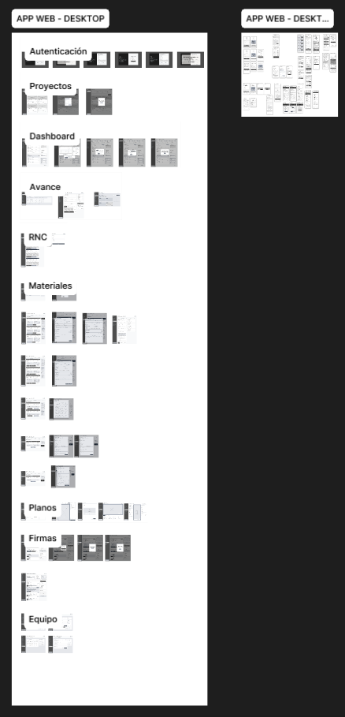
</div><br><br>

Enlace: [Wireframes de la App Web en Figma](https://www.figma.com/design/wYSJ9ua6Bc2UCmH6TnQWie/Untitled?node-id=0-1&t=zWud7TLSj3oIzBkc-1)<br><br>

A continuación, presentaremos los wireframes de nuestra aplicación web de manera detallada, acompañados de una breve descripción de la función que cumple cada sección dentro del flujo de trabajo de Kipu:<br><br>

<div align="center">
    <br><br>
</div><br>

- **Autenticación:** Estos wireframes definen los procesos web de inicio de sesión, registro y actualización de contraseña. La estructura prioriza la usabilidad y la interacción fluida, omitiendo temporalmente el aspecto visual.<br><br>

<div align="center">
    <br><br>
</div><br>

- **Proyectos:** agrupa las vistas dedicadas a la administración y seguimiento de obras, permitiendo crear, revisar y organizar la información principal de cada proyecto desde un solo lugar.<br><br>

<div align="center">
    <br><br>
</div><br>

- **Dashboard:** reúne las pantallas orientadas al resumen operativo, mostrando indicadores clave, alertas y accesos rápidos para tomar decisiones sin recorrer múltiples módulos.<br><br>

<div align="center">
    <br><br>
</div><br>

- **Avances:** concentra el registro del progreso físico de la obra, incluyendo reportes diarios, porcentajes de cumplimiento y seguimiento visual del estado de ejecución.<br><br>

<div align="center">
    <br><br>
</div><br>

- **RNC:** centraliza el registro de Resultados No Conformes, incluyendo observaciones, evidencias y seguimiento de incidencias para asegurar la corrección oportuna de errores en obra.<br><br>

<div align="center">
    <br><br>
</div><br>

- **Materiales:** agrupa las pantallas destinadas al control logístico de insumos y es una de las secciones más extensas de la aplicación. Aquí se gestionan solicitudes, entradas y salidas de stock, niveles mínimos, alertas de reposición, asignación de materiales a partidas y seguimiento de movimientos en almacén. La lógica de esta sección busca reducir la dependencia de registros manuales y de coordinaciones informales, ofreciendo una vista clara del inventario disponible, de los pedidos pendientes y del estado de cada material en tiempo real. También permite reforzar la trazabilidad entre el requerimiento realizado en obra y la atención desde logística, evitando duplicidades, quiebres de stock y errores en la distribución.<br><br>

<div align="center">
    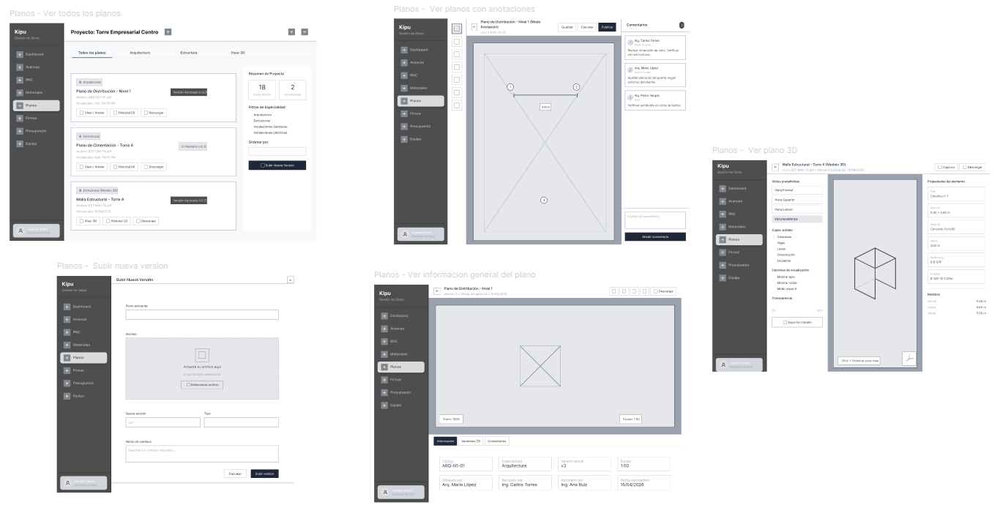
</div><br>

- **Planos:** reúne los wireframes vinculados a la gestión documental técnica, permitiendo versionar, consultar y organizar planos para asegurar que el equipo trabaje siempre con la información vigente.<br><br>

<div align="center">
    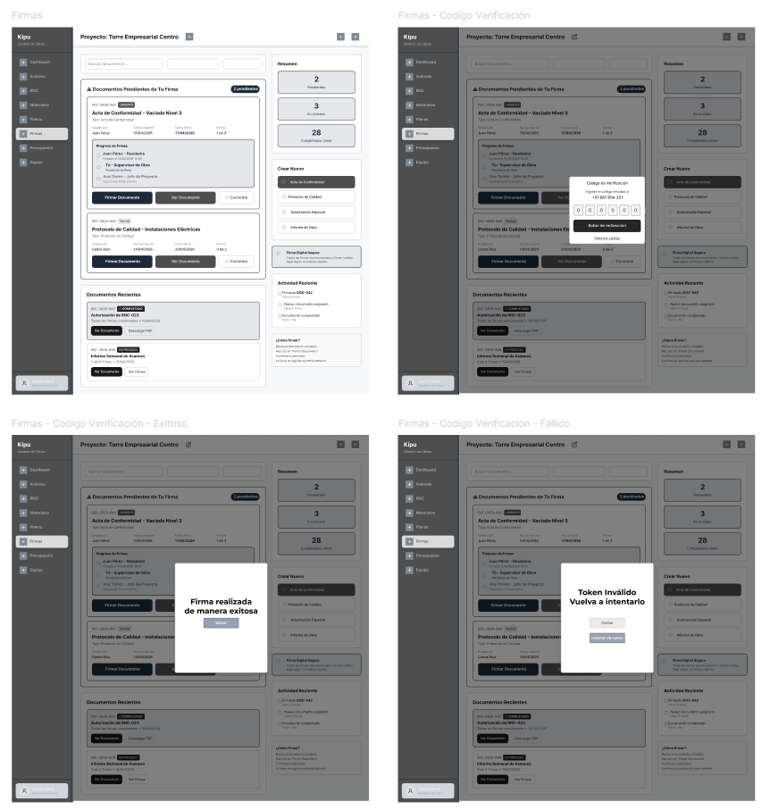
</div><br>

- **Firmas:** contempla el flujo de validación y aprobación de documentos o entregables, incorporando mecanismos de conformidad digital para mantener respaldo y trazabilidad en los cierres de etapa.<br><br>

<div align="center">
    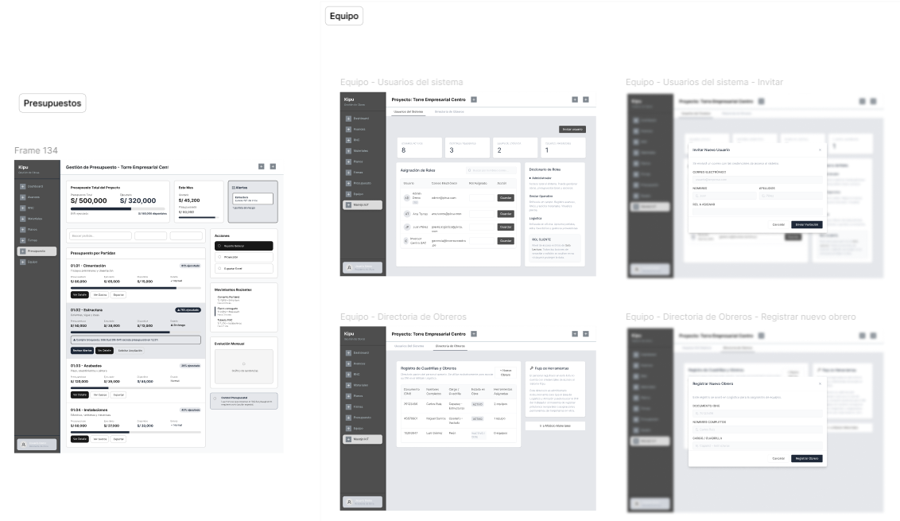
</div><br>

- **Presupuesto y equipo:** agrupa las vistas relacionadas con el control financiero y la gestión del personal. En esta sección se supervisa el presupuesto asignado, el gasto ejecutado y la disponibilidad del equipo de trabajo, de modo que la administración pueda mantener un control operativo y económico más ordenado.<br><br>

## <b>Wireframes versión Mobile:</b>

<b>Wireframes de Autenticación </b><br>
<div align="center">
    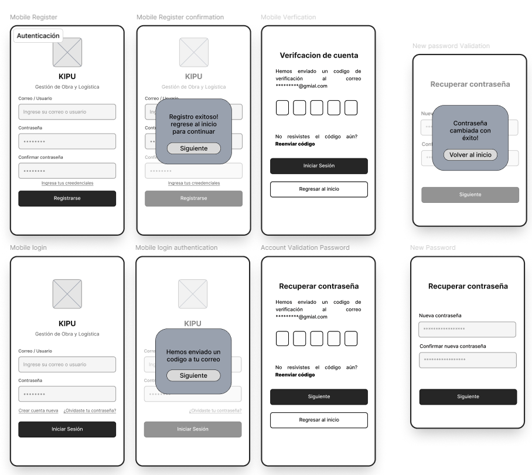
</div><br>

<b>Wireframes de la sección Proyectos</b><br>
<div align="center">
    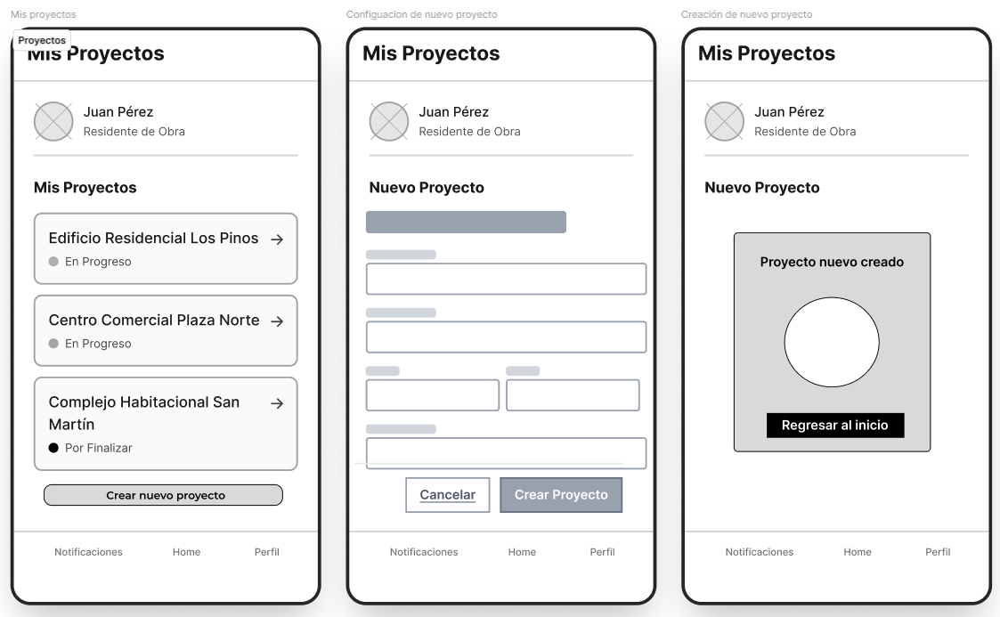
</div><br>

<b>Wireframes de la sección Dashboard</b><br>
<div align="center">
    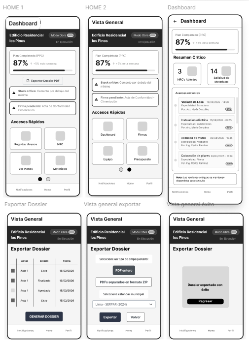
</div><br>

<b>Wireframes de la sección Avances</b><br>
<div align="center">
    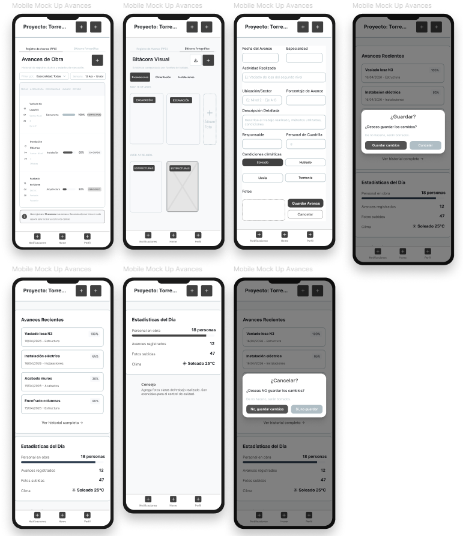
</div><br>

<b>Wireframes de la sección Firmas</b><br>
<div align="center">
    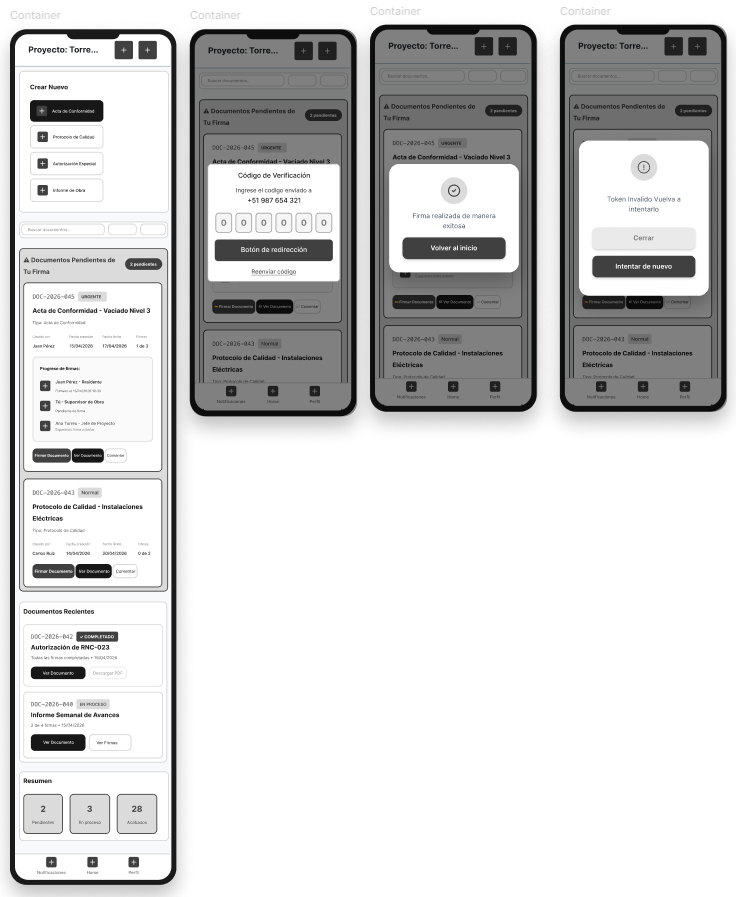
</div><br>

<b>Wireframes de la sección Firmas</b><br>
<div align="center">
    
</div><br>

<b>Wireframes de la sección Materiales</b><br>
<div align="center">
    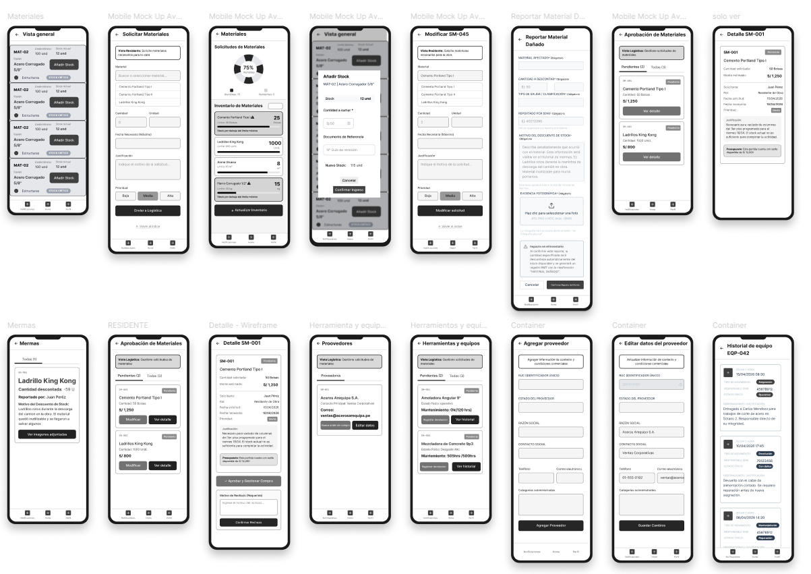
</div><br>

<b>Wireframes de la sección RNC</b><br>
<div align="center">
    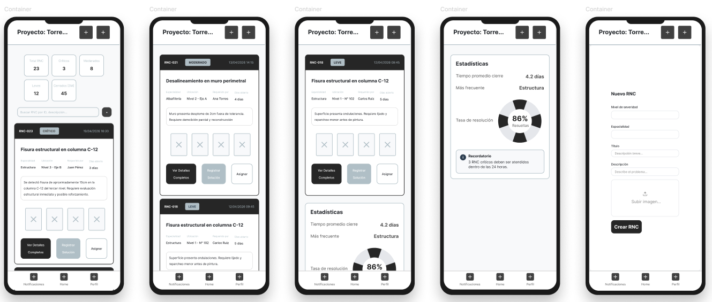
</div><br>

<b>Wireframes de la sección Planos</b><br>
<div align="center">
    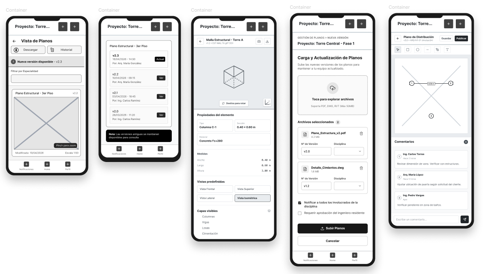
</div><br>

<b>Wireframes de la sección Presupuesto</b><br>
<div align="center">
    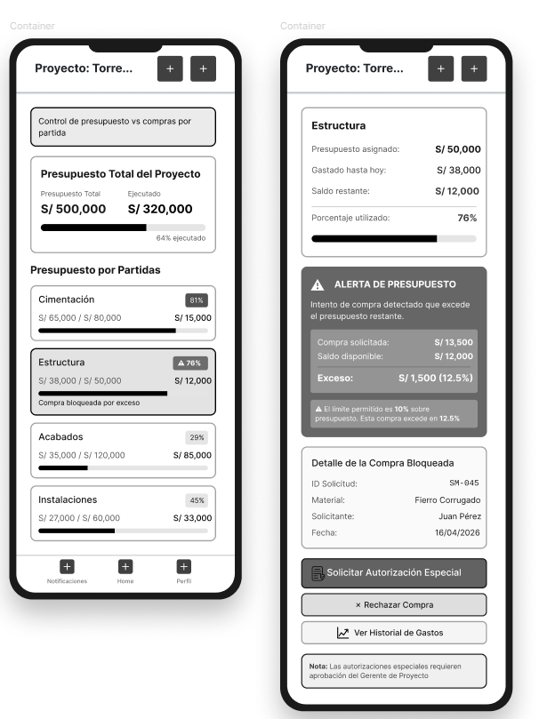
</div><br>

<b>Wireframes de la sección Equipo</b><br>
<div align="center">
    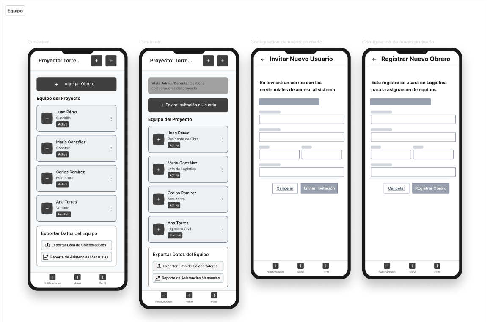
</div><br>

<b>Wireframes de la sección Perfil</b><br>
<div align="center">
    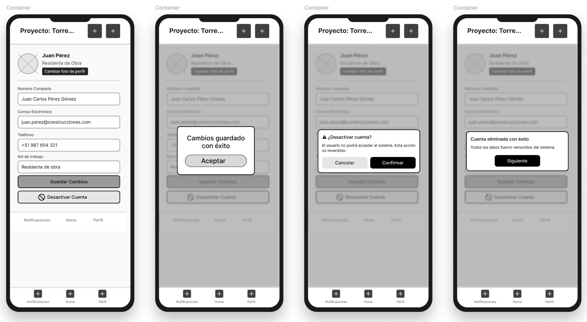
</div><br>

### 4.4.2. Web Applications Wireflow Diagrams.

## Autenticación

**User Goal 1:** Como usuario del sistema, quiero acceder a la plataforma mediante inicio de sesión, creación de cuenta nueva o recuperación de contraseña, para utilizar las funcionalidades de gestión de proyectos de manera segura y personalizada.


---

## Proyecto

**User Goal 2:** Como administrador o gestor del sistema, quiero registrar, modificar y administrar los proyectos dentro de la plataforma, estableciendo sus datos principales y su estado operativo, para mantener un control centralizado de todas las obras activas y simplificar su gestión.


---

## Avance

**User Goal 3:** Como encargado de campo o supervisor, quiero reportar periódicamente el progreso físico de las tareas del proyecto, indicando el porcentaje de avance y agregando observaciones relevantes, para conservar un historial trazable de la ejecución real frente a lo programado.


---

## RNC (No Conformidad)

**User Goal 4:** Como responsable de control de calidad o supervisor, quiero registrar las no conformidades detectadas en la ejecución de la obra, adjuntando evidencia visual como fotografías, para comunicar al equipo correspondiente y dar seguimiento hasta la corrección del problema.


---

## Materiales

**User Goal 5:** Como profesional en campo o solicitante, quiero crear pedidos formales de materiales e insumos, detallando los productos necesarios, las cantidades y la fecha requerida de entrega, para enviar las solicitudes al área logística de forma estructurada y evitar coordinaciones informales.


---

## Planos

**User Goal 6:** Como profesional técnico, quiero cargar, visualizar, versionar y organizar los planos del proyecto, aplicando filtros por categoría o especialidad y descargándolos para consulta sin conexión, para garantizar que todo el equipo trabaje con la versión más reciente y prevenir errores por documentos desactualizados.


---

## Firmas

**User Goal 7:** Como profesional autorizado, quiero aprobar documentos de manera digital mediante un mecanismo de verificación que asegure la autenticidad de la acción, para formalizar el cierre de etapas o la conformidad de entregables con respaldo legal y trazabilidad.


---

## Presupuesto

**User Goal 8:** Como miembro del equipo administrativo o financiero, quiero consultar el presupuesto asignado por cada partida o categoría, compararlo con el gasto real ejecutado y recibir notificaciones ante desviaciones, para identificar fugas presupuestarias y fundamentar decisiones antes de aprobar nuevas compras.


---

## Equipo

**User Goal 9:** Como administrador o líder del proyecto, quiero gestionar los usuarios vinculados a cada obra y ajustar sus permisos de acceso, para que cada persona cuente con los niveles de autorización adecuados a su función y evitar accesos no autorizados a información delicada.


---

## Dossier de Calidad

**User Goal 10:** Como administrador o gerente del proyecto, quiero generar un informe completo en formato PDF que consolide todo el historial de firmas electrónicas, aprobaciones y documentos de calidad de una etapa constructiva, para facilitar la entrega oficial del proyecto a la municipalidad o al cliente final.


### 4.4.3. Web Applications Mock-ups.

Se presentarán los Mock-ups de Kipu, versiones más realistas de los Wireframes.


Enlace de <a href="https://www.figma.com/design/FyoLkuLim7pgB23ZdnuZOl/Kipu---Aplicaciones-Web-Mockups?node-id=0-1&t=p8occfAoy5s2FUhl-1">Mockups</a>

## <b>Mock-ups versión Desktop:</b>

## Autenticación


---

## Avances


---

## Dashboard


---

## Firmas


---

## Materiales


---

## Planos


---

## Equipo


---

## Presupuesto


---

## Proyecto


---

## RNC


## <b>Mock-ups versión Mobile:</b>

## Autenticación


---

## Avances


---

## Dashboard


---

## Equipo


---

## Firmas


---

## Materiales


---

## Notificaciones


---

## Perfil


---

## Planos


---

## Presupuesto


---

## Proyecto


---

## RNC


### 4.4.4. Web Applications User Flow Diagrams.

## Autenticación

**User Goal 1:** Como usuario del sistema, quiero acceder a la plataforma mediante inicio de sesión, creación de cuenta nueva o recuperación de contraseña, para utilizar las funcionalidades de gestión de proyectos de manera segura y personalizada.

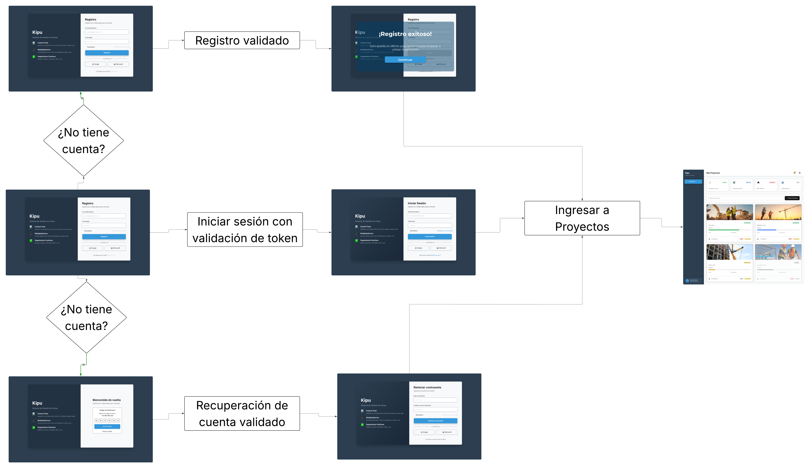

---

## Proyecto

**User Goal 2:** Como administrador o gestor del sistema, quiero registrar, modificar y administrar los proyectos dentro de la plataforma, estableciendo sus datos principales y su estado operativo, para mantener un control centralizado de todas las obras activas y simplificar su gestión.

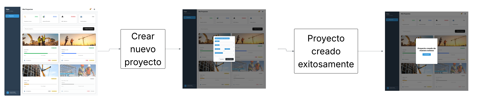

---

## Avance

**User Goal 3:** Como encargado de campo o supervisor, quiero reportar periódicamente el progreso físico de las tareas del proyecto, indicando el porcentaje de avance y agregando observaciones relevantes, para conservar un historial trazable de la ejecución real frente a lo programado.

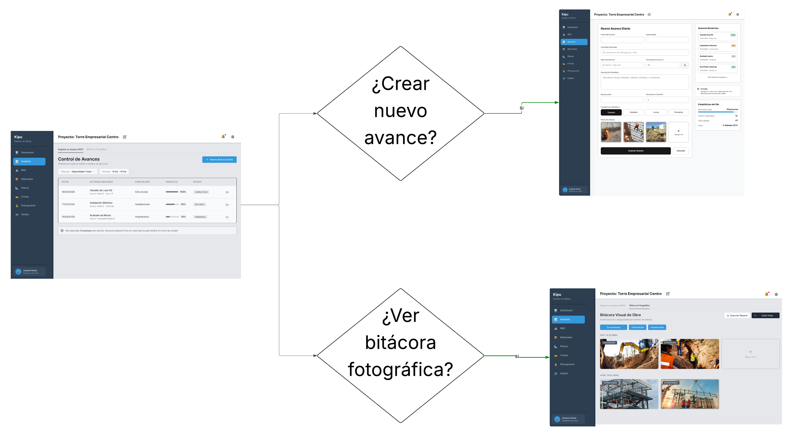

---

## RNC (No Conformidad)

**User Goal 4:** Como responsable de control de calidad o supervisor, quiero registrar las no conformidades detectadas en la ejecución de la obra, adjuntando evidencia visual como fotografías, para comunicar al equipo correspondiente y dar seguimiento hasta la corrección del problema.

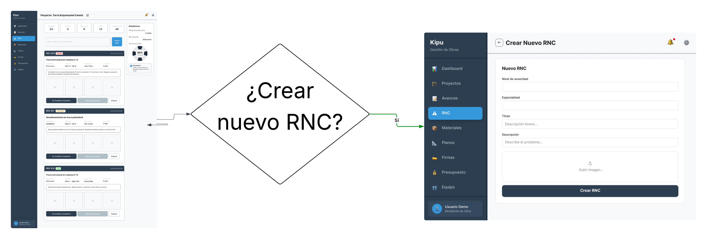

---

## Materiales

**User Goal 5:** Como profesional en campo o solicitante, quiero crear pedidos formales de materiales e insumos, detallando los productos necesarios, las cantidades y la fecha requerida de entrega, para enviar las solicitudes al área logística de forma estructurada y evitar coordinaciones informales.

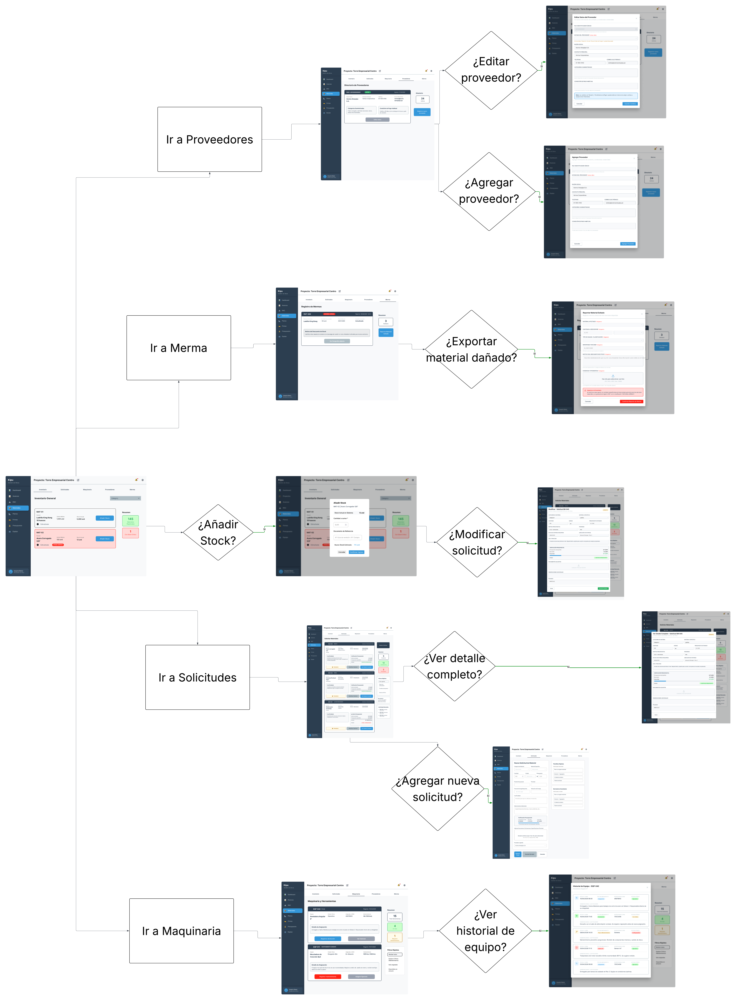

---

## Planos

**User Goal 6:** Como profesional técnico, quiero cargar, visualizar, versionar y organizar los planos del proyecto, aplicando filtros por categoría o especialidad y descargándolos para consulta sin conexión, para garantizar que todo el equipo trabaje con la versión más reciente y prevenir errores por documentos desactualizados.

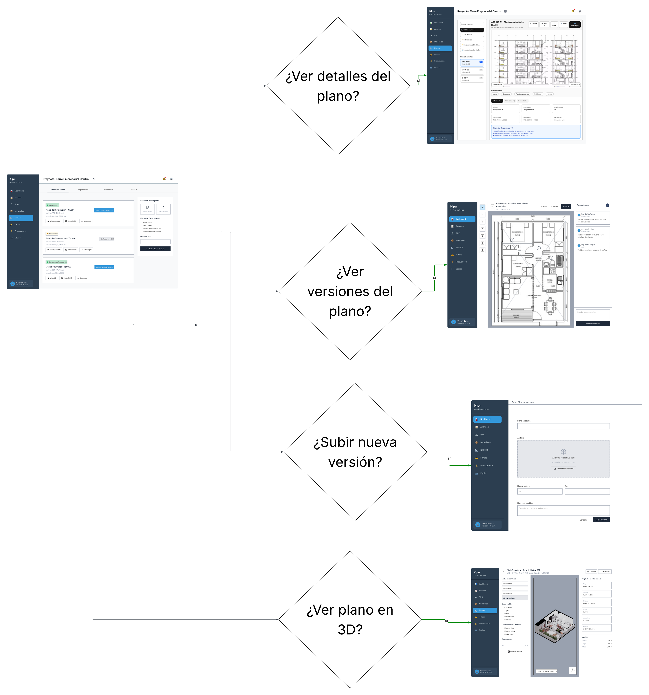

---

## Firmas

**User Goal 7:** Como profesional autorizado, quiero aprobar documentos de manera digital mediante un mecanismo de verificación que asegure la autenticidad de la acción, para formalizar el cierre de etapas o la conformidad de entregables con respaldo legal y trazabilidad.

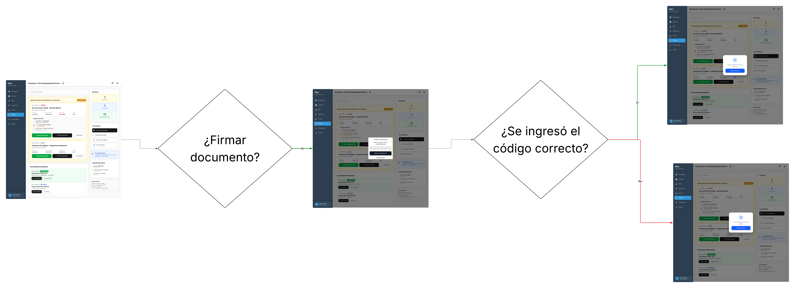

---

## Presupuesto

**User Goal 8:** Como miembro del equipo administrativo o financiero, quiero consultar el presupuesto asignado por cada partida o categoría, compararlo con el gasto real ejecutado y recibir notificaciones ante desviaciones, para identificar fugas presupuestarias y fundamentar decisiones antes de aprobar nuevas compras.

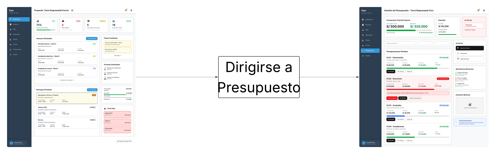

---

## Equipo

**User Goal 9:** Como administrador o líder del proyecto, quiero gestionar los usuarios vinculados a cada obra y ajustar sus permisos de acceso, para que cada persona cuente con los niveles de autorización adecuados a su función y evitar accesos no autorizados a información delicada.

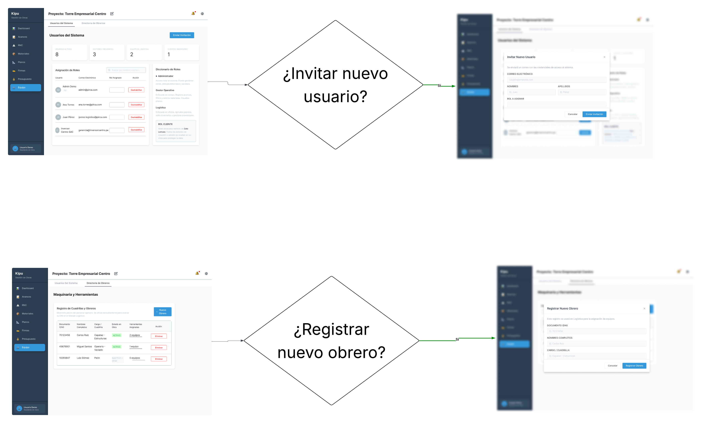

---

## Dossier de Calidad

**User Goal 10:** Como administrador o gerente del proyecto, quiero generar un informe completo en formato PDF que consolide todo el historial de firmas electrónicas, aprobaciones y documentos de calidad de una etapa constructiva, para facilitar la entrega oficial del proyecto a la municipalidad o al cliente final.

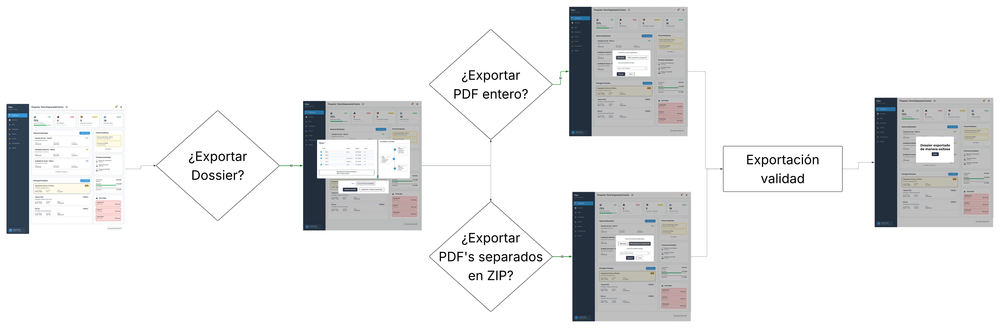

## 4.5. Web Applications Prototyping.

Prototype completo de Kipu:

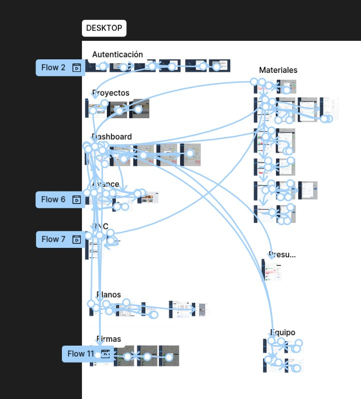

Enlace para ver el Prototype: <a href="https://www.figma.com/design/oCVgJrJ3SUNXq8jIGHlhX0/App-Web---Prototype?t=RCnCwcgdiy5cIIsu-1">Prototype Figma</a>

Enlace para ver demostración del Prototype en vídeo: <a href="https://upcedupe-my.sharepoint.com/:v:/g/personal/u20241e418_upc_edu_pe/IQCY5IVqRkn-Rpyt0Ap_YS49AQWdTh02CBwF0xwLnlNL5UQ?nav=eyJyZWZlcnJhbEluZm8iOnsicmVmZXJyYWxBcHAiOiJPbmVEcml2ZUZvckJ1c2luZXNzIiwicmVmZXJyYWxBcHBQbGF0Zm9ybSI6IldlYiIsInJlZmVycmFsTW9kZSI6InZpZXciLCJyZWZlcnJhbFZpZXciOiJNeUZpbGVzTGlua0NvcHkifX0&e=jhMW5r">Prototype video</a>

## 4.6. Domain-Driven Software Architecture.
En esta sección se emplea el modelo C4 para diseñar la arquitectura del software, abarcando sus distintos niveles: contexto, contenedores, componentes y código. Este método facilita una visión clara del sistema.

### 4.6.1. Design-Level Event Storming.

* **Tablero de Event Storming (Miro):** <a href="https://miro.com/welcomeonboard/eWM5Vkl4cTJUU3lDb0RsSTRxWFpRdHhNK2tRc29OUkZEd01UQUdHbHV6QjlydFpGNTYvMUVrK3dKK2hzUXJ5MXg2S3RPLzVsREZQdlJiaTJIaCtwTzZpcWdYSW9UWVlKSHRCUEFRdytqVS9ZUkJmWDlwQjc0M05FRUxHL0R0YUhyVmtkMG5hNDA3dVlncnBvRVB2ZXBnPT0hdjE=?share_link_id=407483649097" target="_blank" rel="noopener noreferrer">Abrir tablero en Miro</a>

En esta etapa del diseño, se profundizó en la interacción exacta entre los usuarios y el sistema para descubrir los límites transaccionales de **Kipu**. A diferencia del *Big Picture*, el **Design-Level Event Storming** se centra en identificar los **Agregados** responsables de proteger las reglas de negocio (*Policies*) antes de emitir un Evento de Dominio.

A continuación, se documenta la arquitectura dividida por los Bounded Contexts identificados:

<br><br>
<div align="center">
    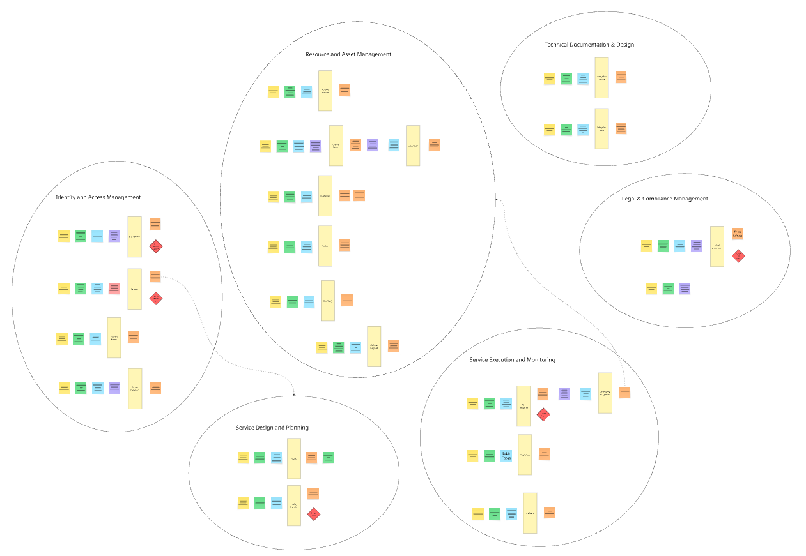
</div>
<br><br>

### Identity and Access Management
Este dominio gestiona la seguridad, el control de acceso y el registro del personal operativo. 

<br><br>
<div align="center">
    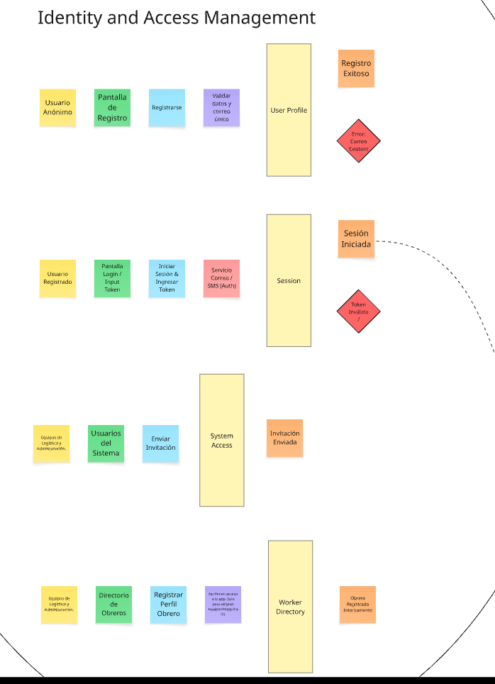
</div>
<br><br>

* **Agregado: User Profile**
  <br> **Flujo:** El *Usuario Anónimo* visualiza la pantalla de registro y ejecuta el comando **Registrarse**.
  <br> **Política:** Validar formato de datos y asegurar que el correo sea único.
  <br> **Eventos:** *Registro Exitoso* o un punto de pánico por *Error: Correo Existente*. <br>
  
* **Agregado: Session**
  <br> **Flujo:** El *Usuario Registrado* ejecuta **Iniciar Sesión**. Depende de un sistema externo (Servicio Correo/SMS) para la autenticación en dos pasos.
  <br> **Eventos:** *Sesión Iniciada* o falla por *Token Inválido*. <br>
  
* **Agregados Secundarios:** System Access (para envío de invitaciones) y Worker Directory.

### Service Design and Planning
Gestiona el ciclo de vida estructural de la obra y la centralización de datos a nivel macro.

<br><br>
<div align="center">
    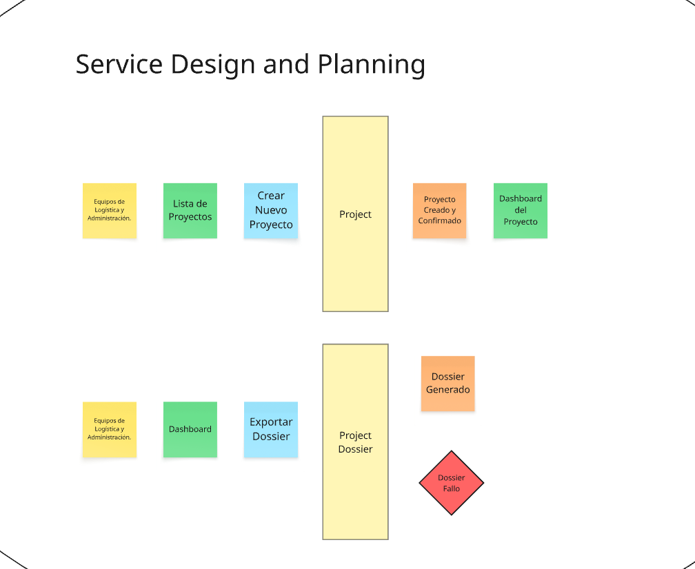
</div>
<br><br>

* **Agregado: Project**
  <br> **Flujo:** Los equipos de logística y administración ejecutan el comando **Crear Nuevo Proyecto** desde la vista de lista de proyectos.
  <br> **Eventos:** *Proyecto Creado y Confirmado*. <br>
  
* **Agregado: Project Dossier**
  <br> **Flujo:** Mediante el Dashboard, se ejecuta el comando **Exportar Dossier** para consolidar la información.
  <br> **Eventos:** *Dossier Generado* o *Fallo de exportación*.

### Service Execution and Monitoring
Controla la realidad en el campo (faena), capturando el avance físico y los problemas de calidad. Destaca por su comunicación asíncrona con Logística.

<br><br>
<div align="center">
    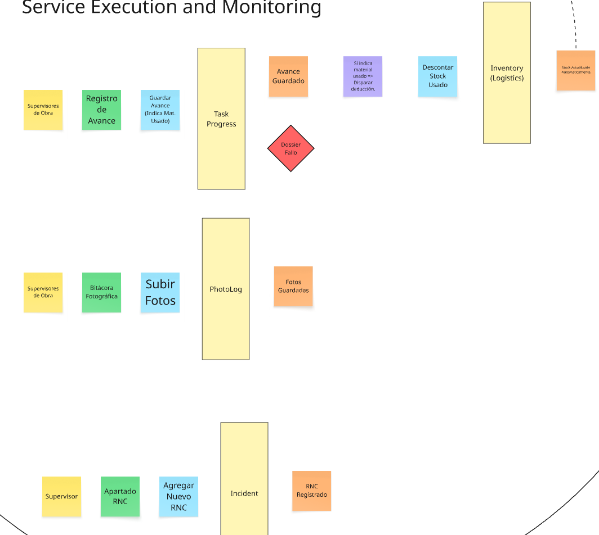
</div>
<br><br>

* **Agregado: Task Progress**
  <br> **Flujo:** El *Supervisor de Obra* ejecuta **Guardar Avance**.
  <br> **Política:** Si el avance indica material usado, se dispara un evento de integración para deducir el stock.
  <br> **Eventos:** *Avance Guardado*. Este evento notifica al Agregado Inventory en el contexto logístico, logrando un *Stock Actualizado Automáticamente*. <br>
  
* **Agregado: PhotoLog & Incident**
  <br> **Flujo:** El supervisor adjunta evidencia visual mediante **Subir Fotos** y reporta fallas con **Agregar Nuevo RNC**.
  <br> **Eventos:** *Fotos Guardadas* y *RNC Registrado*. 

### Resource and Asset Management
El dominio con mayor carga transaccional. Administra la cadena de suministro, maquinaria e inventario general.

<br><br>
<div align="center">
    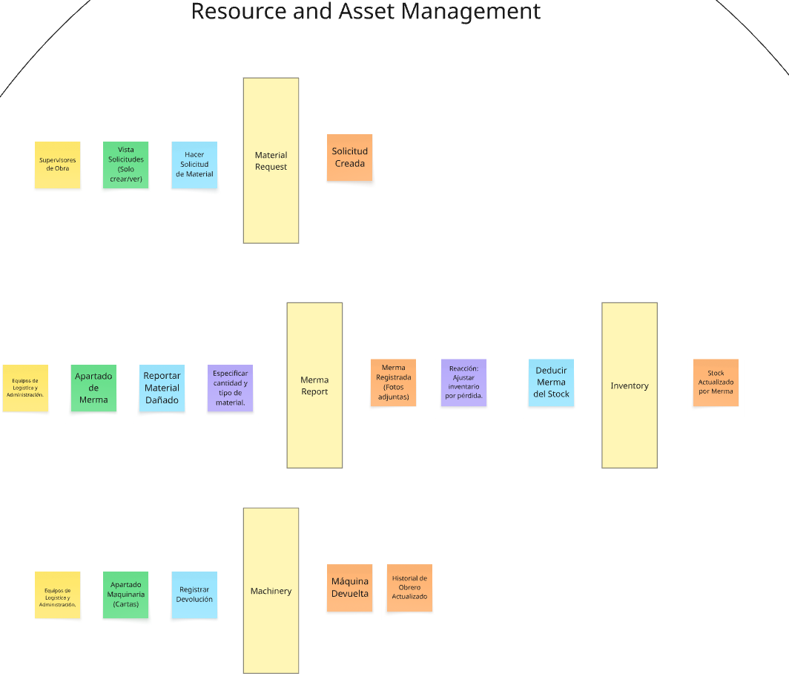
</div>
<br><br>
<div align="center">
    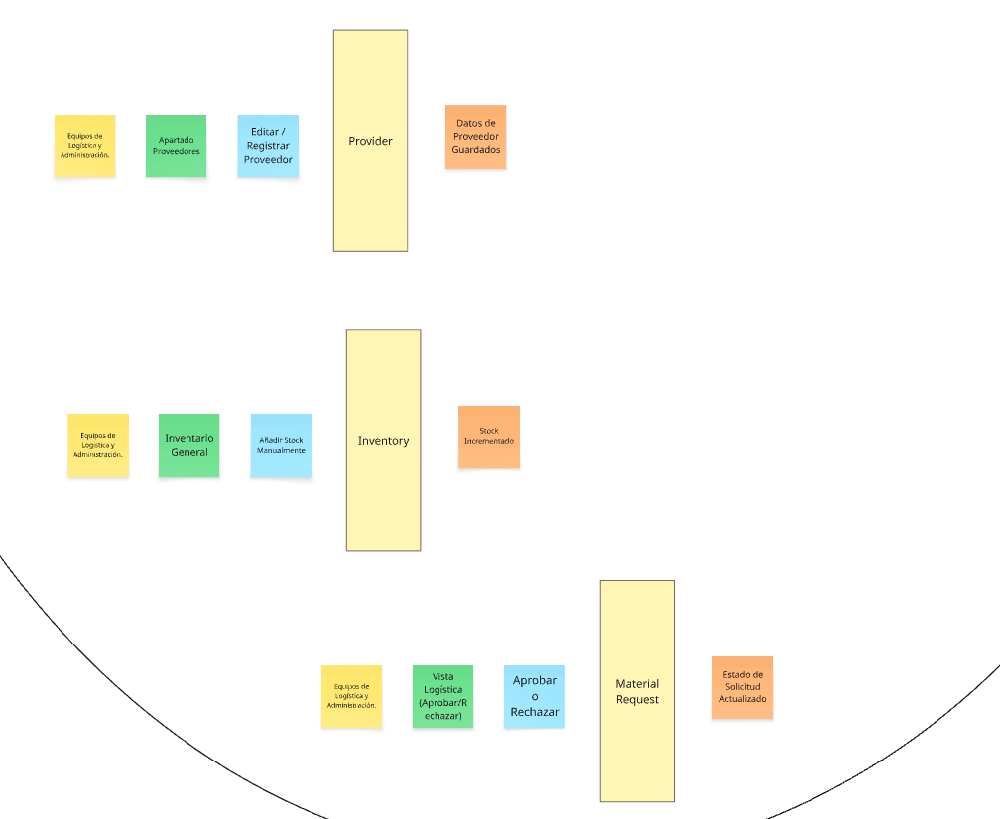
</div>
<br><br>

* **Agregado: Material Request**
  <br> **Flujo:** Los supervisores en obra ejecutan **Hacer Solicitud de Material**. Logística, desde su vista, ejecuta **Aprobar o Rechazar**.
  <br> **Eventos:** *Solicitud Creada* y *Estado de Solicitud Actualizado*. <br>
  
* **Agregado: Merma Report**
  <br> **Flujo:** Al reportar material dañado, se aplica una **Política** que exige especificar cantidad y tipo.
  <br> **Eventos:** *Merma Registrada*. Esto dispara automáticamente el comando de deducir merma en el Agregado Inventory. <br>
  
* **Agregados Secundarios:** Inventory (Añadir stock manual), Machinery (Devolución de equipos) y Provide (Registro de proveedores).

### Technical Documentation & Design
Protege la propiedad intelectual y asegura que el personal en campo construya sobre la versión correcta.

<br><br>
<div align="center">
    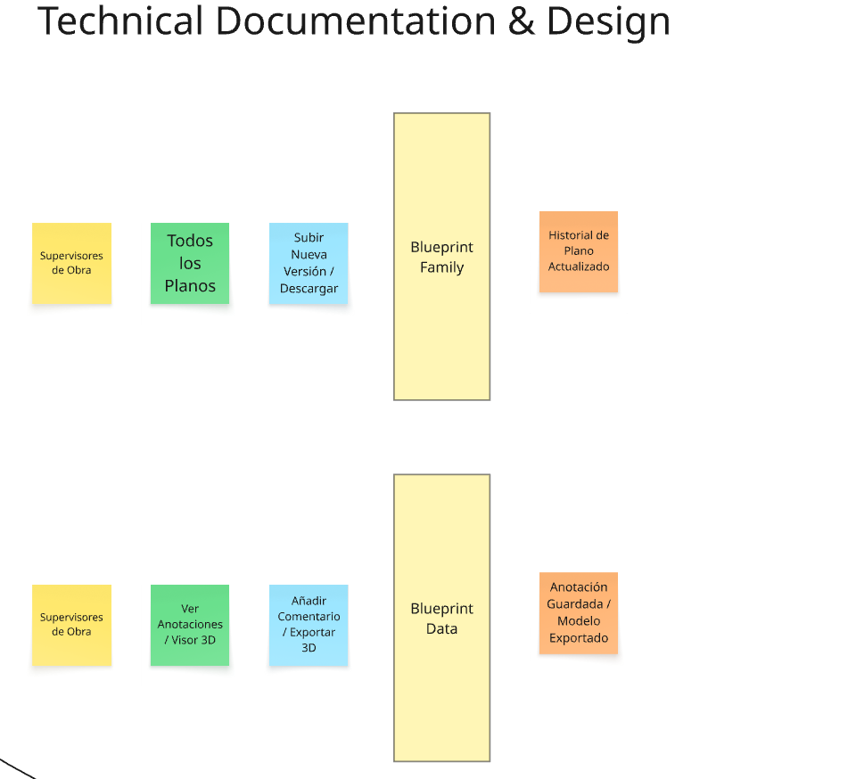
</div>
<br><br>

* **Agregado: Blueprint Family**
  <br> **Flujo:** El *Supervisor de Obra* consulta todos los planos y ejecuta **Subir Nueva Versión / Descargar**.
  <br> **Eventos:** *Historial de Plano Actualizado*. <br>
* **Agregado: Blueprint Data**
  <br> **Flujo:** A través del visor 3D, el supervisor ejecuta **Añadir Comentario / Exportar 3D**.
  <br> **Eventos:** *Anotación Guardada / Modelo Exportado*.

### Legal & Compliance Management
Maneja las responsabilidades legales y el cierre formal de etapas constructivas.

<br><br>
<div align="center">
    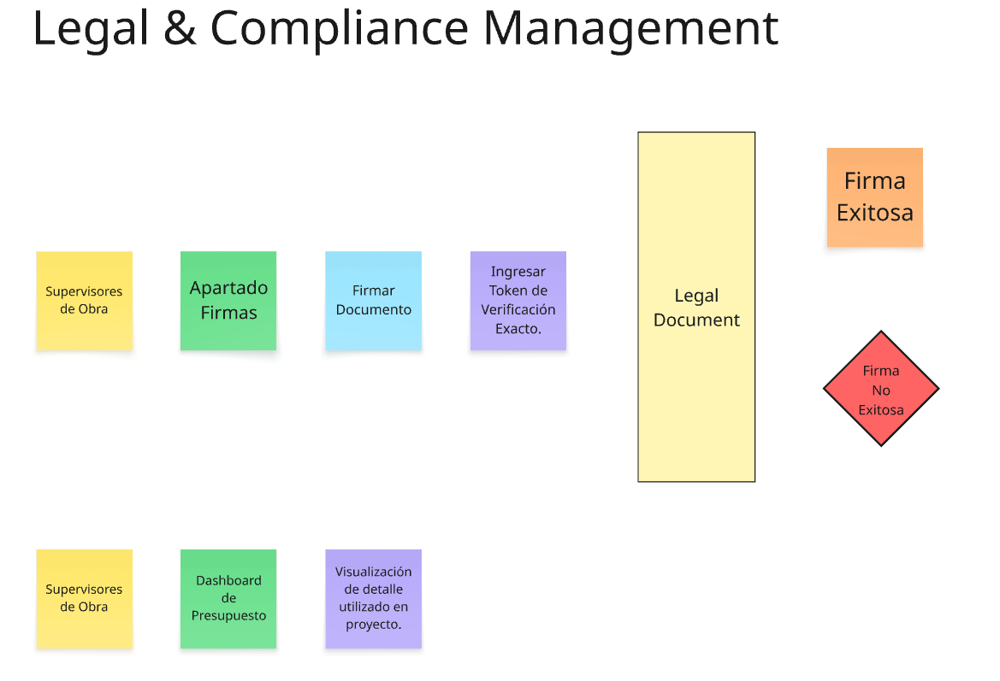
</div>
<br><br>

* **Agregado: Legal Document**
  <br> **Flujo:** El *Supervisor de Obra* visualiza el apartado de firmas y ejecuta **Firmar Documento**.
  <br> **Política:** Es estrictamente necesario *Ingresar el Token de Verificación Exacto*.
  <br> **Eventos:** *Firma Exitosa* o punto de pánico por *Firma No Exitosa*.
    
### 4.6.2. Software Architecture Context Diagram.
En este nivel se visualizan los actores principales: el Operative Manager, el Logistics Officer, el System Administrator y el Client. Asimismo, se detallan las relaciones con los sistemas externos encargados de la seguridad y comunicación, representados por el Servicio SMS OTP y el Servicio de Correo.


<br>

### 4.6.3. Software Architecture Container Diagrams.

En este diagrama se detalla la distribución de la plataforma en contenedores dentro de la nube de Microsoft Azure. Se identifica la Landing Page y la Web Application (SPA) como interfaces de usuario. La comunicación se centraliza a través de un API Gateway, el cual distribuye las peticiones hacia los ocho microservicios especializados desarrollados en ASP.NET Core. Además, se incluye el uso de Azure Blob Storage para el almacenamiento de archivos pesados y una Base de Datos MySQL para la persistencia de datos relacionales.


<br>

### 4.6.4. Software Architecture Components Diagrams.

En esta sección se desglosa la arquitectura interna de los microservicios principales. Se describe cómo cada controlador actúa como punto de entrada, delegando la lógica de negocio a componentes específicos para luego persistir la información mediante conectores de base de datos.

**Componente Blueprint**


<br>

**Componente Document**


<br>

**Componente Identity**


<br>

**Componente Logistics**


<br>

**Componente Notification**


<br>

**Componente Progress**


<br>

**Componente Project**


<br>

## 4.7. Software Object-Oriented Design.
### 4.7.1. Class Diagrams.


## 4.8. Database Design.
### 4.8.1. Database Diagrams.


---
# Capítulo V: Product Implementation, Validation & Deployment.
## 5.1 Software Configuration Management

En esta sección se establecerán las decisiones, herramientas y convenciones necesarias para mantener el orden y la consistencia del código, siguiendo buenas prácticas y aprovechando los recursos disponibles a lo largo de todo el ciclo de vida del desarrollo de Kipu.

### 5.1.1 Software Development Environment Configuration

Para abarcar todas las actividades del ciclo de vida del producto digital, el equipo utilizará el siguiente conjunto de herramientas tecnológicas, divididas por su propósito de uso:

+ **Project Management**<br>Esta sección se encarga de planificar, estructurar, coordinar y supervisar los recursos y actividades necesarios para llevar a cabo un proyecto de software con éxito. Abarca aspectos como la definición del alcance, la gestión del tiempo, los costos, la calidad, los riesgos, el trabajo colaborativo y la comunicación. Su propósito es asegurar que el proyecto se entregue dentro de los plazos y presupuestos previstos, cumpliendo con los objetivos y requisitos establecidos.<br><br>

  +	<b>Jira Software:</b> Herramienta de gestión de proyectos ágil que permite planificar, rastrear y gestionar el trabajo mediante tableros Scrum o Kanban, facilitando la colaboración entre equipos de desarrollo. <br>https://www.atlassian.com/software/jira<br><br>

  +	<b>Trello:</b> Plataforma de gestión visual de tareas basada en el método Kanban. Se utiliza específicamente para la organización y seguimiento detallado del Sprint Backlog 1, permitiendo al equipo mover tarjetas a través de diferentes estados de ejecución (To Do, Doing, Done) para asegurar la transparencia del progreso diario.<br>https://trello.com/<br><br>

+ **Requirements Management**<br>Corresponde al conjunto de actividades orientadas a identificar, documentar, validar y administrar los requisitos tanto del sistema como del software. Este proceso implica comprender las necesidades de los usuarios y de los stakeholders, transformándolas en requisitos funcionales y no funcionales bien definidos. Su finalidad es asegurar que el producto desarrollado cumpla con las expectativas y necesidades del usuario final.<br><br>

  + **Jira Software:** Además de su uso en la gestión de proyectos, Jira también permite gestionar requisitos mediante la creación y seguimiento de historias de usuario, épicas y tareas. Facilita la trazabilidad de los requisitos a lo largo del ciclo de desarrollo, permitiendo priorizarlos, validarlos y mantenerlos actualizados conforme evolucionan las necesidades del proyecto.<br> https://www.atlassian.com/software/jira<br><br>

+ **Product UX/UI Design**<br>Este componente se enfoca en el diseño de la experiencia de usuario (UX) y de la interfaz de usuario (UI) dentro del producto de software. La UX busca analizar y optimizar cómo interactúan los usuarios con el sistema, mientras que la UI se centra en la apariencia visual y la facilidad de uso de la interfaz. En conjunto, se pretende ofrecer una experiencia intuitiva, atractiva y eficiente. En este contexto, se desarrolla un prototipo de sitio web adaptable tanto a computadoras como a dispositivos móviles.<br><br>

  + **Figma:** Herramienta colaborativa en la nube para el diseño de interfaces y prototipos, que permite a equipos diseñar, prototipar y compartir experiencias digitales en tiempo real.<br>https://www.figma.com/design/ <br><br>

  + **UXPressia:** Plataforma de diseño de experiencia de usuario que permite crear customer journey maps, user personas y impact maps para mejorar la comprensión del usuario y la toma de decisiones centradas en UX.<br>https://uxpressia.com/ <br><br>

  + **MIRO:** Plataforma colaborativa en línea que permite crear diagramas, mapas mentales y tableros visuales para facilitar la ideación, planificación y trabajo en equipo.<br>https://miro.com/app/dashboard/ <br><br> 

  + **Canva:** Herramienta de diseño gráfico en línea que permite crear presentaciones, infografías y contenido visual de manera sencilla mediante plantillas y recursos prediseñados.<br>https://www.canva.com/<br><br> 

  + **Structurizr:** Herramienta de modelado de arquitectura de software que permite crear diagramas basados en el modelo C4, facilitando la visualización y documentación de sistemas de manera clara y estructurada. <br> https://structurizr.com/ <br><br> 
  + **Lucidchart:** Herramienta en línea para la creación de diagramas y representaciones visuales, como wireframes, flujos de usuario y diagramas de arquitectura. Permite a los equipos colaborar en tiempo real, facilitando la planificación y el diseño estructurado de interfaces y sistemas.<br>https://www.lucidchart.com/<br><br>

+ **Software Development**<br>Hace referencia al proceso completo de creación de software, que incluye su diseño, programación, prueba y mantenimiento. En esta etapa se implementan los requisitos previamente definidos, empleando distintos lenguajes, herramientas y tecnologías. El objetivo principal es desarrollar un producto funcional, eficiente y de calidad, que satisfaga las necesidades y expectativas del cliente.<br><br> 

  + **GitHub:** Plataforma de desarrollo colaborativo que permite alojar repositorios de código utilizando Git, facilitando el control de versiones y el trabajo en equipo. <br> https://github.com/PircaIndustries <br><br> 

  + **Visual Studio Code:** Editor de código fuente ligero y multiplataforma que incluye herramientas como depuración, control de versiones e integración de extensiones para múltiples lenguajes. <br>https://code.visualstudio.com/ <br><br>

  + **HTML:** Lenguaje de marcado estándar utilizado para estructurar el contenido de páginas web mediante etiquetas y elementos. <br>https://www.jetbrains.com/help/webstorm/editing-html-files.html<br><br> 

  + **CSS:** Lenguaje de estilos utilizado para definir la apariencia y el diseño visual de páginas web, incluyendo colores, fuentes y disposición de elementos.<br>https://www.jetbrains.com/help/webstorm/style-sheets.html#ws_css_completion <br><br> 

  + **JavaScript:** Lenguaje de programación interpretado que permite agregar interactividad y dinamismo a las páginas web.<br> https://www.jetbrains.com/help/webstorm/javascript-specific-guidelines.html<br><br> 


  + **C#:** Lenguaje de programación orientado a objetos desarrollado por Microsoft, utilizado principalmente para el desarrollo de aplicaciones en la plataforma .NET.<br>https://learn.microsoft.com/es-es/dotnet/csharp/ <br><br> 
 

  + **Vue Material:** Biblioteca de componentes UI basada en Material Design para Vue.js, que facilita la creación de interfaces modernas y consistentes.<br>https://vuematerial.io/<br><br> 

+ **Software Testing**<br>Consiste en el proceso de evaluación del software con el fin de comprobar su correcto funcionamiento y nivel de calidad. Incluye la realización de pruebas tanto funcionales como no funcionales para detectar fallos, errores o inconsistencias antes de su implementación final. Su propósito es garantizar que el sistema sea estable, confiable y cumpla con los requisitos definidos.<br><br> 

  + **Lenguaje Gherkin:** Se trata de un lenguaje específico de dominio (DSL) empleado en el desarrollo de software para redactar pruebas de aceptación de forma clara y comprensible para las personas. Se basa en el uso de palabras clave como Given, When y Then para expresar la condición inicial, la acción realizada y el resultado que se espera en un escenario de prueba, lo que ayuda a mejorar la comunicación y el trabajo conjunto entre los equipos al momento de definir requisitos y validar comportamientos.<br>https://cucumber.io/<br><br> 

+ **Software Deployment**<br> Se refiere al conjunto de actividades necesarias para poner el software en funcionamiento dentro de un entorno productivo o en los dispositivos de los usuarios. Este proceso incluye tareas como la instalación, configuración, migración de información y puesta en marcha del sistema. Su finalidad es lograr una implementación eficiente y sin inconvenientes en el entorno final.<br><br> 

  + **Github Pages:** Servicio de hosting estático que permite publicar sitios web directamente desde repositorios de GitHub. <br>https://pages.github.com/ <br><br>


+	**Software Documentation**<br>Hace referencia a la elaboración y actualización de documentos que describen distintos aspectos del software, como su arquitectura, diseño, funcionamiento, instalación, configuración y mantenimiento. Esta documentación sirve como guía tanto para desarrolladores como para usuarios finales, administradores y demás interesados, proporcionando información clara y detallada sobre el sistema. <br><br> 

    + **Markdown:** Es un lenguaje de marcado sencillo que facilita la redacción de texto con formato de manera clara y práctica, el cual posteriormente puede transformarse en HTML u otros formatos de visualización. Se utiliza ampliamente en la documentación de proyectos de software gracias a su simplicidad y flexibilidad. Además, permite incorporar elementos básicos de formato, como títulos, listas, enlaces e imágenes, mediante una sintaxis intuitiva y fácil de aprender.<br>https://www.markdownguide.org/getting-started/<br><br>
    + **Microsoft Office 365:** Suite de herramientas de productividad en la nube que incluye aplicaciones como Word, Excel y PowerPoint, utilizadas para la elaboración, edición y gestión de documentación del proyecto. Facilita el trabajo colaborativo, el almacenamiento en línea y el acceso compartido a la información.<br>https://www.microsoft.com/microsoft-365<br><br>

### 5.1.2 Source Code Management

Con el fin de gestionar adecuadamente la evolución del código fuente, se ha optado por implementar la metodología Git Flow. Este enfoque se basa en el uso de múltiples ramas para organizar y controlar los cambios durante el desarrollo. En términos generales, se mantiene una rama principal denominada main, la cual contiene versiones estables del proyecto en momentos específicos. Paralelamente, se utiliza una rama de desarrollo donde se integran nuevas funcionalidades sin comprometer la estabilidad de la versión principal. Esto permite continuar con la construcción de la landing page mientras se prueban y validan los cambios incorporados en el entorno de desarrollo.

Adicionalmente, se eligió GitHub como plataforma de control de versiones, aprovechando su funcionalidad GitHub Pages. Esta característica permite desplegar el proyecto de manera sencilla, facilitando la visualización del sitio web a partir de archivos en formato .html mediante la generación de un enlace accesible.

En relación con la gestión de nuevas funcionalidades, creamos ramas específicas bajo la nomenclatura “feature/sprint-1-development” para cada mejora o componente a implementar. Este esquema favorece un desarrollo ordenado y progresivo, ya que cada rama funciona como un entorno independiente donde es posible desarrollar y probar una funcionalidad antes de integrarla a la rama de desarrollo principal.<br><br>

Enlace de la Landing Page en GitHub Pages: https://pircaindustries.github.io/Landing-Page-Kipu/  <br><br> 

<div align="center">
    
</div><br>

Repositorio GitHub de la Landing Page: https://pircaindustries.github.io/landing-page-Kipu/ <br><br> 

<div align="center">
    
</div><br>

Repositorio GitHub de los archivos feature: https://github.com/PircaIndustries/Acceptance-Test <br><br> 

<div align="center">
    
</div><br><br>

### 5.1.3 Source Code Style Guide & Conventions

Esta sección define las convenciones de codificación y nomenclatura que se aplicarán en Kipu para mantener consistencia técnica, legibilidad, mantenibilidad y escalabilidad. Las pautas que se describirán a continuación se alinean con guías de referencia ampliamente adoptadas en la industria y serán obligatorias para el desarrollo de la solución.

Nuestro proyecto utilizará HTML, CSS, JavaScript y C# para implementación, y Gherkin para especificaciones ejecutables de comportamiento.

## 1) Principios generales para todos los lenguajes

### 1.1 Nomenclatura obligatoria en inglés

Todos los identificadores deben estar en inglés y reflejar intención funcional.

- Correcto: `userProfile`, `checkoutForm`, `calculateTotal`, `OrderService`.
- Incorrecto: `perfilUsuario`, `formulario2`, `x1`, `servicioPedido`.

Reglas transversales:

- Los nombres deben ser descriptivos y orientados al dominio.
- Se prohíben abreviaciones ambiguas (`tmp`, `obj`, `val`) excepto en contextos locales muy acotados.
- La semántica del nombre debe anticipar responsabilidad y tipo de dato.
- Los nombres de una sola letra se reservan para iteradores de alcance corto (`i`, `j`) o coordenadas matemáticas.

### 1.2 Formato base de código

- Indentación con espacios, nunca tabulaciones.
- Archivos UTF-8.
- Línea final en blanco al cierre del archivo.
- Evitar líneas excesivamente largas; se prioriza legibilidad.
- Comentarios solo cuando aporten contexto no obvio (evitar comentar lo evidente).

Ejemplo:

```text
Mala práctica:
- Mezclar tabs y espacios.
- Comentar cada línea aunque sea autoexplicativa.
- Mantener funciones enormes sin separación lógica.

Recomendado:
- Definir formato automático con herramientas del proyecto (formatter/linter).
- Escribir comentarios de intención, no de traducción literal del código.
- Dividir bloques largos en funciones pequeñas y nombradas por responsabilidad.
```

Complementación conveniente:

- Configurar formateo automático al guardar.
- Integrar validación en CI para prevenir desviaciones de estilo.
- Mantener un checklist de revisión de PR con reglas de esta guía.

### 1.3 Convenciones de estilo por tecnología

Cada lenguaje conserva su convención estándar:

- HTML/CSS/JavaScript: estilo de Google y recomendaciones de ecosistema web moderno.
- C#: convenciones oficiales de Microsoft y guías ASP.NET Core.
- Gherkin: enfoque de legibilidad y comportamiento orientado a negocio.

## 2) Convenciones para HTML

Se adopta HTML5 con enfoque semántico y accesible.

### 2.1 Estructura y sintaxis

- Declarar `<!doctype html>` al inicio.
- Usar `lang` en el elemento raíz (`<html lang="es">` o según corresponda).
- Escribir etiquetas y atributos en minúsculas.
- Utilizar comillas dobles para valores de atributos.

### 2.2 Semántica y accesibilidad

- Usar elementos semánticos (`header`, `main`, `nav`, `section`, `article`, `footer`) en lugar de `div` sin propósito.
- Evitar controladores inline (`onclick`, `onchange`); la lógica se define en JavaScript.
- Incluir texto alternativo significativo en imágenes.
- Asociar etiquetas y controles de formulario (`label` + `for`).

Ejemplo:

```html
<!-- Mala práctica -->
<div onclick="submitForm()">Send</div>


<!-- Recomendado -->
<button type="button" id="send-button">Send</button>

```

Complementación conveniente:

- Mantener jerarquía de encabezados (`h1` -> `h2` -> `h3`) sin saltos arbitrarios.
- Usar atributos ARIA solo cuando HTML semántico no sea suficiente.
- Verificar navegación por teclado y foco visible en elementos interactivos.

Ejemplo recomendado:

```html
<!doctype html>
<html lang="en">
  <head>
    <meta charset="utf-8">
    <meta name="viewport" content="width=device-width, initial-scale=1">
    <title>Account Settings</title>
  </head>
  <body>
    <main>
      <h1>Account settings</h1>
      
      <a href="/comments">All comments</a>
    </main>
  </body>
</html>
```

## 3) Convenciones para CSS

Se adopta CSS con enfoque mantenible, predecible y escalable.

### 3.1 Nomenclatura

- Nombres de clases en inglés y formato `kebab-case`.
- Se prioriza semántica de componente/rol (`checkout-form`, `product-card-title`).
- Evitar nombres crípticos (`.rg`, `.x`, `.blueText`).

### 3.2 Reglas de estilo

- Un espacio después de `:` en cada declaración.
- Finalizar cada declaración con `;`.
- Llave de apertura en la misma línea del selector.
- Aprovechar propiedades abreviadas cuando mejoren claridad.
- Evitar `!important` salvo justificación técnica documentada.

Ejemplo:

```css
/* Mala práctica */
.btnPrimary{
color:white!important;
background:#1a73e8
}

/* Recomendado */
.btn-primary {
  color: #fff;
  background: #1a73e8;
}
```

Complementación conveniente:

- Preferir unidades relativas (`rem`, `%`) para mejorar escalabilidad y accesibilidad.
- Estandarizar paleta y espaciados mediante variables CSS (`:root { --color-primary: ... }`).
- Definir estrategia de arquitectura (por ejemplo, BEM o utilidades) y usarla de forma consistente.

Ejemplo recomendado:

```css
.checkout-form {
  padding: 0 1rem 1.5rem;
  border-top: 0;
}

.checkout-form__title {
  margin-bottom: 0.75rem;
  font: 600 1.25rem/1.4 'Open Sans', sans-serif;
}
```

## 4) Convenciones para JavaScript

Se adopta JavaScript moderno (ES202x) y lineamientos de Google JavaScript Style Guide + MDN.

### 4.1 Nomenclatura y estructura

- Identificadores en inglés.
- Variables y funciones en `camelCase`.
- Clases y constructores en `PascalCase`.
- Constantes de módulo en `UPPER_SNAKE_CASE` solo cuando representen valores invariantes globales.

### 4.2 Reglas de codificación

- Preferir `const`; usar `let` solo si hay reasignación.
- No usar `var`.
- Usar igualdad estricta (`===`, `!==`).
- Dejar espacios alrededor de operadores y después de comas.
- Incluir punto y coma al final de sentencias.
- Usar comillas simples por defecto; reservar template literals para interpolación.
- Manejar errores de forma explícita (`try/catch` o propagación controlada).

Ejemplo:

```javascript
// Mala práctica
var result = '0'
if (result == 0) {
  console.log("ok")
}

// Recomendado
const result = 0;
if (result === 0) {
  console.log('ok');
}
```

Complementación conveniente:

- Definir reglas de linting para complejidad ciclomática y longitud máxima de función.
- Usar módulos con responsabilidades claras y evitar archivos monolíticos.
- Centralizar manejo de errores para respuestas de API y eventos no controlados.

Ejemplo recomendado:

```javascript
const MAX_RETRY_ATTEMPTS = 3;

function calculateSquare(value) {
  return value * value;
}

function getGreeting(hour) {
  if (hour < 20) {
    return 'Good day';
  }

  return 'Good evening';
}
```

## 5) Convenciones para C# (ASP.NET Core)

Se adoptan convenciones oficiales de C# y guías de estilo para ASP.NET Core.

### 5.1 Nomenclatura

Todos los nombres se escriben en inglés.

- Tipos, métodos, propiedades, eventos y constantes: `PascalCase`.
- Variables locales y parámetros: `camelCase`.
- Campos privados: `_camelCase`.
- Interfaces: prefijo `I` (por ejemplo, `IOrderRepository`).

Nota importante: en C# moderno no se recomienda definir constantes en mayúsculas sostenidas como regla general; se usa `PascalCase`.

Ejemplo recomendado:

```csharp
public class OrderService
{
    private readonly IOrderRepository _orderRepository;
    private const int MaxRetryAttempts = 3;

    public OrderService(IOrderRepository orderRepository)
    {
        _orderRepository = orderRepository;
    }

    public async Task<Order?> GetOrderAsync(Guid orderId)
    {
        if (orderId == Guid.Empty)
        {
            return null;
        }

        return await _orderRepository.FindByIdAsync(orderId);
    }
}
```

### 5.2 Formato y prácticas

- Estilo de llaves Allman en bloques de control y tipos.
- Indentación de 4 espacios.
- Uso de `var` cuando el tipo es obvio; tipo explícito cuando mejora claridad.
- Nullability habilitado y validaciones defensivas.
- Métodos asíncronos con sufijo `Async`.
- Comentarios XML en APIs públicas cuando el contexto no sea evidente.

Ejemplo:

```csharp
// Mala práctica
public class user_service {
  public async Task<string> getdata() {
    return await _repo.Get();
  }
}

// Recomendado
public class UserService
{
  public async Task<string> GetDataAsync()
  {
    return await _repository.GetAsync();
  }
}
```

Complementación conveniente:

- Activar analizadores de código y tratarlos como advertencias mínimas en build.
- Aplicar inyección de dependencias para desacoplar infraestructura de dominio.
- Evitar capturar excepciones genéricas sin logging ni estrategia de recuperación.

## 6) Convenciones para Gherkin

Gherkin se utiliza para especificaciones legibles por negocio y equipo técnico.

### 6.1 Reglas de legibilidad

- Escenarios con estructura clara `Given-When-Then`.
- `And` se usa para continuidad lógica dentro del mismo bloque.
- Steps concretos, observables y sin ruido irrelevante.
- Cuando un step requiere tabla, finalizar con `:`.
- Dejar líneas en blanco entre escenarios para facilitar lectura.

Ejemplo:

```gherkin
# Mala práctica
Scenario: Test login
  Given user exists and has name and profile and role and email and extra info
  When login happens somehow
  Then works

# Recomendado
Scenario: Registered user signs in successfully
  Given a registered user with valid credentials
  When the user submits email and password
  Then the system grants access to the dashboard
```

Complementación conveniente:

- Nombrar escenarios por comportamiento de negocio, no por detalle técnico.
- Evitar escenarios con múltiples objetivos; un escenario, un resultado principal.
- Reusar steps comunes para reducir duplicidad y costo de mantenimiento.

Ejemplo recomendado:

```gherkin
Feature: Contact channels

  Scenario: Visitor opens social media from contact section
    Given the visitor is on the landing page
    When the visitor opens the "Contact us" section
    And selects the Instagram icon
    Then the visitor is redirected to the official Instagram page


  Scenario: Visitor sends a contact form request
    Given the visitor provides the following data:
      | field   | value              |
      | name    | Ana Torres         |
      | email   | ana@example.com    |
      | message | I need more details |
    When the visitor submits the form
    Then the system confirms the request was received
```

## 7) Convenciones complementarias para Vue (si aplica)

Cuando la solución incorpore Vue, se adoptará Vue Style Guide como extensión de las reglas anteriores:

- Componentes en `PascalCase` y con nombres multi-palabra.
- `props` en `camelCase` en script y `kebab-case` en plantillas.
- Evitar lógica compleja en templates; mover a `computed`/métodos.
- Mantener separación clara entre presentación, estado y efectos.

## 8) Resumen de convenciones de nomenclatura

| Contexto | Convención |
| --- | --- |
| HTML attributes/classes/ids | Inglés, minúsculas, `kebab-case` cuando aplique |
| CSS classes | Inglés, `kebab-case` |
| JavaScript variables/functions | Inglés, `camelCase` |
| JavaScript classes | Inglés, `PascalCase` |
| C# methods/classes/properties/constants | Inglés, `PascalCase` |
| C# local variables/parameters | Inglés, `camelCase` |
| C# private fields | Inglés, `_camelCase` |


## 9) Referencias adoptadas

Las siguientes fuentes se adoptan como base normativa del proyecto:

- HTML Style Guide and Coding Conventions.
- Google HTML/CSS Style Guide.
- Gherkin Conventions for Readable Specifications.
- Vue Style Guide.
- Google JavaScript Style Guide.
- MDN JavaScript Guidelines.
- W3C JavaScript Style Guide.
- C# Coding Conventions.
- Microsoft ASP.NET Core Coding Guidelines.

Estas referencias se aplicarán de manera complementaria. Si existiera conflicto entre guías, se priorizará la convención oficial del framework o lenguaje principal del módulo implementado.

### 5.1.4. Software Deployment Configuration.

En esta sección mostraremos los pasos que hemos realizado para poder desplegar cada uno de nuestros proyectos.

**Landing Page**

Con el objetivo de realizar el despliegue de nuestra landing page, seleccionamos la plataforma GitHub Pages, ya que permite alojar sitios web estáticos de forma totalmente gratuita.

**1.  Ingresamos al repositorio de la landing page**

<div align="center">
  
</div>

<br>

**2.  Nos dirigimos al apartado de settings**

<div align="center">
  
</div>

<br>

**3.  Vamos a la sección de Github Pages**

<div align="center">
  
</div>

<br>

**4.  Seleccionamos la rama main de github-pages en el apartado de source y damos click en save para desplegar.**

<div align="center">
  
</div>

<br>

**5.  Finalmente estaría todo listo.**

<div align="center">
  
</div><br>

A modo de resumen, la automatización del despliegue funciona de la siguiente manera: GitHub Pages utiliza la rama main como origen de producción. Paralelamente, se configuró un flujo con GitHub Actions que reacciona a los commits en develop para compilar el código estático. Cuando las modificaciones son revisadas y aprobadas por el equipo para su paso a producción, la plataforma actualiza el sitio en vivo con la nueva versión.

## 5.2. Landing Page, Services & Applications Implementation.
### 5.2.1. Sprint 1
#### 5.2.1.1. Sprint Planning 1.
<table>
  <thead>
    <tr>
      <th style="text-align: left; width: 30%;">Sprint #</th>
      <th style="text-align: left;">Sprint 1</th>
    </tr>
  </thead>
  <tbody>
    <tr>
      <td colspan="2" style="background-color: #f2f2f2;"><strong>Sprint Planning Background</strong></td>
    </tr>
    <tr>
      <td><strong>Date</strong></td>
      <td>2026-04-02</td>
    </tr>
    <tr>
      <td><strong>Time</strong></td>
      <td>7:00 PM</td>
    </tr>
    <tr>
      <td><strong>Location</strong></td>
      <td>Reunión virtual mediante Discord</td>
    </tr>
    <tr>
      <td><strong>Prepared By</strong></td>
      <td>Montoya Nina, Paula Fernanda / Ramos Mera, Neo Daniel</td>
    </tr>
    <tr>
      <td><strong>Attendees</strong></td>
      <td>Francia Torres, Jhony Manuel / Montoya Nina, Paula Fernanda / Palacios Tinoco Adrian Fernando / Ramos Hinostroza, Diego Antonio / Ramos Mera, Neo Daniel</td>
    </tr>
    <tr>
      <td><strong>Sprint n – 1 Review Summary</strong></td>
      <td>N/A (Primer Sprint del proyecto Kipu).</td>
    </tr>
    <tr>
      <td><strong>Sprint n – 1 Retrospective Summary</strong></td>
      <td>N/A (Primer Sprint del proyecto Kipu).</td>
    </tr>
    <tr>
      <td colspan="2" style="background-color: #f2f2f2;"><strong>Sprint Goal & User Stories</strong></td>
    </tr>
    <tr>
      <td><strong>Sprint 1 Goal</strong></td>
      <td>The Kipu Product Team is launching our inaugural Landing Page to showcase our value proposition and secure early leads within the construction industry. Our focus is on capturing immediate market interest and establishing a direct, high-value communication channel with our target audience. We believe it delivers a foundation of trust, professional clarity regarding construction process optimization, and a frictionless point of contact for Operations Managers and Logistics Teams. This will be confirmed when visitors engage with the page’s segmented information and we generate a minimum of 10 qualified registrations or demo requests through our primary calls to action.</td>
    </tr>
    <tr>
      <td><strong>Sprint 1 Velocity</strong></td>
      <td>10 Story Points</td>
    </tr>
    <tr>
      <td><strong>Sum of Story Points</strong></td>
      <td><strong>10 Story Points</strong></td>
    </tr>
  </tbody>
</table>

#### 5.2.1.2. Aspect Leaders and Collaborators.

Durante el Sprint 1, el equipo organizó el trabajo en base a las Epics definidas en el Product Backlog. La siguiente matriz muestra la distribución de liderazgo y colaboración por cada Epic:

| Team Member (Last Name, First Name) | GitHub Username | EP01 (Calidad y Trazabilidad) | EP02 (Suministros y Presupuesto) | EP03 (Visualización Técnica) | EP04 (Administración de Cuenta) | EP05 (Landing Page) |
| :--- | :--- | :--- | :--- | :--- | :--- | :--- |
| Francia Torres, Jhony Manuel | ManuelFT4 | L | C | C | C | C |
| Montoya Nina, Paula Fernanda | SeviNyO | C | L | C | C | C |
| Palacios Tinoco, Adrian Fernando | AdrianP3107 | C | C | C | C | C |
| Ramos Hinostroza, Diego Antonio | Kosevy | C | C | C | L | C |
| Ramos Mera, Neo Daniel | norahccccc | C | C | L | C | L |

**Leyenda:** L = Líder, C = Colaborador

#### 5.2.1.3. Sprint Backlog 1.

Para este primer sprint, nuestro enfoque prioritario es el despliegue de los módulos fundamentales de Kipu, permitiendo que las constructoras y consultoras visualicen el valor estratégico de la plataforma. Buscamos establecer una base sólida donde los usuarios puedan explorar las capacidades de gestión logística y técnica, conocer el alcance de nuestros planes de suscripción y entender cómo nuestra herramienta optimiza la trazabilidad en obra. Asimismo, priorizamos la transparencia de nuestra startup, exponiendo nuestra misión y canales de soporte directo. Para lograrlo, hemos seleccionado del Product Backlog aquellas funcionalidades críticas que garantizan una experiencia operativa coherente y funcional desde este primer hito de desarrollo.

Enlace: [Sprint Backlog 1 en Trello](https://trello.com/invite/b/69e1a8ade7c896f39a65000b/ATTI3f0a19c500027a1781547989057c9d4cC31C6F4E/kipu)<br><br>

<table>
  <thead>
    <tr style="background-color">
      <th style="text-align: left;">User Story Id</th>
      <th style="text-align: left;">User Story Title</th>
      <th style="text-align: left;">Task Id</th>
      <th style="text-align: left;">Task Title</th>
      <th style="text-align: left;">Task Description</th>
      <th style="text-align: center;">Estimation (Hours)</th>
      <th style="text-align: left;">Assigned To</th>
      <th style="text-align: center;">Status</th>
    </tr>
  </thead>
  <tbody>
    <tr>
      <td><strong>US-50</strong></td>
      <td>Presentación de Kipu y propuesta de valor</td>
      <td>TK-01</td>
      <td>Implementación Navbar</td>
      <td>Implementación de la barra de navegación y menús</td>
      <td style="text-align: center;">10 min</td>
      <td>Paula Montoya</td>
      <td style="text-align: center;">Done</td>
    </tr>
    <tr>
      <td><strong>US-50</strong></td>
      <td>Presentación de Kipu y propuesta de valor</td>
      <td>TK-02</td>
      <td>Implementación Home</td>
      <td>Implementación de la sección Home (Hero)</td>
      <td style="text-align: center;">1</td>
      <td>Neo Ramos</td>
      <td style="text-align: center;">Done</td>
    </tr>
    <tr>
      <td><strong>US-50</strong></td>
      <td>Presentación de Kipu y propuesta de valor</td>
      <td>TK-03</td>
      <td>Implementación Propuesta</td>
      <td>Implementación de la sección de propuesta de valor</td>
      <td style="text-align: center;">1</td>
      <td>Diego Ramos</td>
      <td style="text-align: center;">Done</td>
    </tr>
    <tr>
      <td><strong>US-50</strong></td>
      <td>Presentación de Kipu y propuesta de valor</td>
      <td>TK-04</td>
      <td>Implementación Diferencias</td>
      <td>Implementación de la sección de ventajas competitivas</td>
      <td style="text-align: center;">1</td>
      <td>Paula Montoya</td>
      <td style="text-align: center;">Done</td>
    </tr>
    <tr>
      <td><strong>US-49</strong></td>
      <td>Visualización de funcionalidades principales</td>
      <td>TK-05</td>
      <td>Implementación Roles: Equipos de logística</td>
      <td>Implementación de la sección de mención de roles: para equipos de logística</td>
      <td style="text-align: center;">1</td>
      <td>Adrian Palacios</td>
      <td style="text-align: center;">Done</td>
    </tr>
     <tr>
      <td><strong>US-48</strong></td>
      <td>Visualización de funcionalidades principales</td>
      <td>TK-06</td>
      <td>Implementación Roles: Gestores operativos</td>
      <td>Implementación de la sección de mención de roles: para gestores operativos</td>
      <td style="text-align: center;">1</td>
      <td>Adrian Palacios</td>
      <td style="text-align: center;">Done</td>
    </tr>
    <tr>
      <td><strong>US-52</strong></td>
      <td>Presentación de misión y visión</td>
      <td>TK-07</td>
      <td>Implementación Planes</td>
      <td>Implementación de la sección de planes estratégicos</td>
      <td style="text-align: center;">1</td>
      <td>Manuel Francia</td>
      <td style="text-align: center;">Done</td>
    </tr>
    <tr>
      <td><strong>US-52</strong></td>
      <td>Presentación de misión y visión</td>
      <td>TK-08</td>
      <td>Implementación Creadores</td>
      <td>Implementación de la sección de creadores y visión</td>
      <td style="text-align: center;">1</td>
      <td>Adrian Palacios</td>
      <td style="text-align: center;">Done</td>
    </tr>
    <tr>
      <td><strong>US-53</strong></td>
      <td>Visualización de canales de contacto y formulario</td>
      <td>TK-09</td>
      <td>Implementación Formulario</td>
      <td>Implementación de la sección de contacto (formulario)</td>
      <td style="text-align: center;">1</td>
      <td>Diego Ramos</td>
      <td style="text-align: center;">Done</td>
    </tr>
    <tr>
      <td><strong>US-54</strong></td>
      <td>Solicitud de registro y/o demo</td>
      <td>TK-10</td>
      <td>Implementación Footer</td>
      <td>Implementación de la sección de pie de página (footer)</td>
      <td style="text-align: center;">10 min</td>
      <td>Neo Ramos</td>
      <td style="text-align: center;">Done</td>
    </tr>
  </tbody>
</table>

#### 5.2.1.4. Development Evidence for Sprint Review.

Durante el Sprint 1, el equipo trabajó en la implementación de la Landing Page de Kipu. Los principales avances incluyen la estructura base del sitio, las secciones de Home, Propuesta, Equipo, Planes y Diferencias, así como la configuración de internacionalización (i18n), el menú de navegación responsivo para dispositivos móviles, la sección de contacto y el despliegue en GitHub Pages.

A continuación, se presentan los commits más relevantes realizados durante el Sprint, organizados por repositorio y rama.

| Repository | Branch | Commit Id | Commit Message | Commit Message Body | Committed on (Date) |
| :--- | :--- | :--- | :--- | :--- | :--- |
| PircaIndustries/Landing-Page-Kipu | main | 44eb15f | Merge pull request #6 from PircaIndustries/develop | Feat: Use relative asset paths in index.html | 2026-04-24 |
| PircaIndustries/Landing-Page-Kipu | develop | 72cefa7 | Merge branch 'main' into develop | N/A | 2026-04-24 |
| PircaIndustries/Landing-Page-Kipu | develop | d6a00fd | Update file paths in index.html | N/A | 2026-04-24 |
| PircaIndustries/Landing-Page-Kipu | develop | ea14da9 | Feat: Merge pull request #5 from PircaIndustries/develop | Feat: Enhance landing page with structure, sections, and i18n support | 2026-04-24 |
| PircaIndustries/Landing-Page-Kipu | develop | 169166e | Feat: Use relative asset paths in index.html | Replace root-absolute asset URLs with relative paths in index.html so stylesheets, images, and the script load correctly when the site is served from a subdirectory or opened locally. | 2026-04-24 |
| PircaIndustries/Landing-Page-Kipu | develop | 0326984 | Feat: Fix mobile header, prevent overflow | Make the main header fixed on small screens and add top padding to the body so content isn't hidden behind it. Prevent visual/horizontal overflow by adding overflow rules to the home card and proposal sections. | 2026-04-24 |
| PircaIndustries/Landing-Page-Kipu | develop | 5e9b33f | Feat: Add i18n, contact page, mobile nav and team images | Introduce internationalization and UI improvements: add translations-driven script with language toggle, apply data-i18n attributes, add responsive mobile nav toggle, append new contact section with its styles, add profile images. | 2026-04-24 |
| PircaIndustries/Landing-Page-Kipu | develop | a133f4b | Merge pull request #4 from PircaIndustries/feature/TeamMembers&Buttons | feat: Adding team members and roles demo | 2026-04-21 |
| PircaIndustries/Landing-Page-Kipu | feature/TeamMembers&Buttons | 4750879 | feat: Adding team members and roles demo | N/A | 2026-04-21 |
| PircaIndustries/Landing-Page-Kipu | develop | 7b5d1cb | Merge pull request #3 from PircaIndustries/landing-manuel | feature: landing - manuel - plans section | 2026-04-20 |
| PircaIndustries/Landing-Page-Kipu | landing-manuel | 34f7518 | feature: landing - manuel - plans section | N/A | 2026-04-20 |
| PircaIndustries/Landing-Page-Kipu | develop | 5b07343 | Merge pull request #1 from PircaIndustries/feature/ui-header-differences | feat: implement header and differences sections | 2026-04-20 |
| PircaIndustries/Landing-Page-Kipu | feature/ui-header-differences | cbd294c | feat: implement header and differences sections | N/A | 2026-04-20 |
| PircaIndustries/Landing-Page-Kipu | develop | 426b88f | Feat: Create proposal section, image and styles | Creation of the proposal section, in this part we communicate Kipu's value proposition | 2026-04-18 |
| PircaIndustries/Landing-Page-Kipu | develop | 55b89a7 | Feat: Add home section to landing page | N/A | 2026-04-18 |
| PircaIndustries/Landing-Page-Kipu | develop | faec327 | Feat: Create index.html | Create index and base structure for Kipu's Landing Page | 2026-04-18 |

#### 5.2.1.5. Execution Evidence for Sprint Review.

El principal logro del Sprint 1 consistió en el despliegue de la versión inicial de la landing page. Se completó el desarrollo del header, hero y footer, junto con las secciones de Propuesta, Diferencias, Roles, Creadores, Planes y Formulario. Asimismo, se implementó la metodología GitFlow, gestionando el avance mediante ramas feat: integradas posteriormente en el branch develop.

<div align="center">
	<br>
	<b>Section Home</b>
	<br>
    
</div><br><br>

<div align="center">
	<b>Section Proposal</b>
	<br>
    
</div><br><br>

<div align="center">
	<b>Section Differences</b>
	<br>
    
</div><br><br>

<div align="center">
	<b>Section Roles</b>
	<br>
    
</div><br><br>

<div align="center">
	<b>Section Members</b>
	<br>
    
</div><br><br>

<div align="center">
	<b>Section Plans</b>
	<br>
    
</div><br><br>


<div align="center">
	<b>Section Contact</b>
	<br>
    
</div><br><br>

<div align="center">
	<b>Section Footer</b>
	<br>
    
</div><br><br>

#### 5.2.1.6. Services Documentation Evidence for Sprint Review.

Durante el Sprint 1, el esfuerzo técnico del equipo se concentró exclusivamente en la capa de presentación (Frontend), utilizando HTML, CSS y JavaScript bajo el modelo de ramificación Git Flow. El objetivo de este primer incremento (MVP) fue construir la Landing Page estática de Kipu para establecer la presencia digital, validar la propuesta de valor y asegurar la correcta navegación del cliente.

Por lo tanto, al tratarse de un entregable puramente visual e informativo en esta iteración inicial, no se requirió la implementación de Web Services ni arquitecturas Backend. El desarrollo, despliegue y documentación de Endpoints mediante OpenAPI está planificado estratégicamente a partir del Sprint 2.

<table>
  <thead>
    <tr>
      <th>Endpoint</th>
      <th>Verbo HTTP</th>
      <th>Acción</th>
      <th>Parámetros</th>
      <th>Response</th>
      <th>URL Documentación</th>
    </tr>
  </thead>
  <tbody>
    <tr>
      <td><em>N/A</em></td>
      <td><em>N/A</em></td>
      <td><em>No aplica para el Sprint 1 (Desarrollo Frontend Estático).</em></td>
      <td><em>N/A</em></td>
      <td><em>N/A</em></td>
      <td><em>N/A</em></td>
    </tr>
  </tbody>
</table>

#### 5.2.1.7. Software Deployment Evidence for Sprint Review.

#### 1. Creación de la Organización y Repositorios Base
Se estableció la organización **PircaIndustries** en GitHub para centralizar los activos del proyecto. Dentro de esta organización, se crearon los repositorios específicos para aislar las responsabilidades del código:
* **Landing-Page-Kipu:** Contiene el código fuente estático (HTML, CSS, JS) de la página de aterrizaje.
* **Acceptance-Test:** Repositorio dedicado exclusivamente a la documentación de pruebas utilizando sintaxis Gherkin.
<div align="center">
    
	<br>
	<p>Vista general de la organización PircaIndustries y sus repositorios activos.</p>
</div>

<br>
<br>

<div align="center">
    
	<br>
	<p>Vista principal del repositorio de la Landing Page, mostrando el código fusionado en la rama principal tras las revisiones.</p>
</div>
<br>
<br>
<div align="center">
    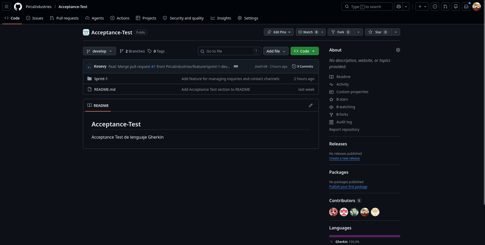
	<br>
	<p>Vista principal del repositorio de Acceptance-Test, evidenciando el uso de archivos Gherkin.</p>
</div>

<br>
<br>

#### 2. Configuración del Flujo de Trabajo (Git Flow)
Para asegurar que solo el código funcional y aprobado llegue al entorno de producción, se implementó la estrategia de ramificación Git Flow en ambos repositorios. Se configuraron ramas `feature/*` para el desarrollo individual, las cuales se integran mediante Pull Requests hacia `develop`, para finalmente pasar a `main` cuando el incremento está listo para despliegue.
<div align="center">
    
	<br>
	<p>Ramas activas en el repositorio de la Landing Page, evidenciando el aislamiento de características antes de su integración.</p>
</div>

<br>
<br>

<div align="center">
    
	<br>
	<p>Gestión de ramas en el repositorio de pruebas de aceptación, manteniendo sincronía con el desarrollo del Sprint.</p>
</div>

<br>
<br>

#### 3. Despliegue
Para el despliegue continuo y gratuito de la Landing Page, se utilizó el servicio **GitHub Pages**. La configuración se enlazó directamente a la rama `main` del repositorio `Landing-Page-Kipu`. 
* **Source:** Despliegue automatizado desde la rama `main` y la carpeta raíz (`/root`).
* **Disponibilidad:** Tras la configuración, el entorno de producción quedó publicado y accesible de forma pública.
**URL del entorno de producción (Landing Page):** [https://pircaindustries.github.io/Landing-Page-Kipu/](https://pircaindustries.github.io/Landing-Page-Kipu/)
<div align="center">
    
	<br>
	<p> Configuración exitosa de GitHub Pages, indicando que el sitio se encuentra "Live" </p>
</div>

<br>
<br>

#### 5.2.1.8. Team Collaboration Insights during Sprint.

A partir de la sección Insights de GitHub, se presentan las gráficas de colaboración del repositorio. Esta visualización refleja la contribución individual de cada miembro del equipo durante el Sprint 1.
<br><br>


## 5.3. Validation Interviews.
### 5.3.1. Diseño de Entrevistas.
### 5.3.2. Registro de Entrevistas.
### 5.3.3. Evaluaciones según heurísticas.
## 5.4. Video About-the-Product.
---
# Conclusiones

+ El proyecto evidencia un avance sólido y ordenado, ya que en pocas semanas se logró construir una base integral que abarca desde la identificación del problema y la validación con usuarios hasta la definición funcional del producto. La evolución de versiones refleja continuidad en el trabajo del equipo, con aportes distribuidos entre todos los integrantes y una cobertura completa de artefactos clave como entrevistas, needfinding, épicas, user stories, backlog e impact mapping, lo que demuestra una buena capacidad de planificación y ejecución colaborativa.

+ El progreso alcanzado no se quedó en el análisis, sino que avanzó hacia el diseño y la implementación con evidencias concretas de sprint, documentación técnica y despliegue. La incorporación de wireframes, mockups, arquitectura orientada al dominio, diagramas de clases y base de datos muestra una madurez creciente del proyecto, porque conecta la visión de negocio con decisiones técnicas y resultados verificables; en conjunto, esto posiciona al equipo en una etapa favorable para consolidar entregables funcionales con mayor calidad y trazabilidad.

# Bibliografía
Aquise, J., Bustamante, G., y Cáceres, M. (2021). *Control de calidad y su impacto en los indicadores de desempeño financiero y operativo (KPIs) de una pequeña empresa constructora en el sur del Perú* [Tesis de maestría, Universidad Peruana de Ciencias Aplicadas]. Repositorio Académico UPC. https://repositorioacademico.upc.edu.pe/handle/10757/672148

Brown, S. (2022). *The C4 model for visualising software architecture*. https://c4model.com/

Evans, E. (2003). *Domain-driven design: Tackling complexity in the heart of software*. Addison-Wesley.

Gothelf, J., y Seiden, J. (2021). *Lean UX: Designing great products with agile teams* (3rd ed.). O'Reilly Media.

Nielsen, J. (1994). *10 usability heuristics for user interface design*. Nielsen Norman Group. https://www.nngroup.com/articles/ten-usability-heuristics/

Schwaber, K., y Sutherland, J. (2020). *The Scrum guide: The definitive guide to Scrum: The rules of the game*. Scrum.org. https://scrumguides.org/scrum-guide.html

Wiegers, K. E., y Beatty, J. (2013). *Software requirements* (3rd ed.). Microsoft Press.
# Anexos

+ Landing Page: [Ver Landing Page](https://pircaindustries.github.io/Landing-Page-Kipu/)<br><br>
+ Repositorio GitHub de la Organización: [Ver Organización](https://github.com/PircaIndustries)<br><br>
+ Repositorio GitHub del Landing Page: [Ver Repositorio](https://github.com/PircaIndustries/Landing-Page-Kipu)<br><br>
+ Repositorio GitHub del Informe: [Ver Repositorio](https://github.com/PircaIndustries/upc-pre-202610-1asi0730-17953-PircaIndustries-report)<br><br>
+ Repositorio GitHub de los Acceptance-Test: [Ver Repositorio]( https://github.com/PircaIndustries/Acceptance-Test)<br><br>
+ Wireframes: [Ver Wireframes](https://www.figma.com/design/wYSJ9ua6Bc2UCmH6TnQWie/Kipu---Aplicaciones-Web-Wireframes?node-id=0-1&t=zWud7TLSj3oIzBkc-1)<br><br>
+ Mock-ups: [Ver Mock-ups](https://www.figma.com/design/YozJtIsGkKkhXZA5kArMvL/Kipu---Open-Source-Mockups?node-id=2-10598&t=ylKZiCxcAheVlOJA-1)<br><br>
<!--+ Prototype: [Ver Prototype ](https://www.figma.com/)<br><br>-->

## Needfinding Interviews

  <div align="center">
    
 </div>


Enlace: [Needfinding](https://upcedupe-my.sharepoint.com/:v:/g/personal/u202224130_upc_edu_pe/IQD0ILyKaMoNQpmNfCo1snWaAcoXcuh_qXizzUDEAj-AWTg?e=XVCNNU&nav=eyJyZWZlcnJhbEluZm8iOnsicmVmZXJyYWxBcHAiOiJTdHJlYW1XZWJBcHAiLCJyZWZlcnJhbFZpZXciOiJTaGFyZURpYWxvZy1MaW5rIiwicmVmZXJyYWxBcHBQbGF0Zm9ybSI6IldlYiIsInJlZmVycmFsTW9kZSI6InZpZXcifX0%3D)

